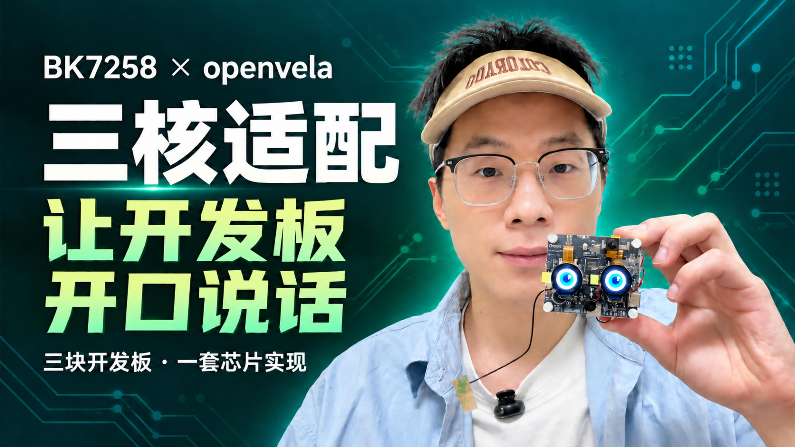
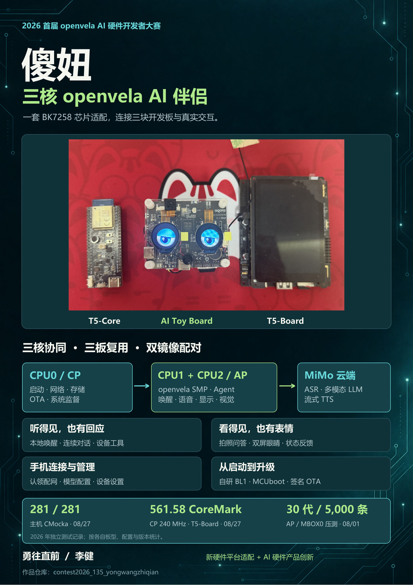

# BK7258 × openvela：三核平台适配与傻妞 AI 伴侣

[English](README_EN.md) · [参赛技术报告](docs/contest/技术报告-BK7258三核适配与傻妞AI伴侣.md) · [板级配置](boards/bk7258/CONFIGS.md) · [实际验收与待办](docs/platforms/bk7258/shaniu-master-plan.md)

一套 BK7258 芯片适配，三块开发板，两个独立 NuttX 镜像：CPU0 运行 CP，
CPU1/CPU2 运行 AP SMP。在此基础上，T5-Board 运行小海豚 Dolphin，
AIToyBoard 运行可独立语音交互的 AI 伴侣「傻妞」。

参赛方向：**新硬件平台适配 + AI 硬件产品创新**。
比赛仓库是 [open-vela/contest2026_135_yongwangzhiqian](https://github.com/open-vela/contest2026_135_yongwangzhiqian)；
开发 fork 不是另一个参赛项目。

## 先看实机演示

[](https://github.com/Embracecactus/contest2026_135_yongwangzhiqian/releases/download/shaniu-demo-20260920/shaniu-demo.mp4)

[主视频：三核适配与实机应用（4 分 48 秒）](https://github.com/Embracecactus/contest2026_135_yongwangzhiqian/releases/download/shaniu-demo-20260920/shaniu-demo.mp4)
· [App 操作补充视频（1 分 26 秒）](https://github.com/Embracecactus/contest2026_135_yongwangzhiqian/releases/download/shaniu-demo-20260920/shaniu-app-demo.mp4)
· [视频下载、字幕及哈希](https://github.com/Embracecactus/contest2026_135_yongwangzhiqian/releases/tag/shaniu-demo-20260920)

主视频小于 5 分钟；补充视频不拼接进主视频。视频是已完成的实机演示成片，
不是无剪辑压力测试。发布副本仅转换为 1080p H.264/AAC，保留完整时长、声音及字幕。
App 视频展示 OTA 入口，**未拍摄完整 OTA 过程**；实际升级结果另见验收记录。

## 比赛材料

[完整提交包、技术报告与展示材料下载](https://github.com/Embracecactus/contest2026_135_yongwangzhiqian/releases/tag/shaniu-demo-20260920)
包含技术报告（PDF / DOCX）、主视频、App 补充视频、四张三板实拍及排版图、
A2 海报和 18 页可编辑答辩 PPT。源码与原始 AI Coding 日志留在仓库，不塞进材料 ZIP。
照片均为真实正面/俯拍，未虚构背面或侧面视角；公开包不含设备授权秘密或同板恢复镜像。

[](https://github.com/Embracecactus/contest2026_135_yongwangzhiqian/releases/tag/shaniu-demo-20260920)

压缩包按大赛模板命名；上传官网和官方仓 PR 合入是后续明确操作，不以材料打包代替。

## 做了什么

- **平台**：三核启动、CP/AP 核间通信、Wi-Fi/BLE、音视频与外设适配；
  芯片实现与物理板接线分离；BL1 + MCUboot 同槽签名 CP/AP、A/B 升级。
- **傻妞**：本地“你好，openvela”唤醒 → 本地应答 → 自动收音 →
  实际 ASR → 官方 Agent / 所选 LLM → TTS → 扬声器。
  一次唤醒进入交互，回答后可直接追问，退出条件满足后回到待机。
- **看与表达**：复用唯一摄像头 owner 拍照识物，双圆屏显示眼睛动画；
  Agent 通过受限工具查询状态、加速度，控制音量、表情与有界振动。
- **手机控制**：BLE 认领、配网、音量/风格/回答模式/模型/唤醒阈值设置；
  Wi-Fi HTTPS 安装眼睛资源、传送 OTA 包。App 不维持每轮对话，也不中转音频。
- **隐私**：默认本地唤醒；云服务使用选定后端和受保护鉴权；
  可选加密记忆投影到官方 Session，不上传旧数据来完成迁移。

ASR 当前为批处理；LLM 当前等待完整文本/工具结果；TTS 支持音频分块接收播放。
不把上述链路统称为全流式，也不承诺“零延迟”。

```text
Android 控制 App ── 认证 BLE ── 配置 / 控制
       └──────── Wi-Fi HTTPS ── 资源包 / 签名 OTA
                                  │
BK7258 CP（CPU0） ←─ RPMsg ─→ AP（CPU1 + CPU2 / SMP）
Wi-Fi / BT / Flash / OTA       官方 Agent / Session / Voice / Media
按键 / 日志 / 系统监督         本地 KWS · 摄像头 · 双屏 · 传感器
                                  │
                              验证 TLS / 所选云服务
                              ASR → LLM → TTS
```

## 三块板如何选择

| 物理板 | 构建标识 | 本作品用途 | 正常配置 / SDK |
|---|---|---|---|
| 涂鸦 T5AI-Core V1.0.1 | `t5ai_core` | 最小系统、启动与芯片适配基线 | `app + openvela_ap`；`cp + ap` |
| T5-Board V1.0.2 | `t5_board` | 带屏工具应用 Dolphin、网络与外设操作 | `app + openvela_ap`；`cp + ap` |
| AIToyBoard / AIDK AI Toy | `aidk_ai_toy` | 傻妞：语音、摄像头、双眼、手机控制 | `app + openvela_ap`；`cp-aidk + ap-aidk` |

三者不是同一 PCB 的别名。购板或复现接线前，请核对
[板型与引脚](boards/bk7258/README.md)、相应原理图及板上实际器件；
不要把 T5AI-EVB 当作 T5-Board V1.0.2。**编译不需要连接或购买开发板**。
三板历史实测各有边界，不能把 AIToyBoard 的产品演示推广到其他板。

## 评审构建指南

### 发布状态与依赖身份

本次代码快照为 `82610138`，交付分支为
`feat/shaniu-contest-delivery-20260920`，基于官方比赛分支 `7079493e`。
**推送到 fork 不等于官方 PR 已合入或比赛已提交。**

635 使用的既有 Agent 扩展已原样发布到
[Agent fork 的固定提交](https://github.com/Embracecactus/packages_ai_agent/commit/add0db19d00301769907a5ece03fb9bd88d2edb4)，
基于官方 `e65550f18759f086d7f544edcf17d1e31223244f`，21 个文件、+1830/-549 行。
团队 manifest 固定引用 `add0db19d00301769907a5ece03fb9bd88d2edb4`，
`openvela.xml` 固定本次 Linux 工作区的 248 个公共依赖提交；SDK 版本不变。
不恢复退役 patch，也不在构建时覆盖官方源码。**依赖已公开不等于已合入上游，
更不等于三板干净构建或 635 实板重验。**来源及验证范围见 [来源记录](SOURCE_PROVENANCE.md)。

2026-09-20 已完成独立源码检出的 **三板 CP/AP direct 构建**，使用固定依赖与
经哈希验证的既有 SDK/toolchain 缓存；源码 `c10a7668`。
这是编译验证，不是 635 签名包重制或实板重验，详见
[本次构建及产物哈希](docs/verification/bk7258/2026-09-20-public-source-build.md)。

### 1. 获取完整 openvela 工作区

建议 Ubuntu 22.04，先准备 Git/Repo、Python 3、CMake、Ninja、Make 及
[openvela 构建环境](https://github.com/open-vela/docs)。不要只 clone 本团队仓后直接运行 NuttX 构建。
以下命令在独立空目录执行，不要嵌套于已有 Repo 工作区，否则 Repo 会复用父工作区。

```bash
repo init -u https://github.com/Embracecactus/contest2026_135_yongwangzhiqian \
  -b feat/shaniu-contest-delivery-20260920 \
  -m contest2026_135_yongwangzhiqian.xml -g default,bk7258-sdk
```

上面先从已发布分支取得固定依赖的 manifest。在官方合入前，再于工作区
`.repo/local_manifests/shaniu-delivery.xml` 保存以下覆盖，然后执行
`repo sync -c -j8`。覆盖只切换团队项目；Agent pin 与 linkfile 由主 manifest 提供：

```xml
<manifest>
  <remote name="shaniu-delivery" fetch="https://github.com/Embracecactus/"/>
  <extend-project name="contest2026_135_yongwangzhiqian"
                  path="contest2026_135_yongwangzhiqian"
                  remote="shaniu-delivery"
                  revision="refs/heads/feat/shaniu-contest-delivery-20260920"/>
</manifest>
```

官方合入后可把 init 仓库换成 `open-vela/contest2026_135_yongwangzhiqian`、
分支换成 `dev-ai-contest-2026`，不再需要团队项目覆盖。固定一次复现的依赖身份：

```bash
repo manifest -r -o resolved-manifest.xml
git -C contest2026_135_yongwangzhiqian rev-parse HEAD
git -C packages/ai_agent status --short
cd contest2026_135_yongwangzhiqian
```

`resolved-manifest.xml` 只记录提交，不包含未提交修改。不要在存在本地工作时盲目 sync。
团队目录保留 manifest 指定的 `contest2026_135_yongwangzhiqian` 名称；SDK 工具按该名称读取同名 XML。

### 2. 安装工具链与构建 SDK

```bash
tools/bk7258/bk7258.py toolchain install
tools/bk7258/bk7258.py toolchain verify
tools/bk7258/bk7258.py sdk rebuild --profile cp --source ../vendor/beken/bk_avdk_smp --jobs 8
tools/bk7258/bk7258.py sdk rebuild --profile cp-aidk --source ../vendor/beken/bk_avdk_smp --jobs 8
tools/bk7258/bk7258.py sdk rebuild --profile ap --source ../vendor/beken/bk_avdk_smp --jobs 8
tools/bk7258/bk7258.py sdk rebuild --profile ap-aidk --source ../vendor/beken/bk_avdk_smp --jobs 8
tools/bk7258/bk7258.py sdk verify --profile cp
tools/bk7258/bk7258.py sdk verify --profile cp-aidk
tools/bk7258/bk7258.py sdk verify --profile ap
tools/bk7258/bk7258.py sdk verify --profile ap-aidk
```

只构建一块板时，仅需表中对应的一对 SDK profile；AIDK 必须是 `cp-aidk + ap-aidk`。
工具链从 `toolchain.json` 的锁定来源校验安装，不随意使用系统 GCC。
SDK 源码由 manifest 固定为 `cb080de1655d579c7593ecf504c440997c4c137b`；
需自行重建受许可约束的本地 bundle，不从私人机器复制不明二进制。

### 3. 三板构建入口

依次执行所需板型；共用 SDK 输出不要并发写入：

```bash
tools/bk7258/bk7258.py build --board t5ai_core --boot direct --jobs 8
tools/bk7258/bk7258.py build --board t5_board --boot direct --jobs 8
tools/bk7258/bk7258.py build --board aidk_ai_toy --boot direct --jobs 8
```

每个入口读取该板 `openvela.conf`，生成 CP/AP 私有配置与分区输入，
调用官方 `build.sh --cmake`，打印 build manifest、ELF/bin 路径和哈希。
产物位于工作区 `out/bk7258/<board>/...`；**direct 是未签名编译/bring-up
路径，不能当作已部署安全设备的升级包。**

T5-Board 的 Dolphin 录音仍待接入官方 Media；当前配置不再选择已退役的
兼容录音后端，保留实现但不把录音列为本次可用功能。桌面其余功能与傻妞
是不同产品配置，详见 [CONFIGS.md](boards/bk7258/CONFIGS.md)。

签名构建使用 `--boot mcuboot` 及明确的 BL1/MCUboot 公钥、rollback floor；
签名、分区、设备身份和烧录步骤见
[现役构建/发布 SOP](docs/platforms/bk7258/nuttx-port/bk7258-build-flash-debug-sop.md)。
编译不需要私人设备身份、云 token、原始训练录音或签名私钥。
公开源码可复现实现与构建输入，不承诺不同签名、私有提示音或用户配置下的
全片镜像逐字节等同于同板 635 包；635 保持最终实板候选，不再部署新版本。
同板恢复包含设备数据，不公开、不跨板烧录，也不为复现自动轮换信任根。

### 4. Android、模型与显示资源

- [Android 工程与构建](android/shaniu-companion/README.md)：JDK 17、Android SDK 35，
  当前源码版本 `0.5.23-shaniu-rebind` / code 28，Android 10+。
- [模型训练与工具入口](tools/bk7258/README.md)：`voice kws audit/train/evaluate`；
  [内置模型元数据](app/bk7258/models/nihao_openvela.metadata.json)随仓库提供。
  TensorFlow 训练环境不是普通固件编译依赖。
- [眼睛资源与打包](app/bk7258/assets/display/README.md)：原图、JSON 与既有
  `package eye-pack` / `verify eye-pack` 入口。

App、训练代码和产品模型目前在本仓统一版本管理；不必另建 GitHub 仓库。
Android 工程不参加 NuttX 构建，训练数据也不通过 linkfile 混入固件。
`packages/ai_agent` 是官方独立依赖项目，不属于本团队仓的子目录。
本次 fork 只交付它的既有产品集成扩展；新板的 App 授权资料请按
[独立身份供应流程](android/shaniu-companion/README.md#授权文件与新板复现)准备，不能复制作者的认领秘密。

固件内置公开 KWS 为 32 通道、23,640 B，SHA 前缀 `922eba91`；
实机曾通过 App 激活 64 通道、47,672 B 候选 `536ebba8`，
二者不是同一模型。私人录音及其实验目录不公开，评测指标见技术报告；
未发布的授权“我在”音色 PCM 为可选资产，不是编译前置。

## 实测结果与边界

| 内容 | 已有证据 | 不扩大的结论 |
|---|---|---|
| 连续语音 / 拍照 | 625–629 等候选有声学交互、关联追问与真实 JPEG 请求记录 | 非当前源码全量同版验收；颜色理解仍有错误 |
| 真人唤醒 | 用户实机成功与失败均有记录 | 没有独立多人 FAR/FRR 通过结论；合成回放不算真人泛化 |
| App / 资源 | 配网、Token Plan、设置回读、眼睛安装已有实测 | NFC 驱动已适配，但未纳入当前板端产品流程 |
| 真实 App OTA | `18.6.398+634`，重启后 counter 634、B 槽、trial confirmed | 不是全量烧录替代 OTA，也不代表全部旧版本升级组合通过 |
| 眼睛重启保持 | 634 安装后复位：READY / error 0 / revision 2 | 旧 FAT 损坏触发根因未重现，不宣称所有存储故障已根治 |
| runtime Skill / 635 | `18.6.399+635`：开机安装技能、2,012 B 工具表；用户与 CodeBuddy 确认语音及双屏显示 | App 控制与 App OTA 本轮未重测，继续引用 634 的实际结果 |

更多延迟、大小、失败尝试与 SHA256 见
[技术报告](docs/contest/技术报告-BK7258三核适配与傻妞AI伴侣.md)和
[Master Plan](docs/platforms/bk7258/shaniu-master-plan.md)。
635 的 Skill 产品入口和 CMake 接线与 `82610138` 文件一致；详见
[635 用户实机验证记录](docs/verification/bk7258/2026-09-20-shaniu-runtime-skill-635.md)。
若部署 635 full 包，构建的 rollback floor 为 635；同号 OTA 包不改写 BL1/BL2。
未实测功耗、长期稳定性、旧密文实迁不写成已完成。

## 目录与维护

| 目录 | 职责 |
|---|---|
| `chips/bk7258/` / `boards/bk7258/` | 芯片机制 / 三块物理板接线、配置与布局 |
| `app/bk7258/` / `app/dolphin/` | 傻妞产品适配 / T5-Board Dolphin |
| `android/shaniu-companion/` | 独立 Android 控制工程 |
| `frameworks/` / `external/` | 团队构建接线；不恢复已退役 patch 链 |
| `tools/bk7258/` | 现役构建、SDK、资产、签名和发布 CLI |
| `.agents/skills/` | 随仓可复用开发 Skill，详见[能力索引](docs/platforms/bk7258/shaniu-skill-capability-map.md) |
| `logs/lijian/` | 已导出的真实 AI Coding 日志及索引；不手动改写 |
| `docs/verification/bk7258/` | 按日期和版本界定的历史验收证据 |

无关 test/示例未进入傻妞产品配置，源码保留用于明确的其他配置或历史复现；
不为了编译产品重新启用它们。主机检查不能代替实板证明。
当前文档总导航见 [docs/README.md](docs/README.md)，历史记录不改写为当前状态。

原创代码采用 [Apache-2.0](LICENSE)；第三方派生、SDK 与生成资产的来源和许可见
[SOURCE_PROVENANCE.md](SOURCE_PROVENANCE.md)。云凭据、私钥、私人语音及设备绑定
恢复材料不随公开交付分发。
