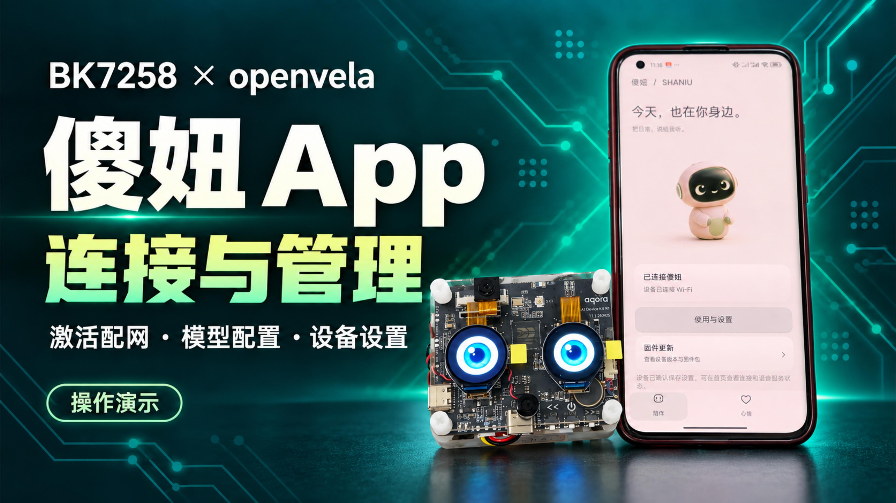

# 傻妞 Android 控制 App

[项目与视频](../../README.md) · [技术报告](../../docs/contest/技术报告-BK7258三核适配与傻妞AI伴侣.md) · [实际验收](../../docs/platforms/bk7258/shaniu-master-plan.md)

原生 Kotlin 工程，包名 `com.shaniu.companion`。当前源码版本
`0.5.23-shaniu-rebind`（versionCode 28），Android 10+（minSdk 29），
compile/target SDK 35。App 只承担配置和控制：设备完成配置后独立运行语音，
关闭 App 不等于结束设备端交互会话。

[](https://github.com/Embracecactus/contest2026_135_yongwangzhiqian/releases/download/shaniu-demo-20260920/shaniu-app-demo.mp4)

补充演示 1 分 26 秒，包含认领配网、设置和 OTA 入口；不冒充完整升级录像。

## 构建

安装 JDK 17、Android SDK Platform 35 及 Gradle 所需构建工具。
在 `local.properties` 指定自己的 SDK 路径，或使用标准 `ANDROID_HOME`；
不要提交个人路径、签名文件或 token。第一次构建需要获取依赖。

```bash
cd android/shaniu-companion
./gradlew :app:assembleDebug
```

产物：`app/build/outputs/apk/debug/app-debug.apk`。
不需要连接开发板，不需要 Beken SDK、私人训练数据、云 API key 或设备认证文件。
没有授权/配对设备时可查看界面，但不应伪造设备在线或设置成功。

安装到自己选择的手机：

```bash
adb -s <手机序列号> install -r app/build/outputs/apk/debug/app-debug.apk
```

已有认领数据的手机必须先确认 APK 签名兼容；不能用卸载、清数据或改签名绕过
安装问题。APK 编译/安装与真实 BLE、设备动作及 OTA 验收分别记录。
现有单元检查可用 `:app:testDebugUnitTest`，不是正常安装的强制前置，
也不代表射频、音频或烧录成功。

## 操作顺序

1. 打开蓝牙并授予系统要求的权限。导入**该设备**由所有者提供的授权资料，
   扫描、选择并认证设备；不要把别的设备认证资料当作通用示例。
2. 让板子扫描附近 Wi-Fi，填写网络配置与所选云服务凭据。支持 MiMo
   标准服务或 Token Plan 配置；设备保存并返回结果后才显示成功。
3. 设置页可控制音量、聊天风格、回答模式、云模型、唤醒模型/阈值、眼睛资源；
   心情页提供产品表达入口。录音、播放或资源事务占用时如实显示暂不可操作。
4. 正常使用说“你好，openvela”进入设备交互。App 不负责逐轮启动、停止、
   重连或录音转发。
5. 重启/短暂断连后重新认证并读取设备当前状态；超时的写操作不自动重发。
   删除手机绑定仅清除手机持有的连接资料，不能清除设备数据来冒充重新认证。

NFC 芯片驱动已有适配，但未接入当前板端产品流程；本次演示使用 BLE 与授权文件，
不把“碰一碰”列为已完成入口。

## 连接与安全边界

- `ProvisionGattSession` / `DeviceControlSession` 串行化命令，连接代次防止
  旧回调污染新会话；设置 ACK 与后续状态确认是两件事。
- BLE 承载设备认证、受保护配置和控制；TLS 校验设备证书 pin、有效期及用途。
  已保存认领凭据不等于设备当前在线。
- 控制凭据由 Android Keystore 保护的 AES-GCM 存储保存，不硬编码进 APK；
  云凭据不明文回读，不输出到日志。UI 明确区分未就绪、忙、失败与断连。
- 默认不需要 Gateway。历史 console-v1 类和测试夹具不构成当前产品交互路径。
  不启用它们来解决编译或连接问题。
- 可选持久记忆由设备加密存储并投影回官方 Session；手机不托管对话历史。
  删除/禁用需设备完成并确认，收到请求不等于已经持久化。

## 眼睛资源与真实 App OTA

眼睛资源和固件均由手机临时 HTTPS 服务通过 Wi-Fi 供设备下载；
BLE 只传已认证的来源描述、CA、完整性参数及控制状态，不传整包固件。
手机与设备需网络可达，并保持供包期间 App 前台和网络可用。
不公开供包端口、不关闭证书验证，不假定中断传输支持断点续传。

- 眼睛包：`.bkep`，由现有
  [资源工具](../../app/bk7258/assets/display/README.md)生成；
  设备验证格式/完整性，经唯一存储 owner 安装并回读。
- 固件包：`.bkpack`，必须匹配板型、布局、现有签名信任和安全计数。
  `OTA_START` 只表示接受请求；重启后确认设备身份、目标版本/计数和
  trial confirmed，才显示升级成功。
- 634 已完成用户发起的实际 App OTA：约 93% 断连，重启回读后 100% 成功。
  635 新增 runtime Skill，App 控制/OTA 行为路径未改，**本轮未在 635 重测**。
- 635 full 包与 OTA-only 包不同：full 构建 floor 635；OTA-only 不替换 BL1/BL2。
  同板恢复包含身份/数据，不能作为公共 APK 附件或其他设备的升级输入。

## 源码与复现

| 位置 | 职责 |
|---|---|
| `MainActivity.kt` | 前台控制、设置与当前状态展示 |
| `provision/` | 扫描、TLS/GATT、所有权、串行控制协议与连接会话 |
| `ota/OtaPackageServer.kt` | 短生命周期本地 HTTPS 供包 |
| `EyePack.kt` | 眼睛资源输入与完整性边界 |
| `app/src/main/assets/wake-models/` | 随 App 的公开内置唤醒包 |
| `app/src/main/res/` | 原创红色水晶伴侣图标与 UI 资源 |

App 工程与固件适配在同一团队仓版本管理，不额外建立 App Git 仓或 NuttX linkfile。
官方 Agent 是工作区另一依赖项目；其未发布扩展会影响设备端干净复现，
不应混淆为 Android Gradle 依赖。来源和许可见
[App 来源记录](SOURCE_PROVENANCE.md)与[项目来源记录](../../SOURCE_PROVENANCE.md)。
