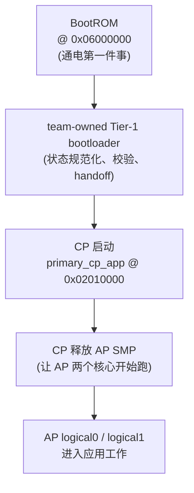

> **事实截止日期**：2026-08-04
> **权威来源**：[技术总报告](../porting-report.md)、[Bootloader 逆向综合](../bootloader/full-reverse-synthesis.md)、[裸机 probe 说明](../probe/README.md)、[项目架构](../../../memory/ARCHITECTURE.md)
> **证据边界**：本章解释硬件角色、地址视图和已验证启动链；不展开 PSRAM 分配、32+2 CRC 算法或动态进度。动态状态只见[第 11 章](11-current-status-and-next-steps.md)。

# 01 硬件与启动链（T5-AI / BK7258）

> 本文是给**完全不懂嵌入式**的朋友写的。凡是你没听过的词，这一章都会先用大白话解释，再给事实。
> 本章只讲“硬件长什么样”和“电一打开后程序怎么一步步跑起来”。更深的算法、PSRAM 内部细节、当前进度，不在本章范围。

## 本文引用的真实来源

- [技术总报告](../porting-report.md)
- [Bootloader逆向综合](../bootloader/full-reverse-synthesis.md)
- [裸机probe说明](../probe/README.md)
- [项目架构](../../../memory/ARCHITECTURE.md)
- [当前动态状态](11-current-status-and-next-steps.md)

> 铁律提醒：官方 NuttX / apps / SDK 只能作为**只读参考**；本项目唯一对应的 SDK 版本是 **v3.1.1.9**；官方 Beken/Tuya 二进制**不在运行链中**，只用于逆向参考。

---

## 1. T5-AI / BK7258 三核 Cortex-M33 和地址图

### 1.1 先理解几个最基础的概念

- **芯片（SoC）**：一块很小的硅片，里面集成了“大脑”（处理器）和“记忆”（存储器）。你可以把它想成一台缩小到米粒级别的电脑。
- **核心（Core）**：芯片里的“大脑”本身。一个芯片可以有好几个核心，就像几个人在同一张桌子上一起干活。
- **Cortex-M33**：这是 ARM 公司设计的一种“小型、省电、可靠”的处理器核心方案。BK7258 芯片里装了 **三个** Cortex-M33 核心，我们叫它们 CPU0、CPU1、CPU2。
- **地址（Address）**：内存里每个字节都有一个“门牌号”，CPU 靠门牌号去读数据、写数据。所有门牌号排在一起，就叫**地址图（Address Map）**。
- **SRAM**：芯片内部自带的“快但是断电就丢”的内存。
- **Flash**：芯片里的“硬盘”，断电不丢，用来长期存放程序。
- **XIP（eXecute-In-Place）**：程序可以**直接在 Flash 上运行**，不需要先整段搬到内存里。
- **BootROM**：芯片出厂时就固化好的一段只读程序，是“通电后第一个跑的东西”。
- **PSRAM**：一种“假装自己是 SRAM 的大容量内存”，比 SRAM 大很多，用来放更多数据。

> 关于名字：T5-AI 是采用 BK7258 SoC 的模组/开发板；二者是“载板/模组—芯片”的包含关系，不是同义词。

### 1.2 芯片统一地址图（本章事实）

下面这些地址，是这颗芯片的**架构事实**（不是猜测，是硬件规定的布局）：

| 区域 | 地址范围 | 大小 / 说明 |
|------|----------|-------------|
| SRAM | `0x28000000` .. `0x280A0000` | 640 KiB（片内高速内存） |
| Flash（XIP 基地址） | `0x02000000` 起 | 程序存放区；总容量与分区本章不展开 |
| BootROM | `0x06000000` | 通电后最先执行的固化程序 |
| PSRAM | `0x60000000` .. `0x61000000` | T5-AI 实板识别为 16 MiB（外部大内存） |

> 小算术验证：SRAM 从 `0x28000000` 到 `0x280A0000`，差值是 `0xA0000` 字节 = 640 KiB；PSRAM 从 `0x60000000` 到 `0x61000000`，差值是 `0x1000000` 字节 = 16 MiB。这和实测一致。

### 1.3 “统一地址图”但“不能随便共享”

从芯片设计看，这套地址图是**统一**的——原则上对应核心都能访问这些地址。但是，**本项目用“角色（role）/保留区”来划分所有权（ownership）**：哪块内存归谁管，是项目规则定好的，不能三个核心随意互相踩对方的地盘。

### 1.4 PSRAM 只在本书预告一下

关于 PSRAM 本章**不展开细节**，只给你两个后续会用到的事实预告：

- PSRAM 的**初始化（init）和电源管理（PM）归属 CP 负责**（owner 是 CP）。
- CP 和 AP 在 PSRAM 里的堆（heap，动态申请内存的区域）**互不重叠**——各用各的，不会撞车。

---

## 2. 物理核心 与 逻辑角色 的映射

三个物理核心（CPU0 / CPU1 / CPU2）在项目中被分配了不同“角色”。这种“角色”叫**逻辑（logical）**划分。

| 物理核心 | 逻辑角色 | 说明 |
|----------|----------|------|
| physical0（CPU0） | **CP** | 控制 / 通信处理器，也是启动主控 |
| physical1（CPU1） | **AP logical0** | 应用处理器核心 0 |
| physical2（CPU2） | **AP logical1** | 应用处理器核心 1 |

要点：

- **CP 只有一个核心**（就是 physical0 / CPU0）。
- **AP 是两个核心**（physical1 和 physical2），它们作为一对“对称多处理（SMP）”伙伴一起工作。
- **CPU2 不是第二个 RPMsg peer（对等端）**。RPMsg 是本项目中 CP 与 AP 之间用来互相发消息的机制；它只有“CP 这一侧”和“AP 这一整侧”两个对等端。CPU2 属于 AP 这一侧，和 CPU1 是同一侧的兄弟，而不是单独再开一个对等端。

> 新手类比：CP 像“车间主任”，AP 像“两个并列的工人”。RPMsg 是主任和工人班组之间的对讲机——不是主任分别和每个工人各拿一台对讲机，而是主任 ↔ 整个工人班组 一台对讲机。

---

## 3. 研究参考与部署链

先说清楚两条线，避免混淆：

1. **官方 Beken / Tuya 二进制**：我们只拿它做**逆向参考**（看人家怎么做的），它**不在本项目真实运行链里**。
2. **本项目实际部署链**（电一打开真正发生的顺序）：

> 图里只画“关系/顺序”，不画算法。虚线外的官方二进制不参与这条链。

顺序白话版：

1. 芯片通电 → 硬件自动跑 `0x06000000` 处的 BootROM。
2. BootROM 完成芯片固有的启动校验与地址映射，把控制权交给 XIP 中的 **team-owned Tier-1 bootloader**。
3. Tier-1 规范化 cache/MPU/watchdog 等交接状态，验证 CP 向量和 magic 后 handoff 到 `0x02010000`；这里不是把整段 CP 镜像搬入 RAM。
4. CP 就绪后，**释放 AP 的 SMP**——也就是把 CPU1、CPU2 两个应用核心放开去干活。
5. AP 两个逻辑核心开始正常运行应用。

---

## 4. CPU0 是启动主控的证据（交叉证明）

我们要回答一个问题：**三个核心里，到底谁才是“第一个醒过来、负责带大家起床”的那个？** 结论是 **CPU0（physical0，也就是 CP）**。

支撑这个结论的证据，是**多条线索交叉印证**的，不是单一证据：

- **静态线索 A**：项目里存在 `primary_cp_app`，它被放在地址 `0x02010000`。这是 CP 的主程序入口区。
- **静态线索 B**：代码里有 `startup_cpu0` 的 `entry_main`——即“CPU0 的启动代码进入主函数”。这指示 CPU0 承担启动主流程。
- **静态线索 C**：`start_cpu1_core` 是**在应用（app）层**才去调用的——意思是“把 CPU1 叫醒”这件事，是更晚、在应用层面才发生的，反过来说明 CPU1 不是最先启动的。
- **板级实测线索 D（probe）**：本项目用的**裸机 probe** 被当前启动链当作一个“CP app”直接跳入执行，而且它的 **VTOR = `0x02010000`**。VTOR 是“向量表偏移寄存器”，简单说就是告诉 CPU“你的中断/异常入口表放在哪个地址”。这个地址正好和 `primary_cp_app` 的位置一致，和上面的静态证据对上了。

### 4.1 两个必须纠正的误区

- **误区一：以为 VTOR 单独就能证明“这是 CPU0”**。不对。VTOR 指向 `0x02010000` 只是说明“这段程序是按 CP app 的方式摆位的”，它和静态证据**合在一起**才构成交叉证明。**不能单独拿 VTOR 说“这就是 CPU0 核身份”**。
- **误区二：以为软件里写在 `0x20000000` 的“core-id 字”很可靠**。不对。那个软件自己填的 core-id 字**不可靠**，不能拿它当判定核心身份的证据。我们判定 CPU0 是启动主控，靠的是上面 A+B+C+D 的交叉验证，不是靠那个字。

---

## 5. 从“地址”视角看启动分区

这一节把地址摆清楚，算法细节留到 03 章。

- **逻辑 boot 区**：从 `0x02000000` 开始，大小 **64 KiB**。这是“逻辑上的启动区”。
- **逻辑 CP 区**：从 `0x02010000` 开始（紧接在逻辑 boot 之后），放 `primary_cp_app`。
- **32 + 2 编码后的物理原始区间**：那 64 KiB 的逻辑 boot，在经过“32 数据 + 2 CRC”的扩展布局之后，落到 Flash 的**物理原始字节区间**是 `[0x0, 0x11000)`。

> 小算术：`0x11000` = 68 KiB。逻辑上是 64 KiB，物理上因为加了每 32 字节配 2 字节 CRC 的校验扩展，变成了 68 KiB，所以物理原始区间比逻辑区大一点。
>
> **这个“32+2”的具体算法本章不写，留到第 03 章。**

---

## 6. 为什么必须先 CP、再 AP？

一句话：**得先有人把“公共环境”收拾好，应用核心才能安全开工。**

展开说：

- **CP 是启动主控（见第 4 节）**，它第一个跑，负责最早期的系统准备。
- **PSRAM 的初始化和电源管理是 CP 的活儿**（见第 1.4 节）。AP 要用的那块大内存，得 CP 先把它点亮、管好，AP 才能用。
- 如果让 AP 先跑，AP 会遇到“内存还没初始化好”“时钟/电源还没安排妥当”的混乱局面，容易出错。
- 所以正确顺序是：CP 先起来 → CP 把共享资源（PSRAM、必要的时钟/电源等）准备好 → CP 再**释放 AP 的 SMP**，让 CPU1、CPU2 安全进入应用工作。

> 新手类比：就像开演唱会，得先有舞台组（CP）把灯光、电源、音响接好，演员组（AP）才能上台。不能演员先冲上去，结果发现没电。

---

## 7. 证据分级（哪些结论更硬，哪些还没证明）

读技术文档，要分清“已经坐实的”和“还没证明的”。本章涉及的证据分级如下：

| 结论 | 证据等级 | 说明 |
|------|----------|------|
| CPU0 是启动主控 | **板级实测 + 静态交叉证明（强）** | probe 在实板上验证；与 `primary_cp_app`、VTOR、`startup_cpu0`、`start_cpu1_core` 静态证据交叉印证 |
| probe 作为 CP app 跳入、VTOR=`0x02010000` | **board-verified（板级验证）** | 在真实板子上观察到 |
| 地址图 / 角色划分（CP、AP、ownership） | **架构事实** | 芯片与项目规则规定的，不是推测 |
| 官方二进制“全功能等价” | **未证明** | 我们只拿官方二进制做逆向参考；**没有证明**官方二进制和本项目实现功能完全等价 |
| 官方二进制在运行链中 | **明确不在** | 铁律：官方 binary 不在运行链 |

> 特别提醒：**不要复制“动态状态”章节的内容**到本章。当前进展、实时进度属于 `11-current-status-and-next-steps.md`，本章不重复。

---

## 8. 新手自测

下面问题用来检验你是不是真看懂了。合上上面内容，自己先答，再回看。

1. **名词认读**：T5-AI 和 BK7258 是什么关系？Cortex-M33 指的是什么？
2. **地址图记忆**：SRAM 的地址范围和大小是多少？BootROM 在哪个地址？PSRAM 实板识别多大？
3. **映射题**：physical0、physical1、physical2 分别对应什么逻辑角色？CPU2 是不是第二个 RPMsg peer？
4. **启动顺序**：画出（或口述）真实部署链：BootROM → ? → ? → ?。官方二进制在这一链里吗？
5. **证据题**：我们说“CPU0 是启动主控”，靠的是哪几条线索交叉证明？为什么**不能**只拿 VTOR 单独证明核身份？`0x20000000` 的 core-id 字可靠吗？
6. **地址换算**：逻辑 boot 是 64 KiB 在 `0x02000000`；经过 32+2 扩展后，物理原始区间是哪一段？大概多大？（提示：`0x11000` 是多少 KiB）
7. **因果题**：为什么必须先 CP 后 AP？CP 在 AP 开工前必须搞定哪件和 PSRAM 有关的活儿？
8. **证据分级题**：下面哪条是“未证明”的——（a）地址图是架构事实；（b）官方二进制全功能等价；（c）CPU0 是启动主控有板级验证？

---

> 继续阅读（仅此一处分流）：[当前动态状态](11-current-status-and-next-steps.md)
