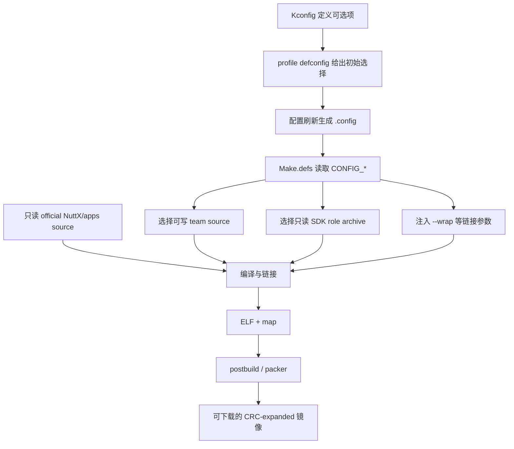

> **事实截止日期**：2026-08-04
> **权威来源**：[ADR-001](../../../memory/decisions/ADR-001-wrapper-only-official-source-boundary.md) · [项目规则](../../../memory/RULES.md) · [项目运维](../../../memory/OPERATIONS.md) · [board Make.defs](../../../board/bk7258/chip/Make.defs) · [SDK bundle入口](../../../board/bk7258/bk_idk/README.md) · [SDK静态库导入说明](../nuttx-port/sdk-static-library-import.md) · [SDK v3.1.1.9迁移报告](../nuttx-port/sdk-v3.1.1.9-migration-report.md)
> **证据边界**：正式流程不修改 official NuttX / apps / Beken SDK 或 vendor static libraries；当前唯一生效 SDK 版本为 v3.1.1.9；本文不描述当前 N15 进度，不包含任何烧录命令。动态状态只见[第11章](11-current-status-and-next-steps.md)。

# 02 仓库 Wrapper 与构建模型

## 1. Workspace 关系

整个工作区由 **contest 仓库** 作为团队自有覆盖层（team-owned overlay）居中组织：

- **contest 仓库本身** 是唯一的"可写、可提交"区域，承载板级支持、构建包装与应用衔接。
- 其旁边的 **official NuttX / apps** 是只读输入，构建时引用但不修改。
- 外部的 **Beken SDK**（v3.1.1.9）同样是只读输入，以静态库 archive + role bundle 形式进入构建。
- 当前 **唯一 active SDK 版本为 v3.1.1.9**；其他版本可在本地保留为 inactive/legacy 输入，但不参与当前分析、构建或验证。

因此要同时记住三类输入：contest 仓库中的 team-owned 代码可写；workspace 中的 official `nuttx/`、`apps/` 只读；外部 Beken SDK archive 也只读。下一节按目录说明各自职责。


## 2. 完整路径职责表

### 板级路径 `board/bk7258/`

| 路径 | 职责 |
|------|------|
| `bootloader/` | 引导加载程序相关包装与衔接（团队维护区） |
| `chip/common/` | 芯片公共配置与跨核共享逻辑 |
| `chip/cp/` | CP 核（通信核）相关源码与 Make 定义 |
| `chip/ap/` | AP 核（应用核）相关源码与 Make 定义 |
| `configs/` | defconfig 配置文件，给出 profile 初始选择 |
| `partitions/` | 分区表定义 |
| `scripts/` | 构建 / 打包辅助脚本 |
| `src/` | 团队板级驱动与应用衔接源码 |
| `bk_idk/` | checksum-pinned role bundle 入口；proprietary archive 不提交仓库 |

### 仓库根路径

| 路径 | 职责 |
|------|------|
| `app/` | 团队应用层 overlay（补充官方 apps 之外的内容） |
| `docs/` | 文档（含本系列教程） |
| `memory/` | 决策与规则存档（ADR / RULES / OPERATIONS） |
| `progress/` | 进度追踪 |
| `logs/` | 构建 / 运行日志 |
| `tools/` | 本地辅助工具 |

`bk_idk` 是 **checksum-pinned role bundle 入口**：仓库仅保留入口与校验和，真正的 proprietary archive 不提交，构建时按校验和拉取或本地放置。

## 3. Wrapper / Overlay 小白解释

**Overlay（覆盖层）**：想象官方代码是一本书，我们不改书里的字，而是在书页上垫一张透明纸写自己的补充。构建时把透明纸与底本组合起来，底本保持只读。这就是 `board/` 与根 `app/` 的角色——官方 NuttX / apps 是输入，团队目录提供板级适配。

**Wrapper（包装器）**：想象 SDK 里有个函数 `bk_flash_partition_read`，我们不想改 SDK 源码，而是在链接阶段告诉链接器：它看到的、尚未解析的 `bk_flash_partition_read` 引用改连到 `__wrap_bk_flash_partition_read`。SDK 的原实现纹丝不动，但我们能在自己的实现里加校验、日志或兜底。

**与直接 patch 对比**：

| 维度 | 直接 patch 官方源码 | Wrapper / Overlay |
|------|--------------------|-------------------|
| 官方树状态 | 被修改，产生 diff | 保持 0 diff 只读 |
| 升级 NuttX / SDK | 冲突、需手工 rebase | 覆盖层独立，升级冲击小 |
| 来源可审计性 | 改动混入官方，provenance 模糊 | 团队改动集中在 contest，边界清晰 |
| 代价 | 低（直接改） | 需要 ABI guard 与冗长包装 |

## 4. ADR-001 精确三选项

ADR-001 将"如何与官方输入协作"收敛为三个互斥选项：

- **选项 A**：直接 patch official NuttX 或 Beken SDK source。
- **选项 B**：rebuild / replace vendor static libraries（重新编译或替换厂商静态库）。
- **选项 C（已采纳 / accepted）**：official inputs 保持 read-only，仅通过最小的 board / app / build wrappers 接入。

**来自 ADR 的优缺点**：

- 优点：**upgradeability**（升级性）——官方树不被污染，版本切换成本低；**ownership / provenance audit**（归属与来源审计）——所有团队改动集中在 contest，可逐文件追溯。
- 代价：需要 **ABI guards**（确保 wrapper 符号与原符号签名一致）以及 **wrapper 冗长**（每个需拦截的符号都要显式声明）。

## 5. 真实 Make 片段与逐行表

```make
ifeq ($(CONFIG_BK7258_AP_CORE),y)
BK7258_SDK_ROLE := ap
else
BK7258_SDK_ROLE := cp
endif
```

| 行 | 含义 | 为什么需要 | 错了会怎样 |
|----|------|------------|------------|
| `ifeq ($(CONFIG_BK7258_AP_CORE),y)` | 若 Kconfig 选中 AP 核，则条件成立 | 根据构建配置决定当前连接的 SDK role | 误判核类型，导致后续选错 archive |
| `BK7258_SDK_ROLE := ap` | 将 SDK role 变量设为 `ap` | 告知构建系统使用 AP 核对应的 SDK bundle | 链接到 CP 的库，符号缺失或行为错乱 |
| `else` | 否则走默认分支 | 覆盖未选 AP 的情形 | 无 else 时变量可能未定义 |
| `BK7258_SDK_ROLE := cp` | 将 SDK role 变量设为 `cp` | 默认连接 CP 核 SDK bundle | role 错误，镜像功能异常 |
| `endif` | 结束 `ifeq` 条件块 | 保证后续 Make 规则恢复正常作用域 | 漏写会导致 Make 解析失败或后续规则归属错误 |

## 6. 真实 Wrap 片段与逐行表

```make
LDFLAGS += --wrap=bk_flash_partition_get_info
LDFLAGS += --wrap=bk_flash_partition_read
LDFLAGS += --wrap=bk_flash_partition_write
LDFLAGS += --wrap=bk_flash_partition_erase
```

| 行 | 含义 | 为什么需要 | 错了会怎样 |
|----|------|------------|------------|
| `LDFLAGS += --wrap=bk_flash_partition_get_info` | 链接期将对 `bk_flash_partition_get_info` 的未定义引用重定向到 `__wrap_bk_flash_partition_get_info` | 在不改 SDK 源码前提下拦截分区信息查询 | 仍调用原实现，团队逻辑不生效 |
| `LDFLAGS += --wrap=bk_flash_partition_read` | 同上，拦截读接口 | 可加校验 / 日志 / 兜底 | 读路径无团队控制点 |
| `LDFLAGS += --wrap=bk_flash_partition_write` | 同上，拦截写接口 | 写路径加固与审计 | 写行为不可控 |
| `LDFLAGS += --wrap=bk_flash_partition_erase` | 同上，拦截擦除接口 | 擦除前保护 | 误擦无防护 |

**准确原理**：链接器遇到对 `bk_flash_partition_read` 等符号的**未定义引用**时，因 `--wrap` 存在，会改为引用 `__wrap_bk_flash_partition_read`；原实现可通过 `__real_bk_flash_partition_read` 访问。若某调用方与目标符号位于**同一 object 文件内部且已在编译期绑定**，则不受 `--wrap` 影响——该边界由 ELF verifier 在构建后确认，本文不说"所有调用"都被拦截，仅声明未定义引用层面的重定向机制。

## 7. 正确构建流程（Mermaid）



这张图中，`Make.defs` 是仓库里已经存在的规则文件；`.config` **驱动它选择分支**，不是“生成 Make.defs”。可写的 team source 与两类只读输入（official source、SDK archive）在编译/链接阶段汇合。链接后的 ELF 先接受符号、地址与 ABI 检查，再由 postbuild/packer 变成 BK7258 Flash 所需的物理镜像。

| 节点 | 新手应记住什么 | 配错的典型后果 |
|---|---|---|
| Kconfig / defconfig | 前者定义选项，后者固定某个 profile 的起始选择 | 同名 profile 构建结果漂移 |
| `.config` / Make.defs | `.config` 提供 `CONFIG_*`，Make.defs 据此选源码、库和链接参数 | CP/AP role 选反或漏编 wrapper |
| team source | 位于 contest 仓库，可审计、可修改 | 正式修复若落到官方树会丢失边界 |
| official source / SDK archive | 都是只读输入，但不是同一类文件 | SDK provenance 或 upstream diff 无法审计 |
| ELF / map | 证明“实际链接进了什么、地址在哪里” | 只看源码可能把未链接代码误当成生效 |
| postbuild / packer | 把逻辑镜像转换为芯片需要的物理格式 | ELF 能链接但板子无法启动 |

## 8. 临时 Debug 规则

- 允许**临时**修改 official 树以便调试，但 **checkpoint 前必须恢复**，确保 official tracked diff = 0。
- 正式修复必须回到 **team wrapper / overlay**，不在官方源码落地。
- 若确认需要 upstream fix，须**单独授权或提交 PR**，不在本地长期保留对官方树的偏离。

## 9. Legacy 输入与 Manifest

为回溯保留 legacy input / manifest，但其**不参与当前分析、构建与验证**；本文不声称存在固定的 legacy 目录，也不将其纳入任何构建路径的职责表。

## 10. "新增功能去哪"决策表与自测

### 决策表

| 功能类型 | 去哪 | 约束 |
|----------|------|------|
| 板级驱动 / 初始化 | `board/bk7258/src` + `chip/*` | 不碰官方 NuttX 源码 |
| 应用层补充 | 根 `app/` overlay | 不碰官方 `apps` |
| 需拦截 SDK 符号 | `--wrap` + team 实现 | 加 ABI guard |
| SDK 行为需改且无 wrap 点 | 先评估 wrapper；不行则单独授权 upstream PR | 不本地改 SDK |
| 配置 / profile | `board/bk7258/configs/<profile>/defconfig` 与 team-owned Kconfig/Make.defs | 维护 team 配置，不改 official Kconfig |

### 5 个自测

1. **要在 flash 分区读取加日志**：应走 `--wrap bk_flash_partition_read` 或在 team `src` 加适配，不改官方 SDK 源码。
2. **临时改了 `nuttx/fs` 调试**：checkpoint 前必须恢复，official tracked diff = 0。
3. **当前唯一生效 SDK 版本**：v3.1.1.9。
4. **`bk_idk` 里的 proprietary archive 是否提交**：不提交，仅保留 checksum-pinned 入口。
5. **升级 NuttX 时 wrapper 模型的好处**：upgradeability（升级冲击小）+ provenance audit（改动可审计）。

## 11. 延伸阅读

继续查看 [11 当前状态与后续步骤](11-current-status-and-next-steps.md)。
