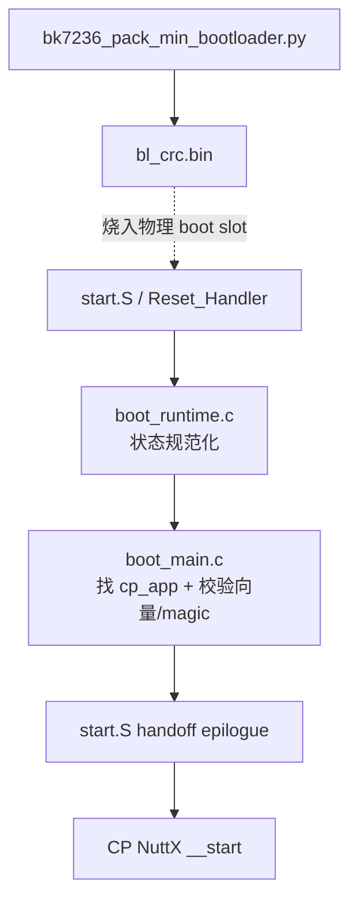

> **事实截止日期**：2026-08-04
> **权威来源**：[移植报告](../porting-report.md)、[逆向综合](../bootloader/full-reverse-synthesis.md)、[Tier-1 README](../../../board/bk7258/bootloader/README.md)、[打包器源码](../../../board/bk7258/bootloader/bk7236_pack_min_bootloader.py)
> **证据边界**：本章解释已验证的 raw NuttX 启动契约、team-owned Tier-1 与 32+2 CRC；不声称复刻官方 bootloader 的全部 OTA、分区和安全功能。动态状态见[第 11 章](11-current-status-and-next-steps.md)。

# 03 Tier-1 Bootloader 与 32+2 CRC

## 1. 这一阶段解决了什么

最初只有两个厂商二进制可参考：

- Tuya 出厂 bootloader，约 65 KiB，包含私有 OTA/FAL 扩展；
- Beken 官方 bootloader，约 52 KiB；
- 两者都不可作为“我们完全理解、可以维护”的项目源码。

项目没有把任一 binary 直接当正常运行链，而是先用反汇编、Ghidra、官方 SDK v3.1.1.9 和实板 probe 找出两者共有的 **raw NuttX 启动契约**，再实现小而可审计的 team-owned Tier-1。

这里的目标不是“完整克隆厂商 bootloader”，而是可靠完成四件事：

1. 把复位后的 cache、MPU、watchdog、secondary-core 状态确定化；
2. 找到 CP app 分区；
3. 验证 app 向量、Thumb reset 地址和 magic；
4. 干净地把 CPU 执行上下文交给 CP NuttX。

## 2. 逆向得到的共同契约

Tuya 与 Beken binary 的外围功能不同，但当前 raw app 启动需要的共同部分一致：

| 契约 | 新手解释 | 不满足时会怎样 |
|---|---|---|
| boot magic 位于 logical `0x100` | BootROM 用固定标记识别 boot 镜像 | BootROM 不接受镜像 |
| app magic 位于 app 向量表 `0x100` | 这是向量槽 64/65，不是额外文件头 | Tier-1 判 app 无效 |
| app `[0]` 是 MSP | 第一个 word 是启动栈顶 | 栈落到非法内存 |
| app `[1]` 是 Reset_Handler | 第二个 word 是入口，最低位必须为 1（Thumb） | Cortex-M 无法正确取指 |
| VTOR 切到 app 向量表 | 后续异常要进入 NuttX 的向量表 | 第一次中断可能跳回 boot |
| handoff 前有 DSB/ISB、MSP 切换和寄存器清理 | 消除旧执行上下文残留 | 冷复位或异常路径不稳定 |

官方 binary 还包含其他逻辑。本项目只对上表及已记录的 reset/handoff 行为负责，不能据此说“官方 52 KiB 已完全等价复刻”。

## 3. Tier-1 的源码分层



| 文件 | 职责 |
|---|---|
| [start.S](../../../board/bk7258/bootloader/start.S) | 向量、boot magic、最早 reset 路径和最终汇编 handoff |
| [boot_runtime.c](../../../board/bk7258/bootloader/boot_runtime.c) | clean-room 重建的 cache/MPU/core-power 规范化 |
| [boot_main.c](../../../board/bk7258/bootloader/boot_main.c) | 查分区、读 MSP/reset/magic、打印有界日志 |
| [bootloader.ld](../../../board/bk7258/bootloader/bootloader.ld) | 固定 logical Flash/RAM 链接布局 |
| [bk7236_pack_min_bootloader.py](../../../board/bk7258/bootloader/bk7236_pack_min_bootloader.py) | 把 logical binary 变为带 CRC 的 physical binary |

当前 BL1 使用固定的 Primary→Secondary BL2 回退策略，并把后续镜像选择交给
NuttX MCUboot BL2。旧 N15/N17 自定义 selector 已退休；第 09 章只保留其历史
设计和验证过程，不代表当前固件仍链接该 OTA 逻辑。

## 4. 为什么会同时出现 logical 与 physical 地址

BK7258 Flash 控制器向 CPU 提供“逻辑连续”的 XIP 视图，但 Flash 原始字节中每 32 字节数据后还有 2 字节 CRC：

```text
physical: [32 bytes data][2 bytes CRC][32 bytes data][2 bytes CRC]...
logical : [             32 bytes][             32 bytes]...
```

| 行 | 含义 | 为什么需要 | 搞错的后果 |
|---|---|---|---|
| `physical` | 下载器看到的原始 Flash 字节 | 烧录范围必须用它 | 分区整体错位 |
| `logical` | CPU 经控制器透明解码后看到的 XIP 字节 | 链接地址和指针使用它 | 代码跳到 CRC 字节 |

因此：

```text
physical = (logical_offset / 32) * 34 + (logical_offset % 32)
```

| 片段 | 含义 | 为什么需要 | 算错会怎样 |
|---|---|---|---|
| `logical_offset / 32` | 前面有多少个完整数据块 | 每块都要补 2 字节 | 少算/多算 CRC 空间 |
| `* 34` | 每个 physical block 是 32+2 | 得到完整块占用 | block 起点错误 |
| `logical_offset % 32` | 当前 block 内偏移 | 保留块内位置 | 落到相邻字节 |

64 KiB logical boot slot 经过扩展后是：

```text
(0x10000 / 32) * 34 = 0x11000 bytes
```

所以 logical boot 地址是 `0x02000000..0x02010000`，而下载器使用的 physical raw 区间是 `0x0..0x11000`。

## 5. CRC16 参数与打包器

本项目 packer 与 Beken 闭源工具的输出做过字节等价验证。参数为：

| 项 | 值 |
|---|---|
| data block | 32 bytes |
| appended CRC | 2 bytes，big-endian |
| polynomial | `0x8005` |
| initial value | `0xffff` |
| reflected | no |

打包器中的关键循环是：

```python
for off in range(0, len(data), CRC_PACKET):
    block = data[off:off + CRC_PACKET]
    if len(block) < CRC_PACKET:
        block += b'\xff' * (CRC_PACKET - len(block))
    out += block
    out += struct.pack('>H', crc16(block))
```

| 行 | 含义 | 为什么需要 | 错了会怎样 |
|---|---|---|---|
| `for off ...` | 每 32 字节处理一次 | CRC 以固定 block 为单位 | block 边界错误 |
| `block = ...` | 取当前 logical 数据 | CRC 必须覆盖原数据 | 校验对象错误 |
| `if len(block) ...` | 处理最后不足 32 字节的块 | physical 格式仍要求完整块 | 最后一块尺寸不合法 |
| `block += b'\xff' ...` | 用 erased Flash 值补齐 | 与官方工具一致 | 末块 CRC 不同 |
| `out += block` | 先写数据 | physical 顺序要求如此 | CPU 解码失败 |
| `struct.pack('>H', ...)` | 再写大端 16-bit CRC | 字节序是契约的一部分 | 每块校验失败 |

## 6. 构建与检查命令逐行说明

这些命令只构建/检查，不会操作开发板：

```bash
cd board/bk7258/bootloader
make
make verify
```

| 行 | 含义 | 为什么需要 | 失败时先看什么 |
|---|---|---|---|
| `cd .../bootloader` | 进入 team-owned boot 工程 | Makefile 使用相对路径 | 当前目录是否正确 |
| `make` | 生成 `bl.elf`、logical `bl.bin`、physical `bl_crc.bin` | 同时验证编译和打包链 | 编译器、slot 越界、packer |
| `make verify` | 检查符号、FAL 表、尺寸和基本契约 | “编译成功”不等于布局正确 | MSP/reset/magic/size |

稳定输出关系是：

| 产物 | 用途 |
|---|---|
| `bl.elf` | 符号、反汇编、链接地址检查 |
| `bl.bin` | 64 KiB logical 内容 |
| `bl_crc.bin` | `0x11000` bytes physical 下载内容 |
| `.json`/map | 记录 SP、reset、magic、size 等可机读证据 |

## 7. 一段真实启动日志怎么读

Frag-1：

```text
u_bootloader enter
partition app @ 0x02010000
jump to:0x02010000
JMP
NuttShell (NSH)
```

| 行 | 谁打印 | 证明什么 | 不能证明什么 |
|---|---|---|---|
| `u_bootloader enter` | Tier-1 | BootROM 已把控制交给 team boot | 不能单独证明 app 健康 |
| `partition app ...` | Tier-1 | 找到 CP app logical 地址 | 还未证明向量有效 |
| `jump to...` | Tier-1 | 校验通过，准备 handoff | 还未证明 NuttX 已调度 |
| `JMP` | Tier-1 | 即将执行汇编 epilogue | 不是 NSH 输出 |
| `NuttShell` | CP NuttX | app 已跨过早期启动并运行 shell task | 不代表 AP/蓝牙/OTA全部健康 |

校验失败时会打印 `BAD` 和 `msp OOR`、`reset no-thumb`、`magic0`、`magic1` 或 `no app part` 等短原因，然后 fail-closed，不带着未知 app 继续执行。

## 8. 这一阶段真正证明了什么

| 项 | 证据 |
|---|---|
| CPU0 是 boot master | 静态证据 + probe 板测 |
| team Tier-1 可把控制交给 NuttX | 板端启动链 |
| 32+2 packer 可替代闭源 CRC 工具 | 字节等价比较 |
| cold handoff 必须规范化 cache/MPU/WDT | v3.1.1.9 逆向 + 后续 physical reset 证据 |
| 官方 bootloader 全部功能已复刻 | **没有证明，也不作此声明** |

读完本章后，最重要的判断方法是：看到地址先问“logical 还是 physical”，看到 boot 功能先问“当前 raw NuttX 契约，还是厂商完整产品功能”。
