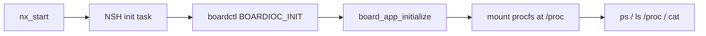
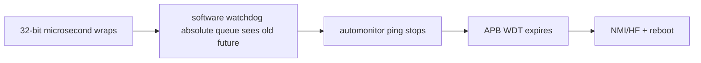

> **事实截止日期**：2026-08-04
> **权威来源**：[N2 NSH](../nuttx-port/n2-nsh-console.md)、[N3 procfs/ps](../nuttx-port/n3-procfs-ps.md)、[N4 时钟](../nuttx-port/n4-d0-clock-diag.md)、[N5 Flash/LittleFS](../nuttx-port/n5-flash-filesystem.md)、[N6 SDK 集成](../nuttx-port/n6-sdk-integration-framework.md)、[4295 秒修复](../nuttx-port/n6-bug-4295s-timer-wrap.md)
> **证据边界**：本章按历史阶段解释 CP N1～N6。N5 当时的 data 地址后来在 N15 迁移；当前地址必须以第 09/11 章为准。

# 04 CP NuttX 地基：N1 到 N6

## 1. 为什么要拆成六个小阶段

嵌入式 bring-up 最怕“一次打开所有功能”：失败时无法判断是启动、时钟、中断、串口、存储还是 SDK。项目采用逐层加能力的方法：

| Stage | 新增能力 | 最小通过标志 |
|---|---|---|
| N1 | Tier-1 跳到 CP NuttX 早期入口 | 早期 UART banner |
| N2 | 调度器 + UART RX + 交互 NSH | `help`、`uname`、`echo` 可交互 |
| N3 | procfs + `ps` | `/proc` 挂载且任务可见 |
| N4 | 时钟诊断与 SysTick 记账 | wall-clock 与实际频率一致 |
| N5 | raw Flash → MTD → LittleFS | 文件跨重启保持 |
| N6 | SDK wrapper、IRQ/GPIO、长时间稳定性 | 真实 IRQ/GPIO 与 5834.58 s uptime |

每一层都保留上一层能力作为回归门禁。

## 2. N1：先证明“能进 NuttX”

N1 不急着启动完整 shell。它只证明：

1. CP linker script 把向量和 app magic 放对；
2. postbuild 能生成 32+2 physical image；
3. Tier-1 能验证 MSP/reset/magic；
4. `__start` 能在 UART1 打出早期字符。

这个阶段把“BootROM/Tier-1/打包/链接”与后面的“内核调度/驱动”分开。如果 N1 都没有字符，排查范围就不该跳到 NSH 或文件系统。

## 3. N2：从只能打印到可交互 NSH

### 3.1 启动器先解锁调度器

CP `__start` 的关键顺序是：


其中 FPU `FPCCR` 的 ASPEN/LSPEN 残留曾导致第一次异常进入 lazy-stacking 路径时挂死。修复留在 team overlay，official NuttX 未修改。

### 3.2 UART RX 的四个叠加 bug

能看到 `nsh>` 只证明 TX；敲键无反应说明 RX 链仍坏。最终发现四个问题必须同时修：

| Bug | 根因 | 最小修复 | 若只修一半 |
|---|---|---|---|
| 1 | 共用 FIFO register 的 RX 在 bits `[8:15]`，旧代码读了 TX `[0:7]` | 右移 8 再取 byte | ISR 有触发但字符错误 |
| 2 | UART `rx_enable` 没开 | 在 setup 中只 OR bit1，保留 baud/TX | FIFO 永远收不到有效字节 |
| 3 | 外设、BK ICU、NVIC 三道中断门没全开 | `irq_attach` 后按层使能 | ISR 永不进入 |
| 4 | RX threshold 默认 0，条件永真 | threshold 设为 1 | 一开中断就 ISR storm |

三道门可以理解为：


`ICU_PRI_IRQ_UART1=26` 是优先级表索引，不是 NuttX IRQ。真实 NuttX IRQ 是 `16 + 15 = 31`。这类“数字看起来像 IRQ”是新手最容易踩的坑。

### 3.3 N2 日志逐行读

```text
u_bootloader enter
partition app @ 0x02010000
jump to:0x02010000
JMP
NuttShell (NSH)
nsh> uname -a
NuttX 0.0.0 ... arm bk7258_t5ai
nsh> echo hello
hello
```

| 行 | 层次 | 意义 |
|---|---|---|
| 前四行 | Tier-1 | app 校验与 handoff |
| `NuttShell` | NuttX init task | 调度器和 console 已运行 |
| `uname -a` | NSH 命令 | 命令解析和 stdout 正常 |
| `arm bk7258_t5ai` | build identity | 当前是本板 BSP |
| `echo`/`hello` | RX→readline→command→TX | 交互闭环，不只是单向打印 |

N2 因而是 `board-verified`，不是“看到 banner 就算过”。

## 4. N3：让系统能观察自己

N3 启用 procfs，并在 team-owned `board_app_initialize()` 中挂到 `/proc`。调用关系是：



为什么这一步重要：

- `ps` 能看到 task 状态、优先级和栈；
- `/proc/uptime` 后来成为 4295 秒问题的关键证据；
- 新功能不能只靠“没死机”，还要能观察资源和生命周期。

N3 的 board 验证包含从提交源码重新构建后的第二轮镜像，避免“板上跑的是未提交临时 binary”。

## 5. N4：先量时钟，再改时钟

### 5.1 为什么 `sleep 10` 曾不到 4 秒

下载器 reboot 路径留下约 80 MHz 的运行状态，而早期 SysTick 记账仍假设 26 MHz。硬件走得更快、软件仍按慢时钟换算，于是 10 秒逻辑等待只消耗约三分之一 wall time。

N4-D0/D0D 的正确做法不是立即改 PLL，而是：

1. manual reset 与 loader reboot 分开测；
2. 用 DWT cycle counter 独立测真实频率；
3. 让 runtime SysTick bookkeeping 跟随已观测频率；
4. 再用 wall-clock 和 `ps` 复核。

### 5.2 100 Hz 是兼容性选择

Cortex-M SysTick reload 只有 24 bit。tick 太慢时，高频 CPU 的 reload 可能越界；项目最终采用 100 Hz 兼容设置，而不是为了“数字越大越好”直接上 1000 Hz。

### 5.3 为什么 CP 不是 480 MHz、AP 可以是 480 MHz

早期 N4 把共享时钟源名称当成了 CPU0 频率。固定的 SDK v3.1.1.9 表实际规定：

- OPP 240M：CPU0/AP/Bus 都是 240 MHz；
- OPP 320M：CPU0/AP/Bus 是 160/320/160 MHz；
- OPP 480M：CPU0/AP/Bus 是 240/480/240 MHz。

因此 CP NuttX（物理 CPU0）的正式上限是 240 MHz，AP NuttX（物理 CPU1/CPU2）
才使用 480 MHz。直接把 CPU0 divider 改成 `/1` 强跑 480 MHz 不属于 SDK 正式 OPP。
完整寄存器、电压和验证契约见
[BK7258 SDK 时钟 OPP 与每核频率契约](../../chips/bk7258/sdk-clock-operating-points.md)。

## 6. N5：从裸 Flash 到文件

### 6.1 三层抽象

```mermaid
flowchart TD
    F[Integrated Flash hardware] --> R[raw read/erase/program]
    R --> M[NuttX MTD lower-half]
    M --> B[/dev/mtdblock0]
    B --> L[LittleFS mounted at /data]
    L --> P[probe.txt persistence]
```

| 层 | 解决的问题 |
|---|---|
| raw | 芯片命令、状态位、erase/program/read 粒度是否正确 |
| MTD | 把硬件变成 NuttX 标准 block/erase API |
| LittleFS | 目录、文件、掉电友好元数据与 mount |

Flash 接口报告 JEDEC identity `0xc86517`，与 GD25WQ64E 的命令身份兼容；这说明接口/容量契约，不是“板上一定焊有一颗独立同型号芯片”的证明。当前 T5-AI 使用的是 BK7258 集成 Flash 资源。

### 6.2 两个典型 bug

- 初版 MTD read 用 16-byte 步长，但控制器 read burst 需要 32-byte、`0x20` 对齐；修为 read32。
- LittleFS 默认 size factor 4 会得到 `read_size=16384 > block_size=4096`；team defconfig 把 read/program/cache factor 设为 1。

### 6.3 持久化才是文件系统验收

第一次 boot 创建 `/data/probe.txt` 并 `sync()`，下一次 boot 读回 `BK7258LFS-OK`。只有 format、mount、write、reset 后 read-back 全闭环，N5-D7 才标为 filesystem `board-verified`。

N5 当时的 data candidate 位于 raw `0x00100000` 附近；N15-M 后来迁移并冻结了新布局。请勿拿本章历史地址执行当前下载，当前布局只看第 09/11 章和生成的 partition manifest。

## 7. N6：把官方 SDK 能力接入 NuttX

### 7.1 静态库不是直接“丢进链接器”

N6 建立了 CP/AP role bundle、checksum manifest、头文件 ABI、Kconfig/Make.defs gate 和 post-link verifier。wrapper 的作用是：

- 让 NuttX 拥有 task/IRQ/文件系统语义；
- 复用 v3.1.1.9 已验证的底层硬件实现；
- 不永久修改 SDK source 或 archive；
- 通过 ELF 证明 wrapper/真实符号究竟谁被链接。

N6 完成了 80-slot RAM vectors、SDK source 到 NuttX IRQ bridge、TIMER1、GPIO LED/key/edge interrupt 和 GPIO lower-half 的板端验证。

### 7.2 4295 秒重启不是 WDT 本身坏了

旧配置使用 32-bit `clock_t`：

```text
CONFIG_TIMER_ARCH=y
CONFIG_USEC_PER_TICK=10000
# CONFIG_SYSTEM_TIME64 is not set
```

| 行 | 含义 | 问题 |
|---|---|---|
| `TIMER_ARCH` | 使用 arch timer 提供系统 tick | 会走 `current_usec()` |
| `10000` | 每 tick 10,000 µs，即 100 Hz | 乘法结果按微秒增长 |
| TIME64 未开 | `clock_t`/中间乘法为 32 bit | 在 `2^32 µs` 折返 |

折返点是：

```text
2^32 microseconds = 4294.967296 seconds
```

即使函数返回 `uint64_t`，右侧 `timebase * 10000` 仍先按 32 bit 算完，再扩宽；丢掉的高位不会回来。



所以 WDT 是最后执行复位的人，不是根因。关 WDT 只能掩盖系统时钟折返。

最小正式修复只改 team defconfig：

```text
CONFIG_SYSTEM_TIME64=y
```

| 行 | 含义 | 为什么有效 | 若删掉 |
|---|---|---|---|
| `CONFIG_SYSTEM_TIME64=y` | `clock_t` 和相关运算使用 64 bit | `timebase * 10000` 保留高位 | 约 4295 秒必然再次折返 |

最终 ELF 出现 64-bit load/multiply/carry 指令，实板 `/proc/uptime` 单调增长到 `5834.58` 秒，跨过旧折返点和多个 WDT 窗口，没有再出现 `HFu_bootloader enter`，因此标为 `board-verified`。

## 8. N1～N6 的共同方法

1. 先做最小可观察输出；
2. 每次只增加一层抽象；
3. 地址、IRQ 和时间都用独立证据交叉校验；
4. “源码存在”之后还要查 ELF；
5. “板上有输出”之后还要完成正例、负例、重启和持久化闭环；
6. 正式修复只回到 team overlay。

下一章进入物理 CPU1/CPU2 的 AP NuttX 与 SMP。
