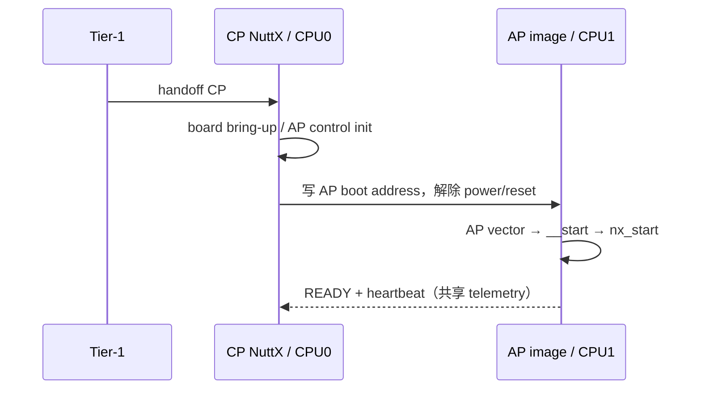
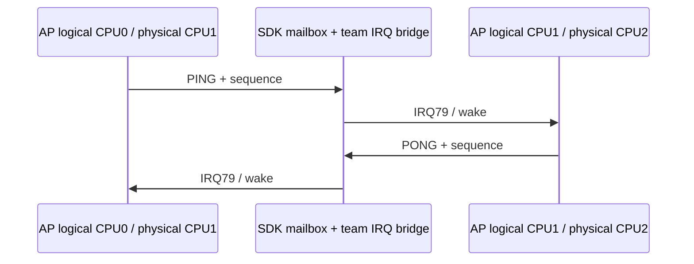

> **事实截止日期**：2026-08-04
> **权威来源**：[N7 AP 单核](../nuttx-port/n7-ap-singlecore-bringup.md)、[N7 HardFault](../nuttx-port/n7-bug-cpu0-task-exit-hardfault.md)、[N8-A](../nuttx-port/n8-a-cpu2-probe-bringup.md)、[N8-B1](../nuttx-port/n8-b1-smp-secondary-bootstrap.md)、[N8-B2](../nuttx-port/n8-b2-bidirectional-ipi.md)、[N8 cold-reset 复盘](../nuttx-port/n8-cold-reset-resolution-report.md)
> **证据边界**：N7/N8 各 gate 均有真实板端证据；N8-D1 只证明 scheduler quiesce/resume 基础，不声称 CPU hot-unplug。physical reset 已验证，完整断电未验证。

# 05 AP NuttX 与 SMP：N7 到 N8

## 1. 先把三个“CPU0”分清

| 说法 | 真实物理核 | 所属 OS |
|---|---|---|
| CP / physical CPU0 | CPU0 | CP NuttX（单核） |
| AP logical CPU0 | CPU1 | AP NuttX SMP |
| AP logical CPU1 | CPU2 | AP NuttX SMP |

因此“AP CPU0 gateway”不是 CP。它是 AP 这个 NuttX 实例内部的 logical CPU0，也就是 physical CPU1。

## 2. N7：先让 physical CPU1 独立跑一个 NuttX

在直接做 SMP 之前，项目先把 physical CPU1 当作 AP-UP（uniprocessor）启动：

AP 是独立链接的第二个 NuttX image，有自己的：

- vector/VTOR、MSP、linker script；
- `.data`、`.bss`、heap；
- SysTick、scheduler 与 idle task；
- SDK `ap` role archive。

N7 的验收不只是“CPU1 有一行日志”，而是检查 runtime VTOR/MSP、320 MHz、SysTick、heap、READY 和持续 heartbeat。这样才能把“AP image 本身问题”与后续“CPU2/SMP 问题”分开。

## 3. N7 期间的 CPU0 task-exit HardFault

当 AP 启动后，CP 偶发在 task 退出时 HardFault。早期 J-Link 看到 `0xaaaaaaaa` 栈填充值，很容易误判为普通 stack overflow；真正根因是两件事叠加：

1. task exit/调度路径可能恢复一个 NULL/无效 context；
2. 非 HIPRI IRQ 发生嵌套时，team STAR IRQ bridge 没有完整保持 NuttX 期望的上下文规则。

最终修复只涉及四个 team-overlay 文件，official NuttX 未修改。这个案例的重要方法不是背代码，而是：

| 误导证据 | 为什么不够 | 最后依靠什么收敛 |
|---|---|---|
| PSP 附近出现 `0xaaaaaaaa` | 它也可能只是未用栈填充 | stacked PC/LR、调度上下文和复现时序 |
| fault 出现在 task exit | 不等于 exit 函数本身写坏内存 | IRQ nesting 与 context restore 联合路径 |
| 改大栈后概率下降 | 只改变时序 | 结构化 fault frame 与最小 overlay 修复 |

## 4. N8 为什么拆成很多 gate

从“CPU2 能执行一条指令”到“两个核能安全调度普通任务”，中间有很长的可信度阶梯：

| Gate | 新增证明 | 尚未证明 |
|---|---|---|
| N8-A | physical CPU2 进入 freestanding probe，vector/VTOR/MSP 正确 | NuttX scheduler online |
| N8-B1 | `up_cpu_start()` secondary bootstrap 到 `SECONDARY_READY` | 双向 IPI、普通 task |
| N8-B2 | logical CPU0↔CPU1 双向 IPI | scheduler 已接管 CPU1 |
| N8-C1 | CPU1 进入 `nx_idle_trampoline()`，`online=0x3` | 普通 task 默认迁移 |
| N8-C2 | 一个显式 affinity `0x2` task 在 CPU1 完成 | 重复 wake/双向同步 |
| N8-C3/C4 | semaphore remote wake 单次/8 次 | 双向 ping-pong |
| N8-C5 | CPU0/CPU1 两 task 双向 semaphore ping-pong | CPU1 本地多 task |
| N8-C6 | 两个 CPU1 task 本地调度交接 | task migration |
| N8-C7 | 单 task 受控 CPU0↔CPU1 migration | timer wake |
| N8-C8 | CPU1 task 8 次 timed wake | CPU hot-unplug |
| N8-D1 | scheduler quiesce/resume 基础回调 | **不支持 hot-unplug** |

逐 gate 的好处是：出错时知道最后一条可信边界在哪，不会把 mailbox、secondary stack、scheduler 和业务 task 混成一个问题。

## 5. N8-A/B1：启动第二颗 AP 核

physical CPU2 启动前必须准备：

- CPU2 vector 和 Thumb reset；
- 合法 MSP、interrupt stack、IDLE stack；
- per-core VTOR；
- `.data/.bss` 已由 AP primary 准备好；
- core-id 映射为 AP logical CPU1。

N8-B1 到 `SECONDARY_READY` 时，CPU2 仍可以停在受控 park/WFI；此时 `online_mask=0x1` 是刻意边界，不代表失败。只有 N8-C1 把它交给 NuttX idle trampoline 后，才应该看到 `online=0x3`。

## 6. N8-B2：IPI 是 SMP 的“门铃”

IPI（inter-processor interrupt）不承担大数据，只负责通知另一核“有调度/调用工作要处理”。

数据面复用 official v3.1.1.9 mailbox/cross-core public能力，NuttX 侧由 team wrapper 接入 IRQ。CPU2 第一次 IRQ 曾触发 NOCP fault，原因是每核的 CPACR/FPCCR 没初始化；补齐 per-core FPU/exception 状态后，`apitest 1`、`apitest 100`、restart、stop/start 与三轮 cycle 才闭环。

## 7. N8-C：从 idle 到真实调度

### 7.1 C1 的关键跃迁

CPU2 从自制 park loop 进入 NuttX `nx_idle_trampoline()` 后：

- NuttX 把 logical CPU1 标 online；
- SMP-call 能 CPU0→CPU1→CPU0 自动闭合；
- CPU1 使用独立 interrupt stack；
- heartbeat、CPU0 SysTick、sleep enter/return 持续增长。

普通 task 默认 cpuset 仍保持 `0x1`。这是一种安全策略：先让 transport/测试显式绑定，避免尚未验证的任意迁移。

### 7.2 为什么每个调度测试都用“精确计数”

例如 C5 的 8 轮 ping-pong 预期：

- CPU0→CPU1：初次 dispatch 1 次 + 8 次 wake = `+9`；
- CPU1→CPU0：8 次 reply wake = `+8`；
- 总 SMP calls = `+17`。

只看到“两个 task 都打印了”无法排除丢中断、合并、重复回调或其实都跑在同一核。精确的 tx/rx/call delta 与 PID release 才能证明路径闭合。

## 8. D1 为什么返回 `-ENOTSUP` 也算通过

N8-D1 目标是建立 quiesce/resume 生命周期基础，不是实现运行时拔掉 CPU1。回调在 logical CPU1 进入/退出、计数和状态都正确，实际 hot-unplug 请求明确返回 `-ENOTSUP`（`-138`）。

这叫 **fail-closed**：不支持的操作明确拒绝，比假装成功但留下半在线 scheduler 更安全。

## 9. Warm restart、physical reset 与 power cut

| 操作 | 本项目含义 | N8 证据 |
|---|---|---|
| warm restart | 软件控制 AP stop/start 或 generation restart | 已验证 |
| COM7 RTS physical reset | 板级 RST，日志出现新 `BClk` 启动 | 3/3 已验证 |
| J-Link RST | RST 线已连接，但具体 commander path需单独证明 | 不替代既有 RTS 证据 |
| power cut | VDD 真正消失后再上电 | 未验证 |

N8 cold-reset 修复覆盖 UART GPIO/clock/TX-empty handoff、boot cache/MPU、watchdog ownership、CPU2 handshake 和有界 poll scheduling。最终无 checkpoint 镜像 warm 3/3、RTS reset 3/3 都回到 NSH，并保持 AP READY、CPU2 scheduler online、已启用 SMP gates PASS。

USB 与 J-Link 同时供电时，关掉 J-Link 供电并不等于断电，因为 USB 仍维持板上 VDD。因此文档始终把 reset 与 power cut 分开。

## 10. N7/N8 留下的可复用架构

1. CP 只负责 AP 生命周期，不把 physical CPU2当独立 remote。
2. AP 是一个原生 NuttX SMP 实例。
3. AP logical CPU0 是硬件/传输 gateway；logical CPU1 可作为业务 producer。
4. 默认 cpuset 保守，复杂调度通过显式、有限、可计数的 gate 开放。
5. 所有等待有上界，所有不支持能力明确失败。

这些约束直接成为 N9 RPTUN/RPMsg 的基础。
