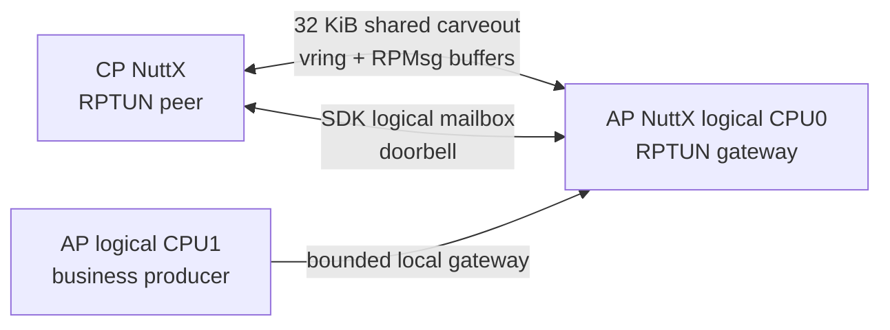
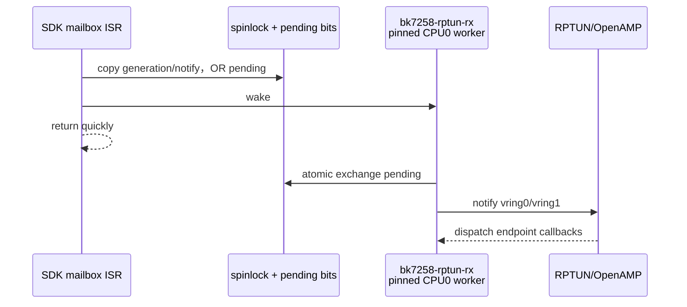
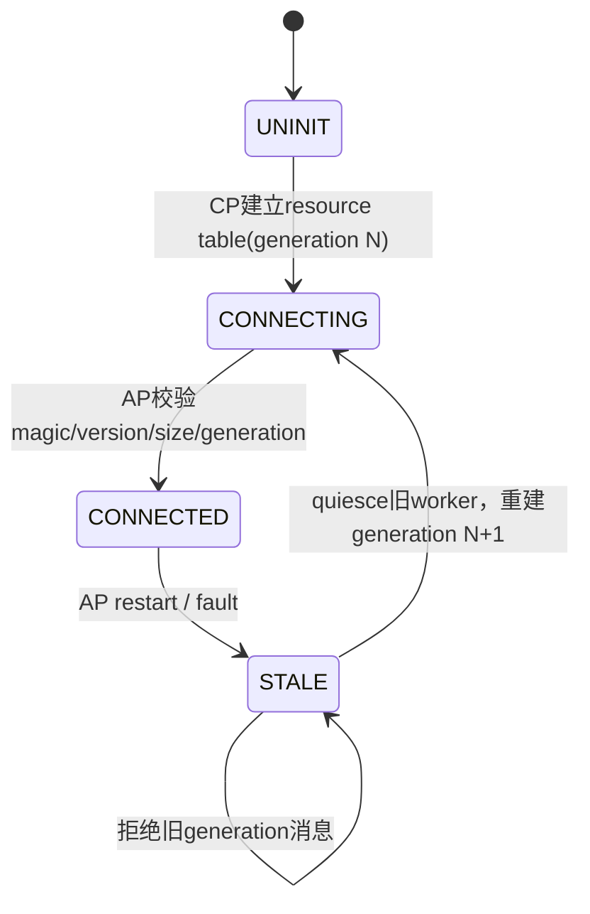
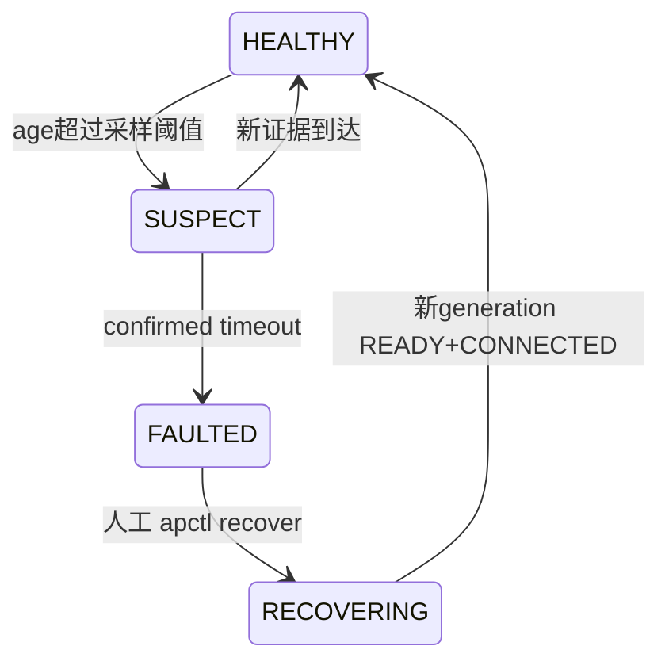

> **事实截止日期**：2026-08-04
> **权威来源**：[RPTUN 架构调研](../nuttx-port/cp-ap-rptun-architecture-research.md)、[N9 完成记录](../nuttx-port/prompts/09-n9-rptun-rpmsg.md)、[N9 源码复核](../nuttx-port/n9-rptun-source-verification.md)、[N10 supervision](../nuttx-port/prompts/10-n10-ap-supervision.md)、[N11 RPMsgFS](../nuttx-port/prompts/11-n11-rpmsgfs.md)
> **证据边界**：N9～N11 均为当前固定 non-cacheable、单 CP↔AP link、受限 worker 模型的板端结论；不自动推广到 cache-on、大共享数据面或第二条 link。

# 06 核间通信、健康监督与远程文件系统：N9 到 N11

## 1. 先用一句话区分五个名词

| 名词 | 在本项目里做什么 |
|---|---|
| mailbox | 很小的硬件“门铃”，通知对方有事件 |
| shared memory | 真正保存 vring、buffer 和控制状态 |
| OpenAMP | 提供 remoteproc/virtio/RPMsg 的通用框架 |
| RPTUN | NuttX 把远端处理器和 OpenAMP 接起来的 lower-half |
| RPMsg | 在 virtio vring 上提供 endpoint 消息 |

mailbox 不是数据总线。它只发 edge/notify；数据在 shared memory 中。

## 2. N9 的最终拓扑



关键约束：

- 整个 AP SMP 只有一个 RPTUN peer；
- AP logical CPU0（physical CPU1）拥有 mailbox IRQ、RX worker 和 OpenAMP 调用；
- AP logical CPU1 不直接进入 OpenAMP，先把请求交给 CPU0 gateway；
- 不切换 BMP，不创建 CPU2 第二 link。

## 3. 32 KiB shared carveout 怎么放

最终固定区间：

```text
0x28097000 .. 0x2809efff  = 32 KiB RPTUN/RPMsg carveout
```

| 邻近区域 | 作用 | 约束 |
|---|---|---|
| AP image/heap/CPU2 stacks | AP 私有运行区 | linker 上界不得进入 carveout |
| `0x2809f000..0x2809f6ff` | team telemetry | 不扩成整页覆盖 vendor 区 |
| `0x2809f700..0x2809f7ff` | vendor PWR_MNG | 必须保留 |
| `0x2809f800..0x2809ffff` | vendor SWAP/tail | 必须保留 |

resource table、两个 vring 和 RPMsg buffers 的实际布局由编译时常量计算并由 verifier 检查。最终 32 KiB 中仍有 `0x4cc0` spare；这比“手算大概够”更可靠。

## 4. 为什么 ISR 不能直接跑 OpenAMP

SDK mailbox callback 发生在 ISR 上下文。ISR 必须短、不可阻塞，而 OpenAMP/RPMsg callback 可能申请 buffer、唤醒 task 或调用 endpoint。



线程优先级也经过验证：board RX worker 225、stock RPTUN worker 224，AP primary 管理循环更低。这样 transport 不会被普通任务饿死，又不会在 ISR 内做复杂工作。

## 5. mailbox 是 edge，shared pending 是 truth

SDK logical channel 是 one-deep/edge-triggered：第二个通知到来时，硬件 edge 可能被合并。项目因此采用：

1. producer 先在 shared control word 原子 OR 对应 vring bit；
2. DMB 保证数据与 pending 对对方可见；
3. 再发 mailbox edge；
4. worker 醒来后循环 drain shared pending；
5. mailbox busy 时保留 coalesced notify，稍后 bounded retry。

这样 mailbox 只是“提醒去看”，真正不能丢的状态在共享内存。

## 6. generation 防止旧链路复活

control header 使用非零 `uint32_t generation`。CP 每次 AP lifecycle 重启递增 generation：



generation 0 保留为 invalid。AP 不只看 magic，还检查 size 和 generation；CP 在清 shared SRAM 前先 quiesce 旧 AP/RPTUN worker。这样迟到的 mailbox edge 或旧 endpoint 不能污染新连接。

## 7. RPMsg endpoint 与 Name Service

RPMsg 的 endpoint 类似“带名字的收件箱”。Name Service 让一侧发布服务名，另一侧动态绑定，不需要手写固定 endpoint address。

N9 验证覆盖：

- CP/AP CONNECTED；
- AP logical CPU0 与 CPU1 两个 producer；
- payload 到满帧（当前有效 payload 496 bytes）；
- idle/load 多轮 echo；
- generation reconnect；
- RPMsg syslog probe；
- 兼容 profile 构建。

实板 `bkrpmsgtest run 100 464 load 60000` 与六场景 suite 均闭环，heap 前后稳定。

## 8. N10：通信“能用”之后还要知道“何时坏了”

supervisor 同时观察三路信号：

| 信号 | 代表什么 | 超时分类 |
|---|---|---|
| primary heartbeat | AP logical CPU0 主循环活着 | `PRIMARY_TIMEOUT` |
| secondary heartbeat | AP logical CPU1 scheduler/业务活着 | `SECONDARY_TIMEOUT` |
| RPMsg sequence/health | transport 仍双向推进 | `RPMSG_TIMEOUT` |

三路分开很重要：AP 主循环活着不代表 CPU2 scheduler 活着，也不代表 RPMsg vring 还前进。

故障状态机：



进入 `FAULTED` 后旧 RPTUN 立即 fail-closed，测试返回 `-ENOTCONN`，不能用 `inject clear` 绕过。自动恢复默认关闭，因为无人值守 restart 是新的产品策略，不应在基础移植阶段偷偷开启。

## 9. N11：AP 不拥有 Flash，为什么还能读文件

CP 继续独占 Flash、MTD 和 `/data` LittleFS。N11 使用 stock NuttX RPMsgFS：


AP mount 参数的含义是：

```text
cpu=cp,fs=/data
```

| 字段 | 含义 | 错了会怎样 |
|---|---|---|
| `cpu=cp` | 远端 RPMsg CPU 名为 `cp` | Name Service 找不到 server |
| `fs=/data` | server 端根目录是 CP `/data` | 访问错误目录或 mount 失败 |

AP 本地把它挂为 `/cpdata`，但这不改变 ownership：所有真实 Flash I/O 仍由 CP 执行。

## 10. 为什么 RPMsgFS 要放专用 worker

stock RPMsgFS server endpoint callback 会同步执行 file open/read/write；client 的同步 wait 也没有通用 per-request deadline。如果让 AP main、RPTUN RX 或 CPU1 scheduler 直接做文件 I/O，一次断链就可能把管理路径一起卡住。

项目采用受限方案：

- endpoint callback 只校验 generation/sequence 并投递；
- AP logical CPU0 的可丢弃专用 worker 执行 `/cpdata` 操作；
- CP 控制命令有 bounded deadline；
- 断链时由 AP restart 回收旧 generation worker；
- 第一版限制文件大小和操作次数。

这不是声称 stock RPMsgFS 每个 POSIX 调用都能自行 timeout，而是把无法取消的阻塞限制在可随 generation 回收的 worker 中。

## 11. N11 暴露的两个深层问题

### 11.1 static lock 必须放 exclusive-monitor 区

首轮 payload 1 成功、payload 64 失败，根因不是 RPMsgFS，而是 AP SMP static lock 放错 SRAM。official v3.1.1.9 说明 BK7258 SRAM 的 exclusive monitor 有专用 64 KiB 区：

```text
0x28000000..0x2800ffff  AP exclusive-state / static-lock
0x28010000..0x2804ffff  CP RAM
0x28050000..            AP/RPTUN/telemetry
```

AP linker 增加 `.spinlock_data/.spinlock_bss`，启动 CPU2 前复制/清零。verifier 对 scheduler、IRQ、PID、timer、mailbox、RPTUN 等 lock 逐符号检查。这个修复是 team linker/wrapper 约束，没有改 NuttX/SDK。

### 11.2 100 Hz 下 `usleep(1000)` 不等于 1 ms

100 Hz 时一个 tick 是 10 ms，`nxsig_usleep(1000)` 会向上取整到一个 tick。循环 3000 次实际可接近 30 s，而不是 3 s。

正确 wrapper 使用：

- `clock_systime_ticks()` 记录开始 tick；
- `MSEC2TICK()` 把 deadline 转为 tick；
- 比较真实 elapsed tick；
- sleep 只负责让出 CPU，不再拿循环次数冒充毫秒。

## 12. N9～N11 的验收结果

| Stage | 最终板端闭环 |
|---|---|
| N9 | single link、双 producer、满帧、syslog、warm reconnect |
| N10 | 三类注入、旧链 fail-closed、人工 recover 到新 generation |
| N11 | 1/64/464/1024 bytes 文件操作、20轮、heap稳定、RPMsg并发、recover后重挂载 |

这里最大的架构成果不是“能发消息”，而是明确了 IRQ/worker/CPU affinity、generation、ownership、阻塞隔离和失败恢复边界。
