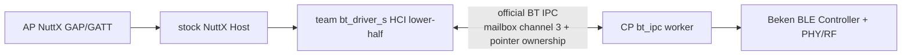
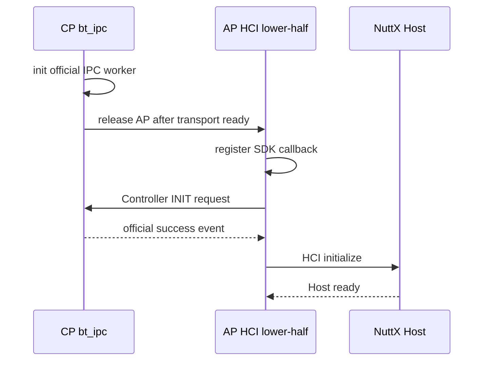
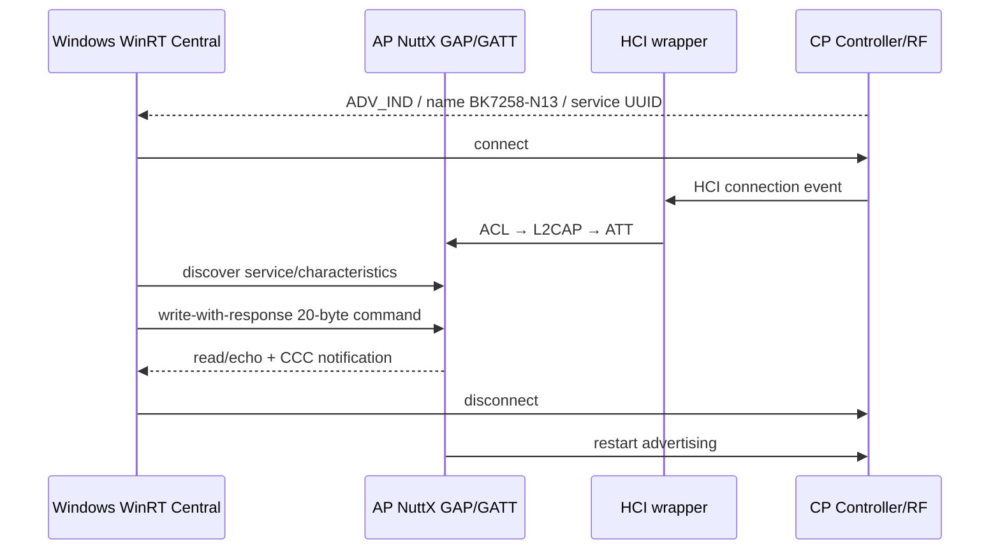

> **事实截止日期**：2026-08-04
> **权威来源**：[N12 Bluetooth IPC/HCI wrapper](../nuttx-port/n12-beken-bt-ipc-wrapper.md)、[N13 计划与完成记录](../nuttx-port/prompts/13-n13-ble-gap-gatt.md)、[N13 源码复核](../nuttx-port/n13-ble-gap-gatt-source-verification.md)、[N13 证据索引](../nuttx-port/n13-evidence-index.md)
> **证据边界**：N12/N13 的批准首版范围已 board-verified；它不包含配对/加密安全、bond、Mesh、多连接、Wi-Fi 数据面或 AP-only Bluetooth warm restart。

# 07 Bluetooth：N12 Controller/Host 分核与 N13 GAP/GATT

## 1. 蓝牙不是一个“驱动”

一个完整 BLE 栈至少分两层：

| 层 | 负责什么 | 本项目 owner |
|---|---|---|
| Controller | RF、Link Layer、HCI command/event/ACL | CP 上的 Beken v3.1.1.9 official Controller |
| Host | HCI 上层、L2CAP、ATT、GAP、GATT | AP 上的 stock NuttX Bluetooth Host |

HCI 是 Controller 与 Host 的边界。项目没有同时运行 Beken Host 与 NuttX Host，否则两个 Host 都会认为自己拥有连接、GATT 数据库和 buffer。

## 2. N12 最终数据路径



通用 service（syslog、test、RPMsgFS）继续走 RPTUN/RPMsg；Bluetooth HCI 走 official `MB_CHNL_BT_CMD`。原因是 vendor Controller archive 已实现并依赖自己的指针所有权、source-core free acknowledgement 和 lifecycle。再套一层 RPMsgHCI 只会形成双重 transport。

## 3. “跨核传指针”为什么特别危险

official BT IPC 不是把 packet 内容复制进一个通用 RPMsg frame，而是传递两核可见的 buffer pointer：

1. source core 分配 packet；
2. mailbox ISR 只把 pointer 投递到 SDK queue；
3. `bt_ipc_thd` 在线程上下文处理；
4. AP wrapper 验证 HCI header 与总长度，复制成 NuttX 可拥有的 packet；
5. receiver 用 `HCI_FREE_PKT` 通知 source core 释放原始 buffer。

如果提前释放、重复释放或 AP restart 后拿旧 pointer 当新 generation buffer，都会成为 use-after-free 或 heap corruption。因此 N12 只宣称 cold-start 生命周期；AP-only warm restart 必须先完成 Controller deinit、queue drain、callback注销和所有 pointer return，任一步超时都要拒绝 restart，转整芯片 cold reset。

## 4. AP HCI lower-half 做什么

| NuttX packet | wrapper 行为 | 必须校验 |
|---|---|---|
| HCI command | 解析 3-byte header，调用 official command send | opcode、parameter length、总长度 |
| ACL out | 解析 4-byte ACL header，调用 official ACL send | handle/flags、payload length |
| event/ACL in | SDK callback复制 packet后交 `bt_netdev_receive()` | packet type、header length、完整长度 |

official send API 返回 `void`，所以“本地调用完成”只代表请求交给 SDK，不等于 RF/Controller 已成功。端到端结果必须等 HCI command complete、scan report、connection event或上层 timeout。

`open()` 的语义是：



如果 IPC 或 Controller init 失败，AP 不发布 READY；malformed packet 返回 `-EMSGSIZE`，Host 未 open 时返回 `-ENETDOWN`。

## 5. MAC 地址为什么要持久化

Controller 需要稳定的 BD_ADDR。当前板首次校准时 `sys_rf/sys_net` 都 erased，team wrapper按 official policy：

1. 尝试读取有效 base MAC；
2. 验证 Beken OUI `c8:47:8c`；
3. 都不存在时使用 official TRNG/编排生成；
4. 把 base MAC持久化到 `sys_net`；
5. Controller 使用派生地址。

实板首次生成 base MAC `c8:47:8c:47:47:47`，Controller BD_ADDR 为 `c8:47:8c:47:47:48`；后续只读回读和重启没有重复追加。这里证明的是当前记录字段与生命周期，不代表整个 RF calibration partition 永远逐字节不变。

## 6. 为什么 Bluetooth init 后还要修复 UART

PHY/RF/calibration 和 Controller lifecycle 会触碰共享 UART block。函数返回并不保证 NuttX console 的 pinmux、baud、RX callback和中断仍保持。CP wrapper在 Controller init/deinit 后恢复 UART1 hardware 与 NuttX RX ownership，否则 Bluetooth 成功后 NSH 可能乱码或失去输入。

## 7. N12 的真实 RF 证明

只在无 advertiser 环境运行 scan并得到 `-ENODATA`，只能证明“有界返回”，不能证明 RF 数据面。

正式 N12-V 使用 Windows broadcaster发 manufacturer data，板端收到：

```text
0b ff fe ff 4e 31 32 56 01 02 03 04
```

| byte/字段 | 含义 |
|---|---|
| `0b` | AD structure 后续长度 |
| `ff` | manufacturer specific data type |
| `fe ff` | company ID（little-endian） |
| `4e 31 32 56` | ASCII `N12V` |
| `01 02 03 04` | 固定 payload |

地址、address type、RSSI、adv type、完整 AD payload 都匹配，`info/scan/suite` PASS，才把 N12 升为 board-verified。

## 8. N13：从“能扫描”到“本板作为 Peripheral”

N12 证明了 Controller/Host 和 RF scan；N13 要证明 Windows 能把 BK7258 当 Peripheral：



CP 不运行 GATT server；N13 service owner只在 AP。

## 9. 一张静态 combined GATT table

stock GAP probe完成后，N13停止 stock advertising，注册一张固定的 GAP+N13 combined attribute table，再以 `BK7258-N13` 名称启动 advertising。

为什么不用运行时切换两张表：

- stock Host和custom代码若都认为自己拥有全局 GATT DB，会出现handle漂移；
- Windows cache会放大handle变化；
- 一张固定表更容易做UUID、handle、CCC和重连验证。

首版固定：

- 一个 Central；
- 20-byte read/write-with-response；
- CCC notification；
- request包含 magic/version/sequence/CRC；
- burst最多100帧，并以安全间隔 pacing。

## 10. callback 为什么只 copy/post

HCI pointer必须尽快归还source core，NuttX LPWORK也不能被业务等待占住：

| 上下文 | 允许 | 禁止 |
|---|---|---|
| SDK HCI callback | 校验、复制、交给 Host | 阻塞业务、长期持有SDK pointer |
| GATT read callback | 从锁保护的20-byte snapshot复制response | 等待worker |
| GATT write callback | 校验offset/len/magic/version/CRC，copy到fixed ring并post | 队列满时覆盖旧请求 |
| board service worker | 状态迁移、echo、notify burst、重启advertising | 漂到未验证CPU或无限等待 |

队列满返回 ATT error，不能 drop-oldest；advertising start/stop失败进入可观测 fault，不悄悄假装可发现。

## 11. N13 两个板端兼容修复

### 11.1 connection reference必须归还

stock inbound ACL connection reference若没精确 release，断开后单连接slot仍被占用，下一轮无法复用。board receive-link wrapper补齐一次且仅一次的 release，并由source verifier防double release。最终J-Link读取 `bt_conn.ref=0`。

### 11.2 Controller与Host的advertising状态可能不同步

Controller在连接时自动停止legacy advertising，但Host flag可能仍认为enabled。board connect worker只在已证明的post-connection点同步flag；disconnect worker执行一次完整restart。20/20 uncached reconnect和最终lifecycle计数相等证明没有重复start/stop。

## 12. 为什么不用 BLEDebug.EXE

项目owner明确要求不启动该GUI工具，因为它会让Windows主机明显卡顿。正式验证使用仓库内无GUI WinRT helper：

1. uncached scan并匹配address/name/service UUID；
2. connect；
3. discover service/characteristic；
4. read/write/subscribe；
5. 验证sequence、CRC、count；
6. unsubscribe、disconnect、重新发现。

每一轮都重新发现，不能把Windows缓存中的device/service当作本轮空口成功。

## 13. 板端闭环与边界

| Gate | 结果 |
|---|---|
| 四类invalid frame | length/magic/version/CRC 全拒绝，随后合法请求仍通过 |
| echo/notify | 100/100，CRC error/lost/duplicate均0 |
| reconnect | 20/20 uncached discover/read/notify/disconnect/rediscover |
| coexistence | BLE 100帧 + RPMsg六场景×100；BLE + RPMsgFS四档×20 |
| physical reset | 3/3重新advertise/connect |
| lifecycle | Host/HCI/N13 `25/25/25`，queue/error为0，`bt_conn.ref=0` |

因此 N13 首版 board-verified，但只覆盖单Central、legacy connectable advertising、一个static custom service、20-byte characteristic和CCC notification。不包含security/bond、Mesh、multi-peer、Wi-Fi/BLE并发或product SLA。
