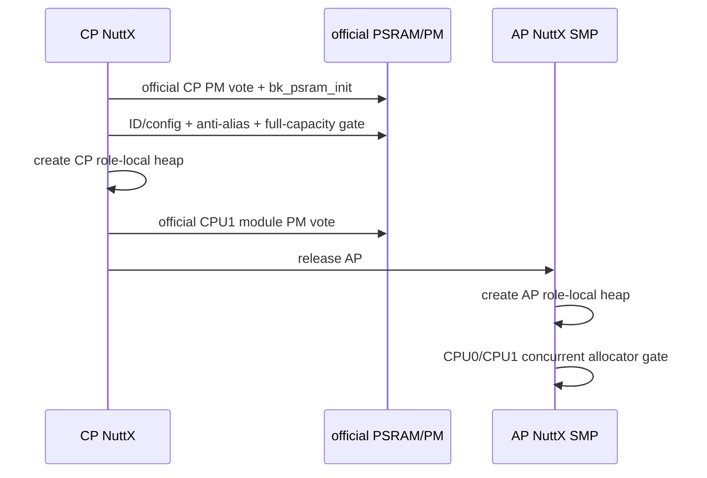
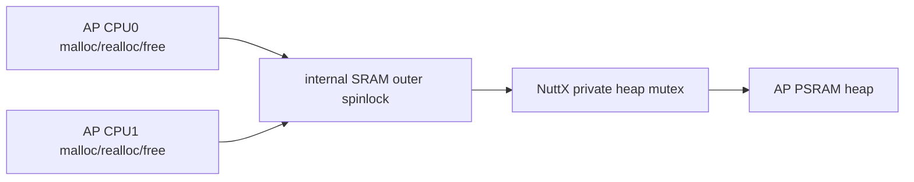

> **事实截止日期**：2026-08-04
> **权威来源**：[N14 完成记录](../nuttx-port/prompts/14-n14-psram.md)、[N14 源码复核](../nuttx-port/n14-psram-source-verification.md)、[N14 证据索引](../nuttx-port/n14-evidence-index.md)、[ADR-002](../../../memory/decisions/ADR-002-n14-psram-ownership-and-layout.md)
> **证据边界**：N14 证明实板16 MiB可寻址、低8 MiB ABI内768 KiB role-local heap及SDK timer；不代表16 MiB全是通用heap，也不覆盖cacheable/DMA coherency、长期性能或温压寿命。

# 08 PSRAM 与 SDK Timer：N14

## 1. 为什么“能读一个地址”不等于有16 MiB

PSRAM地址线或容量配置错误时，较高地址可能 alias到较低地址：写 `0x60800000` 实际改了 `0x60000000`。因此不能只读一个ID或相信产品页。

N14要求：

1. official driver初始化；
2. 读取ID/config；
3. 做跨容量边界anti-alias检查；
4. 在任何heap/AP启动前做一次全容量破坏性pattern gate；
5. 失败就阻断AP release，不能warning后继续READY。

实板识别为APS128XXO：

| 项 | 值 |
|---|---|
| ID | `0x8d08` |
| post-init config | `0x8d1a` |
| physical window | `0x60000000..0x61000000` |
| capacity | 16 MiB |

## 2. owner关系



必须精确表述：

- CP是PSRAM硬件初始化和PM owner；
- AP不调用 `bk_psram_init()`，也不单独投PSRAM PM vote；
- CP/AP各自拥有不重叠的NuttX private heap；
- AP是内存消费者，不是硬件owner。

旧wrapper只调用 `sys_drv_set_cpu1_pwr_dw(0)`，不能替代official CPU1 module 17 power vote；补齐PM链后AP cold启动才稳定。

## 3. 冻结的首版布局

```text
0x60000000 ┌────────────────────────────────────┐
           │ official media/reserved     7 MiB │
0x60700000 ├────────────────────────────────────┤
           │ CP private heap           128 KiB │
0x60720000 ├────────────────────────────────────┤
           │ AP SMP private heap       640 KiB │
0x607c0000 ├────────────────────────────────────┤
           │ AP reserved section       256 KiB │
0x60800000 ├────────────────────────────────────┤
           │ upper physical half         8 MiB │
           │ boot-tested, unallocated            │
0x61000000 └────────────────────────────────────┘
```

| 区域 | 大小 | 运行时策略 |
|---|---:|---|
| `0x60000000..0x606fffff` | 7 MiB | 保留official低8 MiB ABI，不建通用allocator |
| `0x60700000..0x6071ffff` | 128 KiB | CP private heap |
| `0x60720000..0x607bffff` | 640 KiB | AP private heap |
| `0x607c0000..0x607fffff` | 256 KiB | AP reserved |
| `0x60800000..0x60ffffff` | 8 MiB | 全容量boot-tested，默认不分配 |

所以“检测到16 MiB”和“提供16 MiB malloc”是两件完全不同的事。

N15 validation profile后来只在上半区保留一个固定volatile transfer窗口；那不是通用allocator，也不产生持久化语义。

## 4. 为什么首版保持non-cacheable

PSRAM若cacheable，CPU、DMA和两核之间需要clean/invalidate、内存屏障和ownership协议。N14先使用non-cacheable属性，把问题缩小到：

- 地址/容量正确；
- PM正确；
- allocator与SMP锁正确；
- 不引入DMA/cache coherency新变量。

MPU region覆盖可以大于实际容量，但所有allocator/test上界仍以探测到的16 MiB和冻结分区为准。不能因为MPU“允许访问”就越过物理设备或政策边界。

## 5. 为什么 heap control block 不能放PSRAM

初版曾把 `mm_heap_s` control block也放在PSRAM。BK7258这段PSRAM不完成Arm exclusive store，allocator初始化的原子更新会不断失败重试。

正确做法是：

- `mm_heap_s` control block在internal SRAM；
- 由 `mm_initialize_heap()` 管理PSRAM data region；
- board lock也在internal SRAM；
- PSRAM里只放allocator管理的数据block。

这说明“数据可读写”不代表“适合放原子锁/控制结构”。

## 6. AP双核allocator为什么还要outer spinlock

NuttX private heap内部使用可睡眠recursive mutex。AP两个CPU若直接同时进入，在当前SMP/PSRAM组合下可能形成跨核sleeping-lock问题，实板曾同时停在realloc。

board wrapper先用internal-SRAM `spin_lock_irqsave()` 串行化外层：



inner heap仍由NuttX管理；outer lock只保证两个AP CPU不会同时把当前未验证的sleeping mutex推入危险路径。

`realloc` wrapper使用allocate-copy-free语义，不依赖跨区原地扩展。最终CPU0/CPU1固定16/16轮、free前后相同。

## 7. SDK software timer为什么要defer

official SDK timer callback语义是运行在timer daemon task，而不是watchdog/tick ISR。board wrapper因此拆成两步：

1. NuttX watchdog expiry只把事件排队；
2. 固定 `bk-sdk-timer` kthread执行SDK callback；
3. callback可请求self-delete；
4. service等callback返回后才真正free timer object。

如果在ISR直接调用SDK callback，里面的锁、allocation或delete都可能违反上下文；如果callback内立即free自身，返回路径会use-after-free。

`bktimertest`用5 ms period和20 ms长callback制造queued expiry，再在callback中delete，专门覆盖“队列中还有下一次事件”的竞态。

## 8. 关键故障—根因—修复表

| 现象 | 真正根因 | 正式修复 |
|---|---|---|
| AP cold不启动 | 只拉power-down bit，缺official CPU1 PM vote | CP执行完整module PM vote |
| heap init永久卡住 | control block在PSRAM，exclusive store不成立 | control/lock放internal SRAM |
| AP两核都停在realloc | 同时竞争private heap sleeping mutex | board outer spinlock |
| timer self-delete随机崩溃 | callback返回前释放object | deferred final-free |
| 读高地址似乎成功 | 可能是地址alias | anti-alias + full-capacity pattern gate |

所有正式修复都在team wrapper/linker/config中，没有修改NuttX mm或SDK driver/PM/timer源码。

## 9. 板端验证逐项读

Frag-1：

```text
BPSR APTEST status=0 requested=16 completed=16/16
  active=16/16 stage=12/12 errors=0/0 cpu=0/1
```

| 字段 | 说明 |
|---|---|
| `status=0` | 总体成功 |
| `requested=16` | 每个测试producer目标16轮 |
| `completed=16/16` | logical CPU0/CPU1都完成 |
| `active=16/16` | 两路确实进入过allocator活动区 |
| `cpu=0/1` | 不是两个task都偷跑在同一CPU |
| `errors=0/0` | 无内容/边界/allocator错误 |

完整门禁：

| Gate | 实板结果 |
|---|---|
| capacity | raw 1/1，16 MiB anti-alias/full gate |
| CP heap | `bkpsramtest all 256`，256/256，free `131056→131056` |
| AP heap | logical CPU0/1 `16/16`，free稳定 |
| timer | 256 callbacks，20 ms callback，queued self-delete 1 |
| lifecycle | AP cycle 10，restart后再次16/16 |
| reset/factory | physical reset 3/3、final clean、首次校准、校准后cold |
| regressions | RPMsg、RPMsgFS、Bluetooth、SMP、LittleFS全部保留 |

## 10. N14完成后仍不能做什么

- 不把upper 8 MiB直接扩大进heap；
- 不宣称cacheable/DMA coherent；
- 不动态改变CP/AP分区；
- 不把CP硬件owner变成双owner；
- 不用短时测试推导长期性能、wear、温压或产品寿命。

因此N14的准确结论是：**实板16 MiB全容量可寻址，低8 MiB official ABI中的CP 128 KiB与AP 640 KiB role-local heap，以及deferred SDK timer，已board-verified。**
