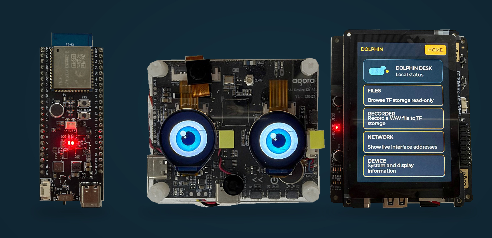
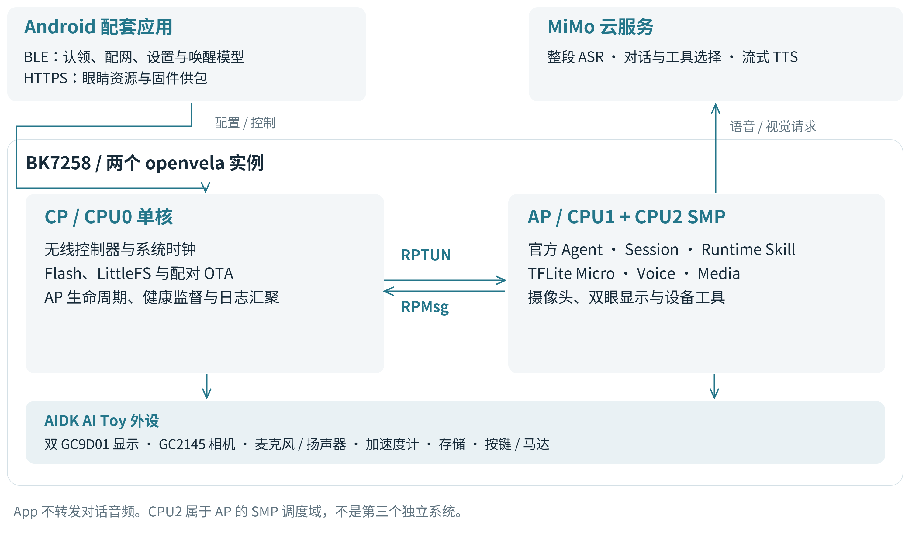
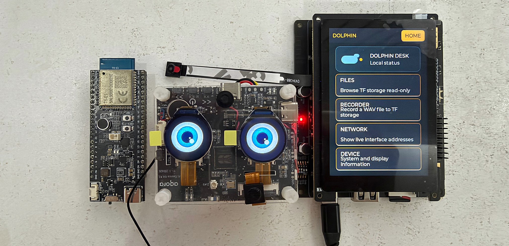
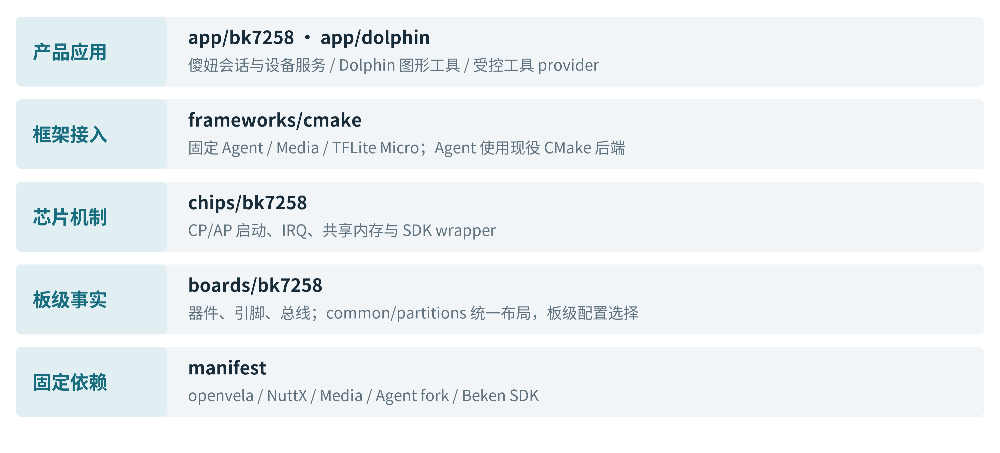
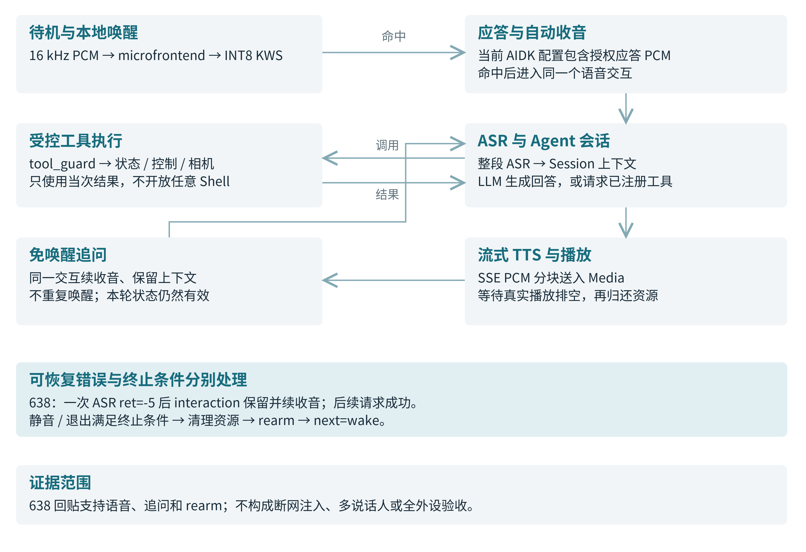
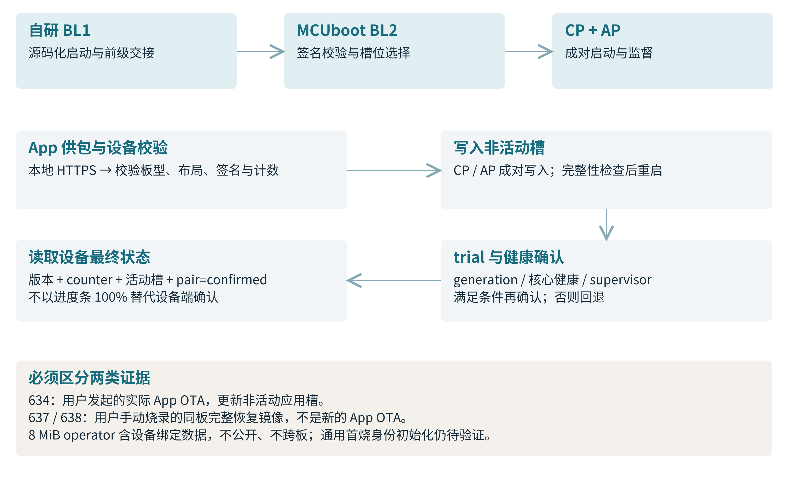
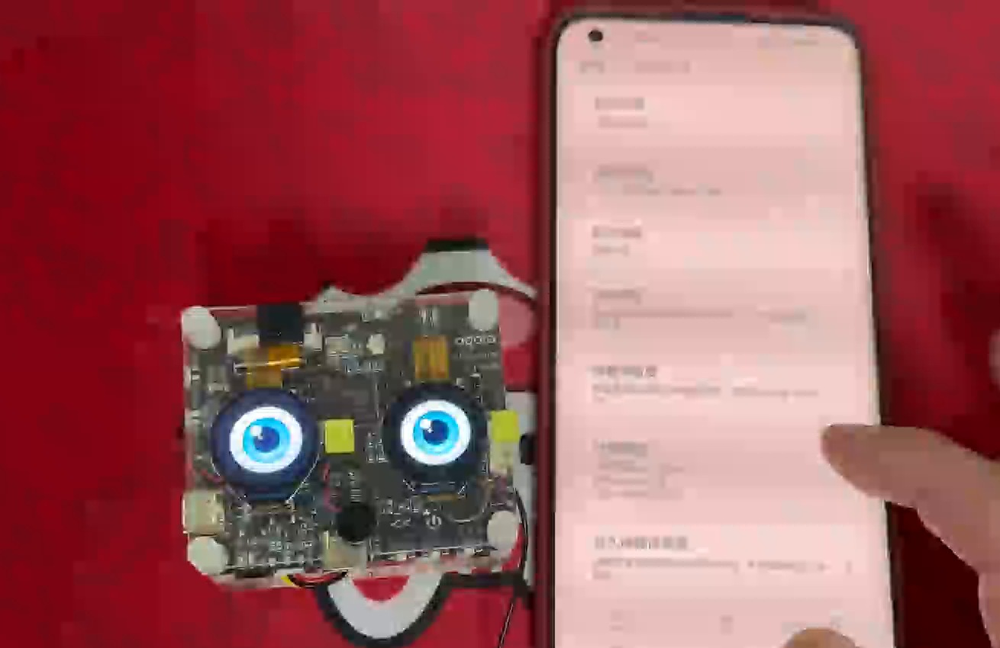

<!-- SPDX-License-Identifier: Apache-2.0 -->
# 傻妞：三核 openvela AI 伴侣

> 2026 首届 openvela AI 硬件开发者大赛 · 勇往直前 · 李健  
> 新硬件平台适配 + AI 硬件产品创新  
> 材料版本 v5.1（必要增量）｜2026-09-20｜事实冻结 `6a8a3e559190fd675db103715b217069cdc4a5ae`

BK7258 平台适配 · Dolphin 图形工具 · 实体 AI 交互。

**阅读约定：** 以原 v5 为底稿，只修正 639/641、新部署入口和资源交付事实。最新显示/身份记录为 641，完整语音仍引用 638，实际 App OTA 仍为 634；不拼成同版本全功能验收。本文与 v5.1 DOCX 的正文、表格和索引同步。

## 导航

[信息表](#information) · [摘要](#abstract) · [绪论](#intro) · [系统方案](#architecture) · [算法原理](#algorithms) · [系统实现](#implementation) · [测试结果](#tests) · [AI-Native](#ai-native) · [总结](#conclusion) · [证据索引](#references)



| 3 核 / 2 镜像 | 3 块开发板 | AI · 多媒体 · 图形 |
| --- | --- | --- |
| CP 单核 + AP 双核 SMP | T5AI-Core / T5-Board / AIDK | 官方框架接入与产品验证 |

<a id="information"></a>

## 1、信息表

**作品信息与成果摘要**

| 项目 | 内容 |
| --- | --- |
| 作品名称 | 傻妞：三核 openvela AI 伴侣 |
| 队伍名称 | 勇往直前（yongwangzhiqian） |
| 参赛方向 | 新硬件平台适配 + AI 硬件产品创新 |
| 成员与分工 | 李健（单人队伍）：平台移植、启动链与驱动、三核协同、应用与模型接入、Android App、构建发布和实板操作；使用 AI 辅助设计、编码、排障与文档整理。 |
| 比赛仓库 | open-vela/contest2026_135_yongwangzhiqian |
| 报告冻结点 | dev-ai-contest-2026 @ 6a8a3e55（2026-09-20；v5.1） |
| 实物形态 | 三块 BK7258 开发板；T5-Board 运行 Dolphin，AIDK AI Toy 运行傻妞。 |

<a id="abstract"></a>

## 2、摘要

本作品面向 BK7258 三核 MCU，建立 CP 单核与 AP 双核 SMP 的 openvela 双镜像平台，复用于三块开发板，承载 Dolphin 与“傻妞”AI 伴侣。接入 Agent、Media、TFLite Micro 和 MiMo，实现唤醒、连续问答、拍照及双屏表情。公开唤醒模型 23,640 B，历史主机回归 281/281 通过；634 完成实际 App OTA，638 取得连续语音证据，639 确认认领与拍照，641 验证两套显示包跨复位保持及 App 重新认领。新增显式数据初始化与身份供应入口；新板首装、身份提交错误、独立多人泛化及长期功耗仍待验证。

**作品定位**

不是把聊天接口接到一块开发板，而是先建立可复用的芯片与板级适配，再交付两类应用。三核指单颗 BK7258 内的 CPU0、CPU1、CPU2；三板指适配复用范围，两者不混用。

281/281 为历史主机测试；634 OTA、635 Skill、637 认领/设置、638 语音、639 拍照及 641 显示/重新认领分别保留证据，不拼成同版本全功能重验。[R06][R23][R24][R36][R37]

## 阅读导航与版本约定

**先看成果，再按证据追到实现**

| 官方章节 | 本报告内容 |
| --- | --- |
| 3.1 绪论 | 真实使用问题、平台挑战与创新点 |
| 3.2 系统方案设计 | 总体框图、三板选型、端云分工、CP/AP 协同 |
| 3.3 核心算法与技术原理 | 公开 KWS 基线、候选评测、MiMo、openvela 能力 |
| 3.4 系统实现 | 源码分层、启动/OTA、BOM、App/Skill、工程门禁与首次烧录边界 |
| 3.5 系统测试与结果分析 | 版本矩阵、功能/性能/稳定性，以及 637—641 分层验收 |
| 3.6 AI-Native 开发说明 | 估算口径、工具与 Token、Skill 和纠偏机制 |
| 3.7 总结与展望 | 成果、目标用户、商业假设与下一阶段门槛 |
| 附录 A—C | 关键历史演进、证据索引、评分维度与提交材料对照 |

**证据采用三层标识**

| 标识 | 含义 | 不代表什么 |
| --- | --- | --- |
| 源码 / 构建 | 代码存在、静态检查或指定配置编译通过 | 不代表已经在设备上运行 |
| 实板记录 | 特定板型、固件和观察窗口内取得数据 | 不代表所有板型或所有后续版本 |
| 用户实机确认 | 由操作者确认语音、显示或单项硬件行为 | 不虚构同一轮完整串口与模型工具轨迹 |

本报告 v5.1 冻结于 6a8a3e55，仅补正 v5（79e37007）之后的必要事实；增量为 51 个提交、29 个变更文件。638 构建源为 dc06613d，641 为 3d68b447，均不以材料 HEAD 替代镜像来源。旧成绩和固定链接保留原版本。[R35]

本轮只核对增量并更新报告/答辩，保留 v5 版式、照片和历史证据；未重跑固件构建或板测。[Rxx] 对应附录 B；P01—P10 仍为补拍来源，不替代功能验收。[R35]

## 3、正文

<a id="intro"></a>

### 3.1 绪论

#### 3.1.1 背景与问题定义

目标场景是桌面或近距离使用的实体 AI 伴侣：用户不必拿起手机发送一句话，而是通过唤醒词进入问答，必要时拍照、调节音量和表情。手机负责开箱配置与维护，设备独立连接云端。当前作品是开发板原型，不将外壳、量产、续航或家庭复杂声场视为已解决。

问题一是交互连续性。一次回答后若立即销毁会话，用户必须反复唤醒；播放未排空就恢复录音又会导致自听、资源抢占或下一轮失败。问题二是资源与所有权：三核共享时钟、Flash 和部分内存，错误地让两套系统同时管理同一资源，会把上层功能问题放大为随机故障。问题三是可维护交付：同一芯片的三块板具有不同接线和外围器件，不能依靠复制一套板级代码来扩展。

#### 3.1.2 要攻克的关键技术挑战

| 挑战 | 本项目的解法 |
| --- | --- |
| 非对称启动与双镜像 | 确认 CPU0 启动身份、建立 CP/AP 配对镜像，AP 内部再启动 CPU2 SMP。 |
| 厂商 SDK 与 openvela 接合 | 保留必要控制器实现，通过团队适配层绑定标准系统接口，避免重写第二套内核或私有语音框架。 |
| MCU 上的语音与图像共存 | 端侧只运行轻量 KWS；Media 统一采集和播放，相机单 owner，限制缓冲副本和会话长度。 |
| 更新与恢复 | 自研 BL1 接入 MCUboot BL2；CP/AP 同槽配对、非活动槽写入、trial 确认与回退。 |

#### 3.1.3 创新点与差异化

平台创新在于给 BK7258 建立可复用的“CP 单核控制面 + AP 双核 SMP 应用面”参考，并把芯片机制和板级电气事实分离。产品创新在于同一平台承载 Dolphin 图形工具和双眼 AI 伴侣：前者验证通用图形与外设，后者组合语音、视觉、表情、工具和设备维护。交互创新是一次唤醒保持会话、系统状态优先于情绪动画，并让大模型通过受限工具而非裸硬件接口影响实体设备。

openvela 本身支持 SMP 与多核；本项目补的是 BK7258 具体启动与双镜像配对适配，不宣称首次为 openvela 实现 SMP。[R02][R09][R13][R21]

<a id="architecture"></a>

### 3.2 系统方案设计

#### 3.2.1 总体架构与数据流



*图 1  设备、手机与云端的角色。图示 AIDK 产品配置，其他两板不继承全部外设。*

语音流：设备端完成唤醒检测，命中后进入录音与云端请求；ASR 文本交由 Agent Session 管理，LLM 回答经流式 TTS 播放。视觉流：单帧 JPEG 进入同一多模态会话。控制流：App 通过受保护 BLE 配置设备及传送唤醒模型；手机本地 HTTPS 仅供固件与眼睛包。[R39]

CP 与 AP 是两个 openvela/NuttX 实例，CPU2 属于 AP 的 SMP 调度域。Bootloader 仅在启动与选择镜像阶段工作，Android 和 MiMo 则分别位于手机与云端；App 不是对话音频中转站。

架构依据：[R01][R02][R07][R09]。三板的 CP/AP SDK 角色和应用选择见 [R03]。

#### 3.2.2 开发板与方案选型



*图 2  用户补拍三板同框：T5AI-Core（左）、AIDK AI Toy（中）、T5-Board（右）；双眼及 Dolphin 界面为实拍。*

| 板型 | 承担的任务 | 选择理由 |
| --- | --- | --- |
| T5AI-Core V1.0.1 | 最小系统与平台基线 | 优先验证启动、NSH、PSRAM 和多核，不让复杂外设干扰 bring-up。 |
| T5-Board V1.0.2 | Dolphin 图形工具应用 | RGB 显示、触摸与 TF 适合检验通用图形和外设适配。 |
| AIDK AI Toy | 傻妞产品主板 | 双圆屏、摄像头、音频、加速度与按键适合实体伴侣交互。 |

**与备选方案的比较**

直接沿用厂商应用框架可以减少适配工作，但无法达到本项目复用 openvela Agent、Media 和标准设备接口的目标；把所有任务挤入单镜像单核可以简化部分启动路径，却不能展示本项目针对三核芯片的职责分离。最终选用双镜像协同，代价是必须额外管理生命周期、跨核服务和配对升级。没有同负载单核对照实验，因此不编造三核带来的性能倍数或功耗优势。

三板使用相同 SoC 适配，不是同一固件在任意板上混刷。引脚、分区、SDK 角色和应用配置必须按板选择。[R02][R03][R09]

#### 3.2.3 端云分工、弱网降级与协同

| 能力 | 设备端职责 | 云端职责 |
| --- | --- | --- |
| 本地唤醒 | microfrontend + INT8 KWS；常态监听 | 无常态监听请求 |
| 问答 | 录音、会话、上下文投影和工具执行 | 整段 ASR、LLM 语义推理 |
| 语音回答 | PCM 接收、缓冲、播放与排空 | 流式 TTS 合成 |
| 拍照识物 | 单帧 JPEG 抓拍与受控提交 | 多模态理解 |
| 状态与维护 | 表情、按键、设置、记忆快照、签名升级 | 提供所配置的 AI 服务 |

**弱网和断网时不伪造成功**

本地唤醒、按键和显示不依赖云端语义推理；断网时不能生成新的云端回答。错误须如实返回并释放当轮资源，再按会话状态决定续收音或退出。638 出现一次 ASR ret=-5，随后同一交互内恢复成功；它是观察样本，不是断网注入试验。热点重连已有历史记录，请求中断网的系统性恢复仍待验收。[R24]

**跨核资源使用约定**

Flash/持久存储、无线控制器和系统监督由 CP 管理；AP 通过官方 RPTUN/RPMsg 服务访问控制面。AP 负责会话和媒体应用，但不会直接接管 CP 已持有的控制器。MBOX0 用作通知，共享内存承载消息数据；AP 的日志汇聚到 CP，便于同时观察 CP/AP 与 CPU2 的状态。

相同受保护配置下复用 TLS 恢复会话以降低连接成本，凭据或端点变化时使缓存失效，证书、主机名和有效期校验不因性能优化而关闭。资源争用优先通过明确所有权、有限等待和清理路径处理，不以“忽略错误继续运行”掩盖半可用状态。

断网策略与实测分开。当前 AIDK 比赛配置已启用授权应答 PCM；关闭该可选开关时，应答阶段静音，不改变后续会话生命周期。[R24][R26][R34]

<a id="algorithms"></a>

### 3.3 核心算法与技术原理

#### 3.3.1 端侧 AI：以公开 32 通道模型为基线

比赛默认唤醒词为“你好，openvela”。端侧采用全 INT8 深度可分离卷积网络（DS-CNN），通过官方 TFLite Micro 推理；这是一项关键词检测任务，不是端侧通用 ASR 或大语言模型。每个模型输出 silence、unknown 和一个目标词，App 切换模型不等于同时识别三个目标词。

| 项目 | 公开固件基线 | 64 通道实验候选 |
| --- | --- | --- |
| 身份 | 32 通道；nihao_openvela.tflite | 独立后训候选，未进入固件镜像 |
| 模型体积 | 23,640 B | 47,672 B |
| 模型 SHA 前缀 | 922eba9175fcda60 | 536ebba87a8cdc8c |
| 估算运算量 | 约 2.43 M MAC / 次 | 约 6.80 M MAC / 次 |
| arena | 板端已用 40,692 B | 主机 80,320 B；板端未测 |
| 板端时间 | 首次监听样本 78.1 / 79.9 / 81.6 ms | 未取得板端耗时 |
| 交付与结论 | 公开内置；当前配置继续固定 32 通道模型 SHA | 不公开；accepted_for_board=false |

**前处理与触发规则**

前端使用 TFLM microfrontend 的 FFT、滤波器组、PCAN 与对数处理。模型输入为约 3 秒音频对应的 [1,149,40,1] 特征；以 20 ms 为帧跳，15 个 hop 形成 300 ms 推理节拍。连续 2 次分数超过阈值才触发，释放阈值为 0.20，触发后设置 1,000 ms 冷却。

阈值必须区分训练元数据、源码默认与设备回读：元数据策略 0.85，产品源码默认 0.60，App 可调 50%—90%；631 的实机档位为 0.65，同日 635 复位回读为 0.60。配置期和运行期核对模型 SHA，避免“文件名相同但权重已变”。

300 ms 是调度周期；约 80 ms 是 32 通道历史推理样本，均不是从说唤醒词到听到云回答的延迟。语音资产权威对照见 [R10]，指标见 [R06][R09]。

#### 3.3.2 训练、量化与评测方法

训练工具链包含数据切分、增强、TensorFlow/Keras 训练、INT8 导出、桌面与 TFLM 对齐、连续流评测和 App 包封装。以下数据属于后训 64 通道候选实验，不作为公开 32 通道模型或独立真人实测的替代。

| 数据来源 | 规模与用途 | 许可和隔离方式 |
| --- | --- | --- |
| 合成正例 | 234 条；Kokoro 训练音色 58 个 | 留出 15 个合成音色；不是 15 位真人 |
| unknown 负例 | FLEURS 359 条源录音扩展为 798 条 | 保留来源与 CC-BY-4.0 署名要求 |
| 静音 / 噪声 | 88 条；与前两项共 1,120 条 | MS-SNSD 按具体文件许可，不一概视为 CC0 |
| 授权真人录音 | 38 片段、131.968 秒、1 位已见说话人 | 仅本地训练 / 评估；不公开私人原始语料 |

前 3 项合计 1,120 条，真人片段另列；扩展数据可能包含原集合，不能把多份报告样本直接相加。采用增益、混响、噪声、时间位移和来源加权增强；按 source_id 管理血缘，避免同源片段跨训练与测试泄漏。

| 评测项目 | 结果 | 正确解读 |
| --- | --- | --- |
| 主机算子一致性 | 220 份输入；最大分差 1/256，决策差异 0 | 只证明这批输入上 TFLM / TFLite 兼容 |
| 留出合成会话 | 41 条 / 369 秒；正例 20/20，负例误识别 1/87 | 样本误识别比例约 1.15%，不是每小时误唤醒率 |
| 已见真人片段分类 | 38/38 | 同一说话人已入训练，不是泛化结果 |
| 严格连续窗命中 | 3/38（旧模型 7/38） | 退步；不能用片段分类成绩掩盖 |
| 词尾放宽关联 | 尾后 1,000 ms 内 29/38；合计关联 32/38 | 时间口径改变，不改写严格窗结果 |

实验结论：不接受该候选为更优正式模型。扩容不必然改善流式触发；必须先解决窗口与真实声场分布，再做独立多人、噪声和板端资源验收。[R09][R10]

#### 3.3.3 MiMo 接入、会话与资源调度

| 模块 | 项目配置与接口 | 实现边界 |
| --- | --- | --- |
| ASR | mimo-v2.5-asr；16 kHz mono WAV 整段提交 | 连续块 Base64 是编码优化，不是流式 ASR |
| LLM | mimo-v2.5 / mimo-v2.5-pro；兼容 chat/completions | 完整文本与工具调用由官方 Agent 会话承接 |
| TTS | mimo-v2.5-tts；SSE PCM16 | 分块接收并送 Media 播放，不等待整段音频下载 |
| 视觉 | 640×480 JPEG 作为多模态消息输入 | 单帧识物，不是端侧视觉大模型或连续云视频 |

接口通过 HTTPS 与 Bearer 凭据鉴权，支持常规 MiMo API 和 Token Plan。App「设备配置」页提交 Wi-Fi、API Key、HTTPS 服务地址及 ASR/LLM/TTS 模型；「云端模型」设置只存公开模型 ID，不代替地址与密钥配置。保存后回读才算成功，评委自备账号与额度。开发期与设备端用量分开。[R39]

**一个会话、一套音频所有者**

一次唤醒创建或恢复官方 Session；ASR 文本、工具返回和助手回答都留在同一会话。TTS 完成后等待真实播放排空、释放媒体资源，再重新录音；追问不重复唤醒。没有有效语音时退出并重新武装 Trigger。当前为半双工流程，不宣称边播边听的打断或 AEC 已完成。

**工具和记忆有明确边界**

设备状态、运动、控制与拍照请求经 tool_guard 校验。控制 schema 与执行共用最大值 100：音量 0—100、振动 1—100 ms；未启用触觉服务时不声明 vibrate。模型不能借工具读取密钥、执行任意 Shell 或写裸 Flash，忙与失败不回显成功。[R27]

持久记忆是最多最近 3 轮的有界会话快照，以 AES-256-GCM 加密并与控制身份绑定，恢复时投影到官方 Session，而不是运行另一个私有 Agent。删除采用换数据密钥和空快照；旧密文迁移未取得正式样本。它不等于无限长期记忆，也不构成已完成安全认证的证明。

MiMo 接口与历史记忆依据：[R07][R09][R18]。授权应答为离线生成的 PCM，不是 MCU 实时运行 IndexTTS；当前比赛配置已启用。[R26][R34]

#### 3.3.4 openvela 系统能力的深度运用

| 核心能力 | 实际组件与接入 | 作品中的落地 |
| --- | --- | --- |
| AI | 官方 packages/ai/agent 的 Session、agent_loop、tool_guard、skill_loader；官方 TFLite Micro | 端侧唤醒、连续会话、受控工具、运行时 Skill |
| 多媒体 | 官方 Media recorder / player / policy、Voice 通道、media_trigger；标准 audio / V4L2 接口 | 麦克风采集、TTS PCM 播放、唤醒触发、JPEG 抓拍 |
| 图形 | 官方 GRAPHICS_LVGL 与 NuttX LVGL 绑定 | T5-Board 的 Dolphin 图形工具界面 |
| 产品显示补充 | 傻妞产品显示服务、双 QSPI framebuffer | 双眼动画与表情资源；不将 framebuffer 独立冒充官方图形框架 |
| 系统协同 | RPTUN / OpenAMP / RPMsg、VFS、RPMsgFS、LittleFS、MCUboot | 跨核服务、日志汇聚、持久存储、配对更新 |

**团队贡献与上游边界**

团队新增 BK7258 芯片支持、三板适配、BL1 与配对镜像工具，以及产品所需的驱动 wrapper 和框架接线。Agent 的既有扩展共 21 个文件、+1,830 / −549 行，已公开固定在 Embracecactus/packages_ai_agent@add0db19；其基线为官方 e65550f，但扩展尚未合入 Agent 上游。比赛仓代码合入与 Agent 上游贡献是两件事。

当前沿用官方 Agent / Voice / Media，不恢复 Vela-Claw、退役 gateway 或 patch overlay。已删除不存在的 external 映射；frameworks/cmake 仍被产品构建消费，不能因目录看似空而删除。当前 Agent 应用以 CMake 为维护后端，非 Agent 的 Make 路径另有边界。[R25][R32]

**可贡献给 openvela 的改进建议**

优先贡献多镜像启动/日志/健康约定、低 SRAM 媒体缓冲与排空契约、Runtime Skill 预置及 Agent 核心库接口。当前 CMake 按文件名裁剪上游内部源集合，已加入失配即失败检查，但仍有内部布局耦合；长期应由明确组件选项替代，而非恢复 patch 或第二套 runtime。[R28]

依据：[R02][R04][R09][R16][R17]。实际链接符号的公开核对见 [R05]，比仅列出 Kconfig 开关更能说明框架已进入构建产物。

<a id="implementation"></a>

### 3.4 系统实现

#### 3.4.1 软件与固件分层



*图 3  代码按产品、构建接入、芯片机制和板级事实分层。*

芯片层实现 CPU0/CPU1/CPU2 的启动、IRQ、时钟与共享内存契约；板级层只描述器件、引脚、总线、分区和配置。产品层持有会话与外设服务，不在 Android 或脚本中另造一份设备状态。Beken SDK 中仍需要的无线及控制器组件由适配层接合，不意味着设备继续运行另一套 FreeRTOS 应用。

| 维护边界 | 落实方式 |
| --- | --- |
| 单一配置事实 | 板级配置选择统一 common/partitions/bk7258 布局；本次迁移仅换路径，不改变布局身份。 |
| 统一操作入口 | 现役 tools/bk7258/bk7258.py 统一入口；Agent 应用使用 CMake，不承诺所有配置 Make/CMake 双后端等价。 |
| 副作用可回溯 | 发布记录源 SHA、依赖 SHA、镜像哈希、板型、计数与验收范围；恢复与应用 OTA 分开。 |
| 代码风格一致 | 产品协调器与 Trigger 按 pinned NuttX 的 78 列 nxstyle 规范整理；共享头文件让声明和定义接受编译器校验。 |

这种分层的检验标准不是目录数量，而是新增板型时能否只增加板级事实、框架升级时能否缩小差异、失败时能否找到唯一资源所有者。仓库历史也保留了从脚本扩张到统一入口、从自建运行时到官方框架的收敛过程。

结构与工具依据：[R25][R28][R30][R31][R32]。500 源 / 252 Kconfig / 2 例外为 v5 历史静态门禁规模；639 构建记录为 506 源，均不是实板用例数。[R36]

#### 3.4.2 关键业务流程：语音与视觉



*图 4  唤醒、连续追问、受控工具、真实排空和 rearm 的生命周期。*

语音流程的关键不是只拼接 ASR、LLM 和 TTS 三个 HTTP 请求，而是让每条正常、取消和失败路径都归还音频资源。图中工具可在一轮回答内执行，但需等待实际结果；一次工具注册日志不能替代一次工具执行成功。

视觉使用同一个摄像头所有者：语音提出识物请求，LLM 选择 camera_capture，设备读取 JPEG 后构造多模态消息，再由同一会话生成回答。历史实测一帧 20,251 B 已完成识物链路，但颜色识别有错误样本，因此只确认链路，不给出未经统计的视觉识别准确率。

638 回贴支持连续语音与静音 rearm；639 另有用户确认唤醒、“我在”及拍照成功，未提供当轮完整视觉日志，不改写历史准确率与数据。[R24][R36]

#### 3.4.3 自研启动链与配对 OTA



*图 5  启动信任与更新事务分开处理，CP/AP 作为一对镜像确认。*

BK7258 的 Flash 数据采用 32 B 数据与 2 B CRC 的透明编码，需要同时处理逻辑地址与物理布局。项目提供源码化 BL1 和打包器，接入 MCUboot BL2 对 CP/AP 进行签名校验和槽位管理。CRC 解决传输/存储格式问题，不替代密码学签名。

实际 App OTA 以重启后版本、计数、活动槽和 pair=confirmed 为判据。634 的 3,416,935 B 包已有实测；637/638/639/641 的手动全量烧录均不作为新 App OTA 验收。[R07][R23][R24][R36][R37]

641 operator 及 full bkpack 带本机 TLS 私钥、配网和云凭据，必须留作同板私有恢复，禁止公开或跨板使用；Release 仅提供去设备数据镜像。新板首装及 OTP/eFuse 仍未通过完整验收。[R37][R38][R40]

#### 3.4.4 硬件设计、接线与关键 BOM

是否完成全新硬件平台适配或驱动开发：是。新增 BK7258 芯片适配及三块现成开发板的板级接入；作品未声称自研一块全新量产 PCB。下表为 AIDK AI Toy 原型的器件与接线清单，不是采购报价或量产成本估算。

| 功能 / 数量 | 器件或接口 | 板级连接与约束 |
| --- | --- | --- |
| 主控 ×1 | BK7258，三核 Cortex-M33 | 片内 SRAM 640 KiB；工程 Flash 布局 8 MiB |
| 眼睛屏 ×2 | GC9D01，160×160 | /dev/fb0 → QSPI1；/dev/fb1 → QSPI0 |
| 摄像头 ×1 | GC2145，DVP / SCCB | I2C1 map mode1，P42/P43；640×480 JPEG |
| 音频 | MIC1；MIC2 为回环参考 | 主麦克风采集；不将参考通路写成已验证 AEC |
| 扬声器控制 | MUTE / PA_SD | P50；采集与播放由 Media 仲裁 |
| 加速度计 ×1 | SC7A20H | I2C0 P20/P21；非陀螺仪 |
| 存储 ×1 | CSNP1GCR01-BOW SD NAND | SDIO mode1 4-bit，P14—P19；CSD 实测 121 MiB |
| NFC ×1 | MFRC522 | UART1 P0/P1；驱动存在，产品碰一碰认领未接通 |
| 马达接口 | CN10，高有效 | P9；语义操作限制 1—100 ms |
| 按键 ×3 | K1 / K2 / K3，低有效 | P13 / P12 / P8；音量− / 电源 / 音量+ |
| 电源与电量 | ETA4322；VBAT ADC | P51/P26 对应检测；电压可读，百分比未标定 |
| 调试 | UART0 / CH340E；SWD | 产品 console：115200 8N1；下载按板型 SOP |

三板共用软件 ABI 的 PSRAM 低地址 8 MiB 区域；T5AI-Core 历史物理容量测试为 16 MiB，不能把“ABI 使用 8 MiB”写成所有板物理 PSRAM 都只有 8 MiB。T5-Board 的 RGB 屏、GT9xx 触摸和 TF 与 AIDK 的双 QSPI 屏、SD NAND 不能混用板级初始化。

接线依据：[R02][R03][R09]。补拍已包含三板正背面、亮屏界面与部分斜视；10 张原图随照片册附上。照片展示外观与当次画面，不替代录音、TF、OTA 或长稳验收。

#### 3.4.5 驱动适配：由真实故障形成的工程解法

| 问题 | 根因与修复 | 可以证明的成果 |
| --- | --- | --- |
| 启动身份与向量布局 | 用启动代码、分区与裸探针确认 CPU0 先启；保留 BK 启动魔数和向量契约，再由 AP 释放 CPU2。 | 从最小跳转到 NSH，再到 AP SMP，而不是仅修改芯片名称。 |
| UART 能输出但不能输入 | RX 字节位域、rx_enable、三级中断门及 FIFO 阈值叠加错误；逐层修复。 | 交互式 NSH 打通；单条串口打印不被当作完整 console。 |
| 时钟名称误导性能 | SDK OPP 320M 对 CPU0 实为 160 MHz；以角色/总线实际 Hz 替换名称推断，性能配置采用 240M。 | generation 146 的独立 benchmark；不沿用旧 320 MHz 误读。 |
| RPMsg 压测 ENOMEM | 临时 pthread 的栈/TCB 生命周期导致持续分配；改为常驻 worker 与受控唤醒。 | 历史 run=53 失败到 run=80 无失败、堆首尾一致。 |
| 看门狗并发与上下文 | 喂狗双键写入可交错，且含互斥操作不能在 IRQ 中执行；任务侧串行并移到 LPWORK。 | 修复机制与对应历史回归；不是无限时长可靠性承诺。 |
| GT9xx 与 LVGL 输入契约 | 标准 GT9xx 未实现帮助层要求的 GETMAXPOINTS ioctl；应用改为标准 read 的单触点回调。 | 不改公共触摸驱动；最新 UI 初始化成功，人工触摸仍待补验。 |

驱动交付覆盖 I2C、SPI、SDIO、PWM、SARADC、GPIOE、RTC、TIMER、SDMADC、I2S、AUD 等适配类别，并按配置接入相机、显示和无线控制器。PWM 等仍受 SDK 能力约束；“实现/编译/初始化”与“真实外设功能/长时间稳定”分别记录，不能用 11 类清单暗示全功能覆盖。

依据：[R05][R08][R09][R11][R12][R13]；历史提交节点见附录 A。曾经用过的临时探针与旧 patch 路线只作历史说明，不恢复为当前依赖。

#### 3.4.6 两类应用与 Android 交互端



*图 6  原 App 操作片约 37 秒画面：手机配置与双眼资源联动。仅为操作场景，不替代 OTA 完成证据。*

| 应用 | 交互设计与价值 | 当前边界 |
| --- | --- | --- |
| Dolphin / T5-Board | LVGL 图形工具：文件、网络和录音等外设入口；用于验证平台可承载非语音应用。 | 历史 0.1.0+13 录音确认保留。稍后复测 TF 为接触问题，重插恢复；不外推新包触摸与录音通过。 |
| 傻妞 / AIDK | 双屏眼睛表达 Listening / Thinking / Speaking / Offline；系统状态优先于情绪。K1/K3 调音量，K2 电源语义。 | 638 语音与音量键；641 两种显示包跨复位保持。K2 低功耗未验收。[R37] |
| Android 控制台 | 添加设备、配网、云配置、音量/风格/记忆/唤醒灵敏度、模型资源和固件更新。 | 641 用户清除认证后重新认领成功；新板供应与记忆一致性未验收，OTA 仍为 634。[R37] |

App 跨页面共享会话，不因切页重连。固件与眼睛包走手机本地 HTTPS；唤醒 .wkm 走已认证 BLE 的 CONFIG_BEGIN→APPEND→APPLY（每帧≤512 B），以 active 模型 SHA/label/phrase 回读确认。应答 PCM 仍编入 ROMFS，App 不能更新；不承诺断点续传。[R39]

认领/配网仍用 BLE provision-v1；现役 voice pairing --direct-cloud（含 --resume）已改接新 bkprov-v1 通道，不再沿用 v5 的“pairing 已退役”结论。641 STATUS 通过，SUPPLY 提交 -2002；NFC 认领仍未接通。[R37][R38]

#### 3.4.7 自定义 Runtime Skill：设备助手

设备端内置 device-assistant.md，启动时安装至 AP 的 /data/agent/skills/。AP /data 为 tmpfs，每次开机重新预置；它与 CP 持久 LittleFS 的 /data 不是同一挂载点。技能包含标题、摘要和工具步骤，沿用官方加载机制，不另造运行时。

| 层级 | 执行机制 | 例子 / 验收边界 |
| --- | --- | --- |
| 工具注册 | bk7258-device、bk7258-camera 注册实际能力 | 2,012 B 是 635 历史工具表，不是 Skill 正文或 638 重测值 |
| Skill 摘要 | skill_loader_build_summary 注入标题和描述；目录变化触发刷新 | 模型知道有哪些技能可读；不等于已读取全文 |
| 触发 | “技能列表”、/skill 或任务匹配 | 清单查询与任务执行是不同入口 |
| Skill 正文 | 模型经受控 read_file 读取步骤 | 路径受官方规则限制；不能读任意系统文件 |
| 工具执行 | 按步骤调用已注册工具，再经 tool_guard 检查 | 查看状态、调整音量/表情、读取加速度；不获得任意定时或 GPIO 能力 |

**635 历史确认与 637 启动续验**

635 串口及用户确认包含技能安装、两个 provider、工具表、语音与显示，并分次读取工具清单及执行单项硬件动作。637 回贴启动日志再次出现 runtime skill installed。638 的语音窗口不含启动段，不据此另称 Skill 安装或全套步骤重验通过。[R06][R23][R24]

**典型触发场景**

用户询问“你可以控制什么”，设备依据工具清单回答真实能力；用户要求“把音量小一点，眼睛变困倦”，模型识别设备任务，按需读取助手步骤并调用控制工具。每次动作必须有当次执行结果，不能用上一轮成功来回答本轮“已经完成”。

比赛要求的运行时 Skill 与开发期 Skill 分开提交。开发期 8 个流程 Skill 及 2 个硬件工具 Skill 见 3.6；实现与验收见 [R06][R09][R14][R18]。

#### 3.4.8 可复现交付与资产管理

| 身份 | 本次采用的记录 | 评委复现时的含义 |
| --- | --- | --- |
| 材料冻结点 | 官方赛事分支 6a8a3e55 | 保留 v5 的历史引用；本次必要增量另列 R35—R40 |
| Agent 依赖 | add0db19，基于官方 e65550f | 公开 fork 的 21 文件扩展，不是 Agent 上游已合入 |
| 公开三板构建 | c10a7668 隔离树的 CP/AP direct 构建 | 52 个实际检出依赖核对；SDK/工具链复用已验 SHA 的缓存 |
| Dolphin 后续修复 | 历史构建与后来实板复测分别记录 | TF 接触问题重插恢复；新包人工触摸/录音未扩大验收 |
| Android 构建 / 发布 | 同为 0.5.23 / code 28，工件分开 | 历史 8,038,482 B；已发布 APK 8,310,136 B，SHA 9ddbf2be…。[R40] |
| 设备 641 | 18.6.401+641；源 3d68b447，dirty=false | 显示/身份记录见 R37；638 语音留在 3.5.6，App OTA 仍为 634 |

**可公开与不可公开资产**

公开 32 通道模型及 App .wkm 包保持不变，私人训练录音和 64 通道候选不公开。应答音有新边界：019a449e 将 31,208 B wake_reply.pcm 在比赛授权范围内入库，当前 AIDK AP defconfig 显式设为 y。v4 的“不入库、默认静音”仅适用于旧快照。[R26][R34]

应答音是离线参考音色合成后播放的 PCM，未在 BK7258 上训练或运行 IndexTTS。赛后删除文件并回退配置仍为计划，不能写成已执行；本次材料包不额外附带该音频。关闭可选开关才为静音应答。录像无逐次模型回读，不推断其权重身份。

**版权、依赖与秘密**

团队原创代码与第三方 SDK/库/数据各自保留许可。比赛期间的应答音授权不自动扩大为长期再分发授权。设备证书私钥、持有秘密、云凭据、签名私钥及同板恢复镜像均不进入本次材料包；用户自行保管设备身份。

641 固件对比包、debug APK 与资源已发布到开发 fork；operator/full bkpack 因含设备秘密不发布。当前源码已在官方赛事分支，不能照抄旧“未推送”段落；新文档与官网/材料 Release 是否替换仍分别确认。[R35][R37][R40]

#### 3.4.9 工程门禁与维护边界

下表保留 v5 已核对的接口、构建和门禁修订；639/641 新入口与显示加固另见 3.5.7。静态检查和构建记录不能替代实板故障注入。

| 问题 | 实际修订 | 验收与维护边界 |
| --- | --- | --- |
| 工具宣称与执行不一致 | schema 最大值 200→100；vibrate 按触觉配置声明；音量与振动共用常量 | 避免模型请求必然被拒绝的值；振动仍要求 1—100 ms。[R27] |
| 接口漂移 | 新增 bk7258_agent_trigger.h，由产品与 Trigger 同时包含；用官方 LVGL 头代替 extern | 声明与定义接受编译器核对；不是新建第二个 Trigger owner。[R32] |
| Agent 构建源失配 | 文件名 blocklist 每项必须命中；失配 FATAL_ERROR；打印保留源列表 | 638 configure 实际打印 28 kept；仍耦合固定上游内部布局。[R24][R28] |
| 静态门禁漏检 | 修复缩进/空行前 include 与双引号头文件漏检；补充相应主机用例 | v5：500 源 / 252 Kconfig / 2 例外；639 构建记 506 源。均为静态范围。[R29][R36] |
| 构建与文档分叉 | Agent 以 CMake 为维护后端；非 Agent Make/Dolphin 接线保留；合并重复 AUTOMATION 文档 | frameworks 有真实消费者；external 失效映射删除。[R25][R30][R32] |
| NFC UART 错误被吞 | 虚拟 SPI 边界记录失败/恢复边沿，持续失败每 32 次限频提醒 | 官方 send 无返回错误通道；未做断线注入，NFC 产品认领仍未通过。[R32] |

**长期方向**

以组件选项/公开库接口替代 Agent 内部文件名裁剪；继续统一配置与分区事实。kernel_compat 允许“passed + evidence”的状态演进，但当前条目仍为 pending，不因上层语音跑通自动升级。

新分区路径：boards/bk7258/common/partitions/bk7258/；AIDK 布局身份仍为 bk7258-559f52beaec8a54e。路径迁移不是分区重排。[R31]

#### 3.4.10 首次烧录、身份与资源交付

当前已增加显式数据初始化与新身份供应入口，但不等于全新板首装通过。先查 bkdata status；仅在备份并确认需初始化非有效 LittleFS 时执行 init。641 身份查询通过、写入提交仍报 -2002；作者的恢复镜像不能跨板使用。[R37][R38]

| 路径 | 可做什么 | 不可以推导什么 |
| --- | --- | --- |
| 数据初始化 | CP：bkdata status；需初始化时显式 bkdata init --confirm erase-non-littlefs | 仅 /dev/mtdblock0；有效 LittleFS 不重写，不动 SD/尾区；新板未实测。[R38] |
| 同板 release full | 自有签名密钥 + 同设备 accepted base，物化 8 MiB 恢复镜像 | 641 全包含设备秘密，不公开、不跨板；公开 images 不含数据。[R37][R40] |
| 逐设备身份 | 本板证书/私钥及 32 B 持有秘密；生成四字段 owner-bootstrap.json | 授权文件先生成；供应失败仍保留，只能按同份材料 --resume，不把文件存在当成功。[R38] |
| 现役有线供应 | voice pairing --direct-cloud → CP bkprov → AP bkprov-v1/store | Windows COM/WSL 路径；641 STATUS 通过，SUPPLY commit=-2002，未通过写入。[R37][R38] |

**编译入口（不执行烧录或身份写入）**

在根 README 指定的 Repo 工作区完成固定依赖与对应 SDK 校验后，从团队仓调用：

```bash
tools/bk7258/bk7258.py build --board aidk_ai_toy --boot direct --jobs 8
```

T5AI-Core / T5-Board 使用 cp + ap；AIDK 使用 cp-aidk + ap-aidk。普通构建不需训练集或云凭据；签名发布另需私钥。完整首装步骤按当前 README 与输入清单，不能把命令示例当实测成功。[R38][R39]

**设备数据与可更新资源**

眼睛入口：导入眼睛素材包→通过 Wi-Fi 安装所选眼睛→读取当前眼睛；要求 state=3、error=0，且 pack_id/revision/source_sha256 匹配。已存在 pack_id 返回 -17，当前无切换已装眼睛包/删除按钮；换外观须新 pack_id。唤醒模型另有读取当前与恢复上一模型入口，不与眼睛回退机制混同。[R39]

CP LittleFS、AP tmpfs 与 SD NAND 显示资源分别管理。应答 PCM 为比赛期授权资产；owner-bootstrap、私钥和同板恢复镜像不公开。641 眼睛安装/复位由串口证实，App「读取当前眼睛」完整回读仍待补。[R37][R38]

<a id="tests"></a>

### 3.5 系统测试与结果分析

#### 3.5.1 测试环境与版本矩阵

| 测试层 | 环境 / 工具 | 用途 |
| --- | --- | --- |
| 固件主机 | Ubuntu 22.04；Arm GNU 10.3-2021.10；CMake/Ninja | 配置、编译、链接、包结构、签名与哈希核对 |
| Android 主机 | JDK 21.0.6；Gradle 8.13；SDK 35（缓存依赖） | 公开 App assembleDebug |
| 设备 | AIDK AI Toy；T5-Board；T5AI-Core | 按各板型串口和下载 SOP 取证 |
| 手机 / 云端 | Xiaomi Mi10；MiMo Token Plan 配置 | BLE、设置、资源供包、实际 OTA 与语音 |
| 回归与测量 | CMocka、现役 pytest/串口工具、benchmark | 主机单测、板端日志、功能与性能样本 |

| 版本 / 日期 | 板型与证据 | 已覆盖 | 未覆盖 |
| --- | --- | --- | --- |
| 146 / 8 月 27 日 | T5-Board 性能专用配置 | CPU0 240 MHz；各 10 次 benchmark | 当前产品并发与云端性能 |
| 625—629 / 历史 | AIDK 语音样本 | 连续问答与分阶段日志延迟 | 统一条件统计分位值 |
| 634 / 9 月 19 日 | AIDK + Mi10 | 真实 App OTA、B 槽 confirmed、眼睛复位保持 | 后续 635—641 的 App OTA 重验 |
| 635 / 9 月 20 日 | AIDK 历史 Skill 镜像 | Skill、语音、显示用户确认；另有只读复位补验 | 新一轮 App 控制 / OTA 与长稳 |
| 9 月 20 日公开构建 | 三板 direct + 后续 T5 修复；App 28 | 构建、链接、产物来源 | 冻结点全功能实板重验 |
| 637 / 9 月 20 日 | AIDK，同板完整镜像 | 用户确认认领、设置、唤醒与对话 | 原始传输日志、App OTA |
| 638 / 9 月 20 日 | AIDK，源 dc06613d | 干净构建；回贴语音/追问/rearm | 新 App OTA、长稳/多人泛化 |

635—638 仍保留原版本证据；较晚的 639/641 另见 3.5.7。639 源 df87a94b，641 源 3d68b447，均记录 dirty=false；这不是本轮重新构建。641 显示与重新认领不自动继承为同版完整语音或 App OTA。

637/638 见 3.5.6；639/641 见 3.5.7。[R23][R24][R36][R37]。回贴串口/用户确认不冒充本轮采集的原始日志文件。

#### 3.5.2 功能测试结果

| 功能 | 实际结果 | 范围 / 依据 |
| --- | --- | --- |
| 三核启动与 console | CP NSH 可交互，AP 双核 SMP 与跨核日志可用 | 各板历史平台记录；[R02][R13] |
| 唤醒与连续问答 | 638 回贴：应答→ASR→LLM→TTS→免唤醒追问→静音 rearm | 当前语音窗口证据；不是多人准确率统计。[R24] |
| 拍照识物 | 历史 20,251 B JPEG 多模态回答；639 用户另确认拍照成功 | 未有新准确率统计；颜色误识历史保留。[R07][R09][R36] |
| 双屏表情 / 资源 | 641：default-v1 10,494 B；cyan-v3 108,634 B，各自复位保持 fallback=0 | 两次保持通过；首写一次丢失未闭合，App 回读待补。[R37] |
| 按键与设备控制 | 历史单项硬件动作；638 音量键 observed=60/67/73/87/100，result=0 | 638 未覆盖新马达/表情动作或低功耗电流。[R06][R24] |
| Wi-Fi 扫描 | CP 21 条，App 返回 14 条可选网络，status=0 | 632 的已认领设备只读扫描；[R07] |
| App 设置 / 重新认领 | 637 设置确认保留；641 用户清除 App 认证后重新认领成功 | 不等于新板身份供应或重绑后记忆一致性。[R23][R37][R38] |
| 真实 App OTA | 634 重启后 counter=634、活动 B、pair=confirmed | 637—641 手动全量烧录不是新 App OTA。[R07][R37] |
| 加密记忆 | 新快照保存和重启恢复已有记录 | 旧密文迁移未实测；[R07][R09] |
| Runtime Skill | 635 安装及工具确认；637 回贴再次显示技能安装 | 工具清单、摘要、正文分开；638 无启动段。[R06][R23][R24] |
| Dolphin 录音 / 触摸 | 历史录音成功；新 UI 启动，TF 接触问题重插后恢复 | 最新录音落卡与人工触摸未外推通过。[R01][R08] |
| NFC 认领 | 未接入产品主流程 | 不能用驱动探测通过替代碰一碰认领；[R07][R09] |

“有通过样本”不是成功率；“源码存在”不是设备通过；“同路径未修改”不是已经重测。功能表保留未通过项，避免材料扩大工程事实。

#### 3.5.3 平台性能、回归与压力验证

CPU0 性能采用 T5-Board generation 146 专用镜像：SDK 正式 OPP 240M，对应 CPU0=240 MHz，-O3，单线程；关闭 AP 自动启动、Wi-Fi、RPTUN、WDT 和 Trace。它测量平台基线，不等同于傻妞多媒体并发负载下的可用算力。[R11]

| 指标 | 结果 | 测量条件 |
| --- | --- | --- |
| CoreMark | 均值 561.576945；约 2.340 / MHz | 10 次；每次 10,000 iterations；Correct operation validated |
| Ramspeed 系统 memcpy | 155,827.220 KB/s | 64 KiB buffer，1,000 iterations；10 次均值 |
| Ramspeed 内部 memcpy | 248,972.890 KB/s | 同一专用配置 |
| Ramspeed 系统 memset | 233,699.378 KB/s | 同一专用配置 |
| Ramspeed 内部 memset | 533,009.086 KB/s | 同一专用配置 |
| Whetstone | 按 3,290 ms 折算约 30.395137 MIPS | 原工具单位口径有问题；采用记录中校正值 |

| 回归 / 压力项 | 量化结果 | 边界 |
| --- | --- | --- |
| 主机 CMocka | 281/281：BL1 42 + BL2 42 + AP/CP 197 | 主机逻辑/ABI，不是 281 次实板功能 |
| 历史 xTS | mm 8/8；sched 16/16；scanf 164 pass / 0 fail | 历史 T5 配置；不是当前产品负载 |
| AP / mailbox 窗口 | 约 14 分钟：30 次 start/stop、5,000 条 MBOX0、10 次轮询 | generation 96，非 12/24 h soak |
| RPMsg 生命周期修复 | 修复前第 53 轮 ENOMEM；修复后第 80 轮无失败 | used 39,696 / free 225,488 / largest 221,816 B，首尾一致 |
| PSRAM / timer | CP 256 轮；AP 双核各 16 轮；timer 256 次 | 各自历史记录，不合并为最新整机跑分 |

Ramspeed 的 KB/s 按原工具报告保留，不自行改成 MiB/s。CoreMark 不使用旧 OPP 320M 的名称误读；以上表格不是与其他产品的横向性能排名。[R09][R11][R12][R13]

#### 3.5.4 语音时延与产品资源

云端延迟统一定义为串口日志中的“收音结束→TTS 首块”，不包括说唤醒词、等待端点、扬声器实际发声等完整体感时间。历史样本不能混算为当前固件的 P50/P95，也不能只保留最好的一轮。

| 固件 | ASR / LLM / TTS 首块 | 收音结束→TTS 首块 |
| --- | --- | --- |
| 625 | ASR 2.280—4.072 s；LLM 1.126—5.129 s；TTS 1.160—1.205 s | 5.343—8.599 s |
| 626 | 两轮 ASR 3.084 / 2.981 s；LLM 1.752 / 1.237 s；TTS 1.412 / 1.552 s | 6.250 / 5.771 s |
| 627（慢样本） | LLM 约 5.5—9.2 s，保留异常表现 | 8.611—12.217 s |
| 629 | 未在此拆分未列出的阶段值 | 4.802 / 4.458 s |

ASR 发送时间在部分样本中占主要比例，工程采用连续块 Base64 减少副本，并将 IOB 数从 36 调到 128。该优化增加静态 SRAM 19,136 B，体现延迟与内存的取舍，而不是无成本的“全面提速”。

| 资源 / 多媒体指标 | 数值 | 身份与解释 |
| --- | --- | --- |
| 638 CP / AP raw | 1,107,276 / 1,604,784 B | 两者与 637 逐字节相同；不是编码后的 Flash 段大小 |
| 638 operator / bkpack | 8,388,608 / 7,980,186 B | 同板完整恢复镜像 / 签名包；不等同 App OTA 包 |
| 公开 32 通道 KWS | 23,640 B；arena 已用 40,692 B | 模型体积与运行内存分别报告 |
| 眼睛帧缓存 | 5 × 160 × 160 × 2 = 256,000 B | RGB565 帧预算；不是完整峰值 RAM |
| 表情资源包 | 108,634 B；16 表情 + offline | 安装与复位保持有记录 |
| 单帧 JPEG | 7,267—22,519 B，640×480 | 不代表视觉推理帧率 |
| 历史录像管线 | 14.98→29.8 fps；10 s / 298—301 帧 | v249→v323 历史平台验证，非当前 AI 性能 |

638 的 speak total=5,732 ms、play wait=463 ms 是单轮播放阶段日志，不是本表的首块或体感延迟。缺少功耗、同版时延分位值与并发峰值 RAM。[R24]

#### 3.5.5 可靠性、失败样本与验证缺口

| 风险 / 项目 | 已取得的证据 | 仍需完成的验证 |
| --- | --- | --- |
| 真人唤醒漏检 | 有实机成功；候选严格流式窗 3/38，未达到接受条件 | 独立说话人、距离/噪声分层、固定阈值，统计漏检与每小时误唤醒 |
| 云端与弱网 | 638 一次 ASR ret=-5 后同交互恢复成功；历史慢样本保留 | 根因未定位；仍需受控断网、同版时延分布与多轮恢复 |
| 多核健康 / 内存 | 历史短窗 faults/recoveries=0；RPMsg 堆斜率修复有对照 | 当前产品 12/24 h 稳定性、任务/堆/帧率波动 |
| 媒体并发 | 资源安装窗口曾出现 KWS 队列丢最老帧告警 | 同一版本下载、动画、KWS 并发的资源峰值与唤醒表现 |
| 显示 / 存储 | 639 暴露 EIO/卷挂载失败；641 修复并有两次复位保持 | 首轮写后立即复位丢包未闭合；长稳及 App 完整回读待补。[R37] |
| 电源与电量 | 635 VBAT 可读，约 4,116 mV 只是当次读数 | 运行/待机/软关机电流、充电与续航；电量百分比标定 |
| 安全与所有权 | 641 身份 STATUS 通过；App 重新认领获用户确认 | SUPPLY commit=-2002；新板初始化、记忆一致性与 OTP 待补。[R37][R38] |
| T5 新候选 | UI 启动通过；TF 接触问题重插恢复（较晚复测） | 人工触摸与最新录音落卡；不继承旧版本完整功能结果 |

**漏检与异常兜底**

未命中继续监听，App 阈值可配并回读。638 的一次 ASR 失败后仍保留交互并续收音，最终静音退出才 rearm。该恢复样本不代表漏检、断网或所有媒体错误已解决，也不把 PTT 改成必需入口。

638 同窗口仍有 mix ret=-22、录音编码 -541478725/-32、No available backend 与播放 EOF 告警；本次没有定位其根因。早期 Bluetooth 告警亦未获得消除证据。成功链路和未闭合异常同时保留。[R24]

仍需完成项不是本轮已执行的测试；641 两次显示保持成功不掩盖一次首写丢失和 SUPPLY commit=-2002。[R37][R38]

#### 3.5.6 637 / 638 分层验收

637 为含未提交应答资产/配置的构建（dirty=true）；638 从 dc06613d 干净团队工作树重建（dirty=false，565 输入）。CP/AP raw 哈希相同，不把换代数和签名描述为新增算法性能提升。[R23][R24]

| 层次 | 本次已取得的证据 | 明确的边界 |
| --- | --- | --- |
| 构建 / 包自检 | 638：operator 8,388,608 B；bkpack 7,980,186 B；计数与 floor 均 638 | 工作树干净指记录的团队输入；本报告未重新构建整个多仓工作区。 |
| 637→638 差异 | CP/AP raw 相同；operator 全片差 659 B，均在计数、头与签名等区域 | persistent_data 与不可写尾部各 0 差异；仍是同板恢复，不等于可跨板使用。 |
| 传输与认领 | 用户手动烧录；637 用户确认认领、连接、设置和对话；638 由用户完成烧录/配置 | 无本机对应传输日志；636 的 Writing Flash Fail 不能冒充 637/638 的记录。 |
| 638 语音与追问 | 应答 result=0，写出 31,208 B；ASR/LLM 成功；TTS 播放后 interaction=active、next=capture | 回贴窗口无启动段、摄像头或显示动作，不追加这些功能验收。 |
| 退出与恢复 | request=5 complete=-61 后 rearm ret=0、next=wake；一次 ASR ret=-5 后同交互恢复成功 | 瞬时失败未定位；不是受控断网测试，也不是已消除全部告警。 |
| App OTA / 发布 | 实际 App OTA 仍为 634；637/638 没有新的 App OTA 实测 | 生成本报告不等于官网或 Release 上传完成。 |

**638 音频定量样本**

TTS 输入 24 kHz、207,360 B，经输出链得到 16 kHz、138,240 B；speak total=5,732 ms，其中 play wait=463 ms。它们是当轮音频/播放指标，不是端到端响应或“收音结束→首块”延迟。音量 observed=60/67/73/87/100，result=0。

**完整哈希与日志出处**

operator SHA256：33c387c1d57841fc4391c553f32ff29e55d3552ba48009b02456af52a9821cfc
bkpack SHA256：2a3b6c387f43e2a9c8a143bfcbeb6a876c73e68eab8d730e0bf88160a390ddfe

原始串口未落盘为独立文件，仅有用户回贴与公开摘要，故不提供原始 UART 哈希。功耗、长稳、独立多人唤醒与 NFC 断线注入仍未验收。[R23][R24]

#### 3.5.7 639 / 641 必要增量验收

639（源 df87a94b）与 641（源 3d68b447）均记录干净团队构建；641 固件为 18.6.401+641、计数/floor 641。操作者完成烧录、App 及板上操作，本文据回贴记录核对，不新增实测。[R36][R37]

| 项目 | 新增事实 / 结果 | 不能外推的边界 |
| --- | --- | --- |
| 639 新入口与交互 | bkdata/bkprov 随固件就绪；启动 failures=0。修正 Wi-Fi 密码后认领成功；用户确认唤醒、应答和拍照。 | 首次失败属该次 Wi-Fi 试验；不推断所有认领失败原因。新板初始化仍未测。 |
| 显示存储加固 | active 包读失败时只读回退默认/首个有效包；rename 后同步目录；挂载/EIO 进入 WAITING_ASSET，每 500 ms 重试。 | 不改写 active 标记；不是自动修复 FAT，也不是 OTA 回滚或 App 已装包切换。 |
| 641 两次复位保持 | default-v1（10,494 B）和 cyan-v3（108,634 B）各自安装、复位后 RENDER PASS、fallback=0。 | 格式化后首轮安装立即复位曾丢包/标记；后续两次通过，未解释首轮根因。 |
| 身份查询与写入 | bkprov status：identity=present bytes=628。SUPPLY 传完后 commit=-2002，约 0.955 s 返回，active 身份仍在。 | 只读 STATUS/RPC 通过；相同身份重放写入失败，不是超时或新板首装完成。 |
| App 重新认领 | 用户在 641 复位后清除 App 认证并重新认领成功；同期 TLS/configuration/wake model 就绪。 | 用户确认，无独立截图；不证明新板写入、记忆一致性或 641 完整语音/OTA。 |

验收仍分层：完整连续语音引用 638，真实 App OTA 引用 634。641 的 App「读取当前眼睛」闭环、首写持久性及身份提交错误未闭合；资源安装窗口仍有 KWS 队列告警。App 清除认证后重新认领成功，不应再笼统写成“重新认领完全未验”。

641 operator：8,388,608 B；SHA256 5a70b0769e80ba2c5c7697e25a06a0dbebacf4365bfd8d4380202a8b96f1e830。该镜像含本机数据，仅用于身份追溯，不作为公开下载件。[R37]

<a id="ai-native"></a>

### 3.6 AI-Native 开发说明

#### 3.6.1 工具、用量与可审计口径

| 指标 | 数据与口径 |
| --- | --- |
| AI Coding 代码占比 | 约 90%，由作者估算 AI 参与产出范围；未做逐行生成归因，不能把编辑次数换算成代码比例。 |
| 使用工具 | Claude Code、Codex、CodeBuddy；开发期工具与设备端 MiMo 云推理分开。 |
| 已导出日志样本 | 162 个会话；3,439 次文件编辑事件，其中 Edit 2,952、Write 487。样本不覆盖所有工具的全部工作。 |
| MCP 使用 | 合计 553 次：codegraph 404、context7 45、web-search-prime 41、web-reader 37、zread 22、zai 4。未声称使用无记录的 Figma / VelaJS MCP。 |
| Token 统计 | 409,058,299 = 输入 374,508,691 + 输出 34,549,608。40,370 条带用量事件按 session_id + seq 去重。 |
| 统计限制 | 上数为仓内既有日志汇总，本次未重新对全量日志做独立计费审计；不是全部工具账单，不代表去除缓存后的独立消耗。设备端 MiMo 推理用量另计。 |

**AI 带来的实际帮助**

AI 主要用于跨源阅读、接口梳理、生成实现、比较假设与整理可复现命令。UART 的多重门控缺陷、RPMsg worker 生命周期、时钟 OPP 与实际 CPU Hz 的差异，均要求源码、二进制和实板证据交叉验证。人负责目标、关键取舍、实物连接与验收，不能把 AI 的文字自评当作“硬件已经通过”。

**使用中暴露的问题与纠偏**

历史开发出现过脚本入口和运行时重复、错误归因公共框架、上下文漂移、删除仍被 Dolphin 使用的录音接线，以及把候选模型成绩混成正式产品成绩。后续采用官方框架优先、产品适配最小化、单资源 owner、固定源/包/板身份和证据分层来纠偏。

没有受控对照能够证明开发速度提升多少倍，本报告不填造效率百分比。可以核实的是有日期的实现、失败、修复、测试和发布记录；AI 贡献以这些可追溯产出而非 Token 越多越好来说明。

统计沿用历史导出样本 [R09][R22]；增量未提供新的全量用量审计，因此不增加 Token 总量或代码比例。自动日志未修改。

#### 3.6.2 自定义 Skill 与工程工作流

| 开发期 Skill | 固化的重复工作 |
| --- | --- |
| edge-wakeword-training | 语料许可、血缘切分、训练量化、流式评测与正式/候选模型分离 |
| dependency-framework-migration | 迁入官方框架、provider 接入、单 owner、退役旧运行时 |
| android-device-session | 跨页面会话、认证代次、设置回读与失效边界 |
| android-companion-hil | APK 覆盖安装、BLE、切页、音量与 App OTA 验证 |
| voice-device-hil | 真实声学路由、wake→ASR→TTS、当次相机与下一轮恢复 |
| embedded-release-verification | 源码/产物/实板三种身份、签名计数、构建与恢复边界 |
| fork-change-publication | 源树与发布树对账、依赖归属、差分与 PR 范围 |
| publish-pr-cn | 评审友好的中文 PR 标题、摘要、改动与验证说明 |

以上 8 个 Skill 位于 .agents/skills/；另有 tools/bk7258-hil-download 和 tools/windows-hardware-debug 两个硬件工具 Skill。它们服务开发过程，不能代替设备端 /data/agent/skills/device-assistant.md 这一运行时要求。

**从需求到交付的收敛循环**

先确定板型、配置、源提交和需要证明的最小行为，再阅读官方接口与现有路径；实现只落在对应所有权层。随后复用现役检查和测试入口，先做静态/主机核对，再执行必要实板步骤。最后把“做了什么、观察到什么、没有测什么”绑定到镜像身份，并将重复步骤沉淀到 Skill。

此前 8 个 Skill 规范检查不等于 8 套 HIL 全部通过。新的门禁也区分源码兼容与实板状态：kernel_compat 允许附证据的 passed，但当前契约条目仍为 pending，不因 638 语音通过自动改成全部验收。

Skill 清单见 [R14]，新门禁与共享 Trigger 接口见 [R28][R29][R30][R32]。开发 Skill 不替代设备端 Runtime Skill。

<a id="conclusion"></a>

### 3.7 总结与展望

**工程成果、产品价值与下一阶段**

#### 3.7.1 成果总结

平台、三板与两类应用成果不变。634 保留真实 App OTA，635 为 Skill 历史证据，637 为认领/设置，638 为连续语音；639 增加用户拍照确认，641 取得两套显示包复位保持、身份 STATUS 与 App 重新认领结果。T5 的 TF 接触恢复结论不变，均不外推同版全功能验收。[R36][R37]

#### 3.7.2 目标用户与商业假设

| 层次 | 目标受众与使用偏好 | 可验证的商业路径 |
| --- | --- | --- |
| 首阶段 | 成年开发者、创客及嵌入式/AI 教学用户；重视可修改、可展示、可复现 | 开发套件、课程与适配服务；先检验复现成功率和维护成本 |
| 产品验证阶段 | 偏好桌面语音与形象互动的成年用户，先验证中文近距离场景 | 硬件原型 + 自带云服务凭据；测量活跃使用、留存与单次会话成本 |
| 生态扩展阶段 | 同 SoC 的设备厂商和方案团队 | 芯片/板级复用、产品定制及上游贡献；以量产验证为前置 |

以上是产品规划，不是已取得订单、收入或市场份额。当前没有可审计的量产 BOM、定价、云成本总账或竞品同条件功耗对照，因此不承诺低价、长续航或固定毛利。未将作品定位为儿童监护、医疗或安全保障设备。

#### 3.7.3 不足与未来工作

优先级一：定位 bkprov supply 的 commit=-2002，实测新板 bkdata 初始化与身份供应；补闭格式化后首次写入/立即复位丢包观察。优先级二：独立多人唤醒、同版时延、弱网、长稳与功耗；T5 新触摸/录音及重绑后记忆一致性。优先级三：Agent 上游接口、量产信任根与授权资产赛后清理。

成功标准应是稳定的真实交互、清楚的失败反馈、可重复的构建与维护，而不是继续堆叠模型、入口和临时兼容层。

App 清除认证后重新认领已获 641 用户确认，但不等于从零供应身份或保留记忆验证。当前仍为可审计原型，不宣称量产可靠性完成。[R37][R38]

## 附录 A  关键历史演进

**从首次移植到平台与产品收敛（上）**

回溯可检索历史至 2026 年 7 月赛事脚手架后，以下选取影响架构、验收或当前交付的关键节点。该表是工程演进摘要，不是把每次日志同步、文档移动和合并提交计为独立技术创新。

| 时间 / 提交锚点 | 实际推进 | 对当前材料的约束 |
| --- | --- | --- |
| 07 月 06—16 日<br>8987bbcf / 41cb6df7 / 48298a87 | 赛事脚手架与 RV1126B HPMCU 初期移植、NSH 和 AMP 打包 | 属于历史探索；不冒充本次 BK7258 的第四块展示板。 |
| 07 月 17—23 日<br>05edd7de / 56b303ed / 64c455e7 | BK 启动链交叉分析、源码 BL1/packer、最小 NuttX 镜像 | 先确定 CPU0 与 Flash 格式，再启动内核；证据日期与批量提交日期不同。 |
| 07 月 18—23 日<br>acbe4088 / 19919d2a / fbe057ee | 交互 NSH、procfs、MTD / LittleFS | 串口 RX 四重故障与存储粒度问题得到定位。 |
| 07 月 28—08 月 02 日<br>4f3a9595 / d3f48471 / 7c4c5394 | CP/AP 分层、CPU2 SMP、冷复位与核间服务 | 从两核原型扩展为 AP SMP，不能把裸探针等同完整 SMP。 |
| 08 月 02—03 日<br>2ae927b9 / a38712e6 / d29c9a3d | RPMsg worker、健康监督、RPMsgFS | 修复生命周期导致的资源消耗，建立服务和代次边界。 |
| 08 月 03—09 日<br>65c9c121 / 6b79a1bf / 59d0da37 | PSRAM/timer、连续 A/B、MCUboot | 平台底座逐步形成；后续产品不需重复造存储和更新机制。 |
| 08 月 20—28 日<br>2642a4be / eaef2413 / 12b5880b | 统一 CLI、原生配对 OTA、芯片与板级解耦 | 从多入口堆叠转向单一配置事实与可维护边界。 |

早期若使用过临时 overlay、私有语音或不同芯片实验，只能作为历史说明。当前使用路径由冻结点源码和来源记录决定；旧的时钟假设已被 8 月 27 日记录更正。

**从首次移植到平台与产品收敛（下）**

| 时间 / 提交锚点 | 实际推进 | 对当前材料的约束 |
| --- | --- | --- |
| 08 月 27—30 日<br>ecc1c0a1 / 27a18a7f / b5980c37 | OPP 纠正与性能、主机回归、AIDK 适配 | 性能数字按真实 CPU0 频率；三板适配不等于三板全功能同验。 |
| 09 月 07—11 日<br>a79b632f / 7a3c49ca / 374b0e5e | 看门狗上下文修复、旧 gateway 退役、Dolphin 产品推进 | 把系统问题与产品问题分层，不保留平行运行时。 |
| 09 月 14—16 日<br>9cd047f7 / 4da7f80e / 7079493e | 官方 Agent / Media 链路与适配层清理 | 播放排空、单 owner、provider；不重新引入已删 overlay。 |
| 09 月 19—20 日<br>634 / 635（固件计数，非 Git SHA） | 实际 App OTA、运行时 Skill、语音和显示确认 | 保持两个固件的独立身份；工具清单/摘要/正文分开。 |
| 09 月 20 日<br>76a9a018 / fc052cda / e455d995 | 恢复 Dolphin 录音接线，修复 GT9xx 应用回调 | 历史录音保留；最新候选只确认 UI，TF/触摸/录音不扩大结论。 |
| 09 月 20 日<br>063c1626 / da2b06f1 / b72b8bbb | 私人 PCM 显式开关、代码风格、材料事实校准 | v4 历史冻结 b72b8bbb；v5 进一步至 79e37007，均保留原证据。 |
| 09 月 20 日<br>b72b8bbb..79e37007 | 48 个增量：工具 schema、分层门禁、CMake/Trigger、交付说明 | 源码/构建修复与实板验收分开。[R27]—[R34] |
| 09 月 20 日<br>637 / 638（固件计数） | 同板完整镜像；638 源 dc06613d，CP/AP 与 637 相同 | 认领/设置与语音续问分别有记录；App OTA 仍为 634。 |

**历史与当前状态的更新规则**

保留探索、失败和退役路线，不倒改旧日志。新验收只更新对应版本；较晚 TF 接触复测优先于旧“无响应”状态，不据此扩大到新录音或人工触摸。

638 clean build 与 637 dirty build 分开；659 B 全片差异不能写成新增算法优化。当前应答 PCM 已入库并启用，不再沿用 v4 的静音默认结论。

v5 历史增量见 [R23]—[R34]；本轮 639/641 与发布边界见 [R35]—[R40]。早期提交和测试不改写。

<a id="references"></a>

## 附录 B  证据索引

下列索引指向仓库的固定版本。正文中的 [Rxx] 可据此追到原文件；表内数值均保留原记录的板型与固件，不以报告导出时间代替测试时间。链接在 DOCX 和 PDF 中均可点击。

**[R01] · 项目入口与复现入口**

源码入口、三板配置、工具调用与交付状态。

**[R02] · BK7258 板级开发说明**

双实例架构、板型与 CP/AP 所有权。

**[R03] · 板型与构建配置**

三板配置选择及功能边界。

**[R04] · 源码与产物来源记录**

635 历史来源及 637/638 新记录；团队仓与依赖仓的身份分开。

**[R05] · 9 月 20 日公开源码构建记录**

三板 direct、Dolphin 后续构建、Android APK 与哈希。

**[R06] · 635 Runtime Skill 实板记录**

635 签名产物、技能安装、用户确认及同日只读补验。

**[R07] · 傻妞产品主记录**

各代语音、634 OTA 与 637/638 的分层结果。

**[R08] · Dolphin 主记录**

历史录音与 GT9xx；TF 较晚接触复测以 R01 当前摘要补充。

**[R09] · 仓内技术事实汇总**

冻结于 v4 的历史训练、资源与 AI-Native 汇总，不用当前候选替换。

**[R10] · 语音资产交付与分发范围**

模型身份与应答资产范围；配置是否启用以 R26/R34 校准。

**[R11] · CPU0 240 MHz 性能实测**

generation 146、OPP 校正与各 10 次 benchmark。

当前材料冻结：6a8a3e559190fd675db103715b217069cdc4a5ae。R01—R34 保留 v5 的引用版本；本轮新增 R35—R40，不用当前 HEAD 覆盖历史证据。

**[R12] · 平台诊断与性能记录**

主机回归与性能证据的环境边界。

**[R13] · BK7258 移植过程报告**

启动链、UART、SMP、RPMsg 与阶段性演进。

**[R14] · 团队开发 Skill 目录**

8 个开发流程 Skill 及参考文档。

**[R15] · Android 配套应用说明**

认领、配置、恢复及 OTA 操作入口。

**[R16] · 依赖清单**

固定依赖提交；不得以浮动分支替换。

**[R17] · Agent 扩展公开提交**

21 文件扩展；未合入 Agent 上游。

**[R18] · 产品入口源码**

Agent 初始化、运行时 Skill 安装与产品接入。

**[R19] · 代码风格收敛提交**

英文注释与分模块风格；不等于新增实板验收。

**[R20] · 私人应答音构建开关**

历史 063c1626 的可选开关；当前比赛配置已由 R26/R34 更新。

**[R21] · 材料事实校准提交**

历史 b72b8bbb 校准；不是本次最新材料冻结点。

**[R22] · AI Coding 日志索引目录**

采集器导出的会话记录；本次材料重制未修改日志。

**材料核对范围**

v5.1 以原 v5 文件为底稿，比较 79e37007..6a8a3e55 的 51 个提交/29 个文件；核对新增入口、显示修复、639/641 记录和实际 Release 清单。未重跑固件构建、烧录或硬件测试，不称为所有历史逐行审计。

仓库部分段落仍写“无初始化入口”“尚未推送”；它们已与新增 bkdata/bkprov 及本次官方 HEAD 冲突。本文按实现、具体验收和实际分支校准；命令存在不等于新板写入已通过。[R35][R37][R38]

**[R23] · 637 签名全镜像与用户确认**

dirty 构建、同板包、启动回贴、认领/设置/对话确认。

**[R24] · 638 构建、包身份与语音验收**

clean 团队输入、659 B 差异、连续语音与失败恢复边界。

**[R25] · v5 CLI 与首烧历史矩阵**

v5 旧矩阵仅作历史；现役 pairing/bkprov 与新板状态改见 R37/R38。

**[R26] · 当前 AIDK AP 实际配置**

32 通道模型 SHA、授权 PCM=y 及产品功能选择。

**[R27] · 工具 schema 与执行范围修复**

最大值统一为 100；vibrate 受触觉服务配置约束。

**[R28] · Agent 构建源裁剪与漂移检查**

失配 FATAL_ERROR、保留源列表与内部布局耦合契约。

**[R29] · 源码层次门禁实现**

include 缩进/空行/双引号修复，仍是静态词法检查。

**[R30] · 统一构建、烧录与发布 SOP**

提交前检查、artifact 身份和同板恢复数据边界。

**[R31] · AIDK 分区布局统一提交**

迁至 common/partitions；内容与布局身份保持不变。

**[R32] · v4 至 v5 的完整差异**

48 个增量提交；接口、构建、门禁、NFC 与材料修订。

**[R33] · 工具入口与消费者导航**

主机工具分组、消费关系及历史路径状态。

**[R34] · 比赛期间应答音入库与启用**

比赛授权 PCM 与 defconfig=y；赛后清理属于后续计划。

上述链接固定源提交；将本报告放入仓库不会回写被引用的历史文件。由同一来源生成 DOCX 与 Markdown，避免维护两份独立事实表。

**v5.1 新增证据**

**[R35] · v5 至 v5.1 的增量范围**

51 个提交、29 个变更文件；本轮只更新与交付事实有关的部分。

**[R36] · 639 新入口与实机交互记录**

bkdata/bkprov 入镜像，启动、修正 Wi-Fi 后认领、拍照与眼睛导入。

**[R37] · 641 显示恢复与身份通道记录**

两包跨复位保持、STATUS 通过、SUPPLY commit=-2002；App 重新认领。

**[R38] · 首次部署输入与现役初始化入口**

逐设备身份、显式 bkdata 初始化、资源输入与新板待验边界。

**[R39] · 当前 App 资源入口与云配置字段**

眼睛走 HTTPS，唤醒模型走 BLE 配置事务；同 ID 拒绝重复安装。

**[R40] · 641 去设备数据镜像与 App 发布**

公开镜像、构建证据、APK、眼睛包与模型包；不含 operator/full bkpack。

**资源使用与发布核对**

眼睛包须保持手机前台且与设备同局域网。重复 pack_id 的 -17 是拒绝重复安装，不能当成已切回；需要新 pack_id。唤醒 .wkm 走 BLE 分片，并可读取/恢复上一模型；换模型不改变“我在”应答音。641 的 App 眼睛回读仍待补。

本轮核对 Release API：6 个内容资产加 SHA256SUMS.txt，包括去设备数据镜像、证据、8,310,136 B APK、两只眼睛包和模型 ZIP。来源记录记载发布者回下载验哈希，本轮未自行重下载测试；官网材料与源码合入分别确认。

## 附录 C  评审与提交对照

**官方模板覆盖与材料导航**

| 评审维度 | 对应章节 | 主要可核对内容 |
| --- | --- | --- |
| 技术难度（30） | 3.2 / 3.3 / 3.4 / 3.5 | 三核双镜像、启动与配对 OTA、驱动、框架接入、性能和压力证据 |
| 产品创新（20） | 2 / 3.1 | 平台复用、实体交互和 638 连续会话；按证据区分产品完成度 |
| 项目完整度（20） | 3.5、源码、照片 | 634 OTA、638 语音、639/641 新验收；首烧/身份写入限制公开 |
| AI 开发（10） | 3.3 / 3.6 | MiMo、KWS、日志口径、MCP 与自定义 Skill |
| 商业潜力（10） | 3.7 | 明确目标用户和验证顺序，不编造收入/成本/市场规模 |
| 展示效果（10） | 演示视频、海报、PPT | 同一套作品定位与版本口径，实物素材真实 |

| 提交物 | 文件 / 状态 | 说明 |
| --- | --- | --- |
| 技术报告 | 本 PDF + 同源 DOCX / Markdown | 按官方 1 / 2 / 3.1—3.7 组织；MD 配图随目录提供 |
| 正式演示 | shaniu-demo.mp4，287.905 s | 4 分 47.905 秒；不与补充片合并 |
| App 补充片 | shaniu-app-demo.mp4，85.612 s | 补充操作场景，非第二段拼入主片 |
| 实物照片 | 10 张补拍原图 + 8 页照片册 | 正背面、亮屏与部分斜视；照片不替代功能验收 |
| 海报 / 答辩 | v5 A2 海报 + v5.1 的 22 页答辩 | 海报/照片不改；答辩必要事实同步 639/641，实拍与版式保留 |
| 源码 / AI 日志 | 留在赛事专属仓 | 无需重复装入材料 ZIP；不修改自动日志 |

截止日期按用户提供官方模板为 2026 年 9 月 20 日。源码已在赛事分支不等于官网已接收材料；提交时应以官网上传回执为准。公开 Release 中的视频位置也与官网上传状态分开。

本次仅生成新的材料文件与压缩包，不修改远端仓库，不迁移 Release，不代为声明官网上传完成。

---

配图均随 `assets/report-v5/` 目录提供。硬件照片来自作者实拍；图示是逻辑架构，不代替实机验收。本次材料更新没有改写源码、自动 AI 日志或远端 Release。

[R01]: https://github.com/open-vela/contest2026_135_yongwangzhiqian/blob/79e3700792e02df6ec953bf527b450019f1fd742/README.md
[R02]: https://github.com/open-vela/contest2026_135_yongwangzhiqian/blob/79e3700792e02df6ec953bf527b450019f1fd742/boards/bk7258/README.md
[R03]: https://github.com/open-vela/contest2026_135_yongwangzhiqian/blob/79e3700792e02df6ec953bf527b450019f1fd742/boards/bk7258/CONFIGS.md
[R04]: https://github.com/open-vela/contest2026_135_yongwangzhiqian/blob/79e3700792e02df6ec953bf527b450019f1fd742/SOURCE_PROVENANCE.md
[R05]: https://github.com/open-vela/contest2026_135_yongwangzhiqian/blob/79e3700792e02df6ec953bf527b450019f1fd742/docs/verification/bk7258/2026-09-20-public-source-build.md
[R06]: https://github.com/open-vela/contest2026_135_yongwangzhiqian/blob/79e3700792e02df6ec953bf527b450019f1fd742/docs/verification/bk7258/2026-09-20-shaniu-runtime-skill-635.md
[R07]: https://github.com/open-vela/contest2026_135_yongwangzhiqian/blob/79e3700792e02df6ec953bf527b450019f1fd742/docs/platforms/bk7258/shaniu-master-plan.md
[R08]: https://github.com/open-vela/contest2026_135_yongwangzhiqian/blob/79e3700792e02df6ec953bf527b450019f1fd742/docs/platforms/bk7258/dolphin-master-plan.md
[R09]: https://github.com/open-vela/contest2026_135_yongwangzhiqian/blob/b72b8bbb47580a488323daed922b4466c0698982/docs/contest/技术报告-BK7258三核适配与傻妞AI伴侣.md
[R10]: https://github.com/open-vela/contest2026_135_yongwangzhiqian/blob/79e3700792e02df6ec953bf527b450019f1fd742/docs/contest/语音资产交付与分发范围.md
[R11]: https://github.com/open-vela/contest2026_135_yongwangzhiqian/blob/79e3700792e02df6ec953bf527b450019f1fd742/docs/verification/bk7258/2026-08-27-bk7258-sdk-clock-240m-validation.md
[R12]: https://github.com/open-vela/contest2026_135_yongwangzhiqian/blob/79e3700792e02df6ec953bf527b450019f1fd742/docs/verification/bk7258/2026-08-27-bk7258-p0-diagnostics-performance.md
[R13]: https://github.com/open-vela/contest2026_135_yongwangzhiqian/blob/79e3700792e02df6ec953bf527b450019f1fd742/docs/platforms/bk7258/porting-report.md
[R14]: https://github.com/open-vela/contest2026_135_yongwangzhiqian/tree/79e3700792e02df6ec953bf527b450019f1fd742/.agents/skills/
[R15]: https://github.com/open-vela/contest2026_135_yongwangzhiqian/blob/79e3700792e02df6ec953bf527b450019f1fd742/android/shaniu-companion/README.md
[R16]: https://github.com/open-vela/contest2026_135_yongwangzhiqian/blob/79e3700792e02df6ec953bf527b450019f1fd742/openvela.xml
[R17]: https://github.com/Embracecactus/packages_ai_agent/commit/add0db19d00301769907a5ece03fb9bd88d2edb4
[R18]: https://github.com/open-vela/contest2026_135_yongwangzhiqian/blob/79e3700792e02df6ec953bf527b450019f1fd742/app/bk7258/bk7258_agent_product.c
[R19]: https://github.com/open-vela/contest2026_135_yongwangzhiqian/commit/da2b06f1
[R20]: https://github.com/open-vela/contest2026_135_yongwangzhiqian/commit/063c1626
[R21]: https://github.com/open-vela/contest2026_135_yongwangzhiqian/commit/b72b8bbb47580a488323daed922b4466c0698982
[R22]: https://github.com/open-vela/contest2026_135_yongwangzhiqian/tree/79e3700792e02df6ec953bf527b450019f1fd742/logs/lijian/
[R23]: https://github.com/open-vela/contest2026_135_yongwangzhiqian/blob/79e3700792e02df6ec953bf527b450019f1fd742/docs/verification/bk7258/2026-09-20-shaniu-637-full-image.md
[R24]: https://github.com/open-vela/contest2026_135_yongwangzhiqian/blob/79e3700792e02df6ec953bf527b450019f1fd742/docs/verification/bk7258/2026-09-20-shaniu-638-full-image.md
[R25]: https://github.com/open-vela/contest2026_135_yongwangzhiqian/blob/79e3700792e02df6ec953bf527b450019f1fd742/tools/bk7258/README.md
[R26]: https://github.com/open-vela/contest2026_135_yongwangzhiqian/blob/79e3700792e02df6ec953bf527b450019f1fd742/boards/bk7258/aidk_ai_toy/configs/openvela_ap/defconfig
[R27]: https://github.com/open-vela/contest2026_135_yongwangzhiqian/commit/030443ccf3882c3cc8c389e253c99dc716bc0c56
[R28]: https://github.com/open-vela/contest2026_135_yongwangzhiqian/blob/79e3700792e02df6ec953bf527b450019f1fd742/frameworks/cmake/agent_framework.cmake
[R29]: https://github.com/open-vela/contest2026_135_yongwangzhiqian/blob/79e3700792e02df6ec953bf527b450019f1fd742/tools/bk7258/_lib/layers.py
[R30]: https://github.com/open-vela/contest2026_135_yongwangzhiqian/blob/79e3700792e02df6ec953bf527b450019f1fd742/docs/platforms/bk7258/nuttx-port/bk7258-build-flash-debug-sop.md
[R31]: https://github.com/open-vela/contest2026_135_yongwangzhiqian/commit/8b4d1abf6405bf0b8ca4e146982dbfbac16c90ae
[R32]: https://github.com/open-vela/contest2026_135_yongwangzhiqian/compare/b72b8bbb47580a488323daed922b4466c0698982...79e3700792e02df6ec953bf527b450019f1fd742
[R33]: https://github.com/open-vela/contest2026_135_yongwangzhiqian/blob/79e3700792e02df6ec953bf527b450019f1fd742/tools/README.md
[R34]: https://github.com/open-vela/contest2026_135_yongwangzhiqian/commit/019a449e0f11d6fd593a66c9b5042af2a540717e

[R35]: https://github.com/open-vela/contest2026_135_yongwangzhiqian/compare/79e3700792e02df6ec953bf527b450019f1fd742...6a8a3e559190fd675db103715b217069cdc4a5ae
[R36]: https://github.com/open-vela/contest2026_135_yongwangzhiqian/blob/6a8a3e559190fd675db103715b217069cdc4a5ae/docs/verification/bk7258/2026-09-20-shaniu-639-full-image.md
[R37]: https://github.com/open-vela/contest2026_135_yongwangzhiqian/blob/6a8a3e559190fd675db103715b217069cdc4a5ae/docs/verification/bk7258/2026-09-20-shaniu-641-full-image.md
[R38]: https://github.com/open-vela/contest2026_135_yongwangzhiqian/blob/6a8a3e559190fd675db103715b217069cdc4a5ae/docs/platforms/bk7258/first-deployment-inputs.md
[R39]: https://github.com/open-vela/contest2026_135_yongwangzhiqian/blob/6a8a3e559190fd675db103715b217069cdc4a5ae/README.md
[R40]: https://github.com/Embracecactus/contest2026_135_yongwangzhiqian/releases/tag/shaniu-firmware-20260920
