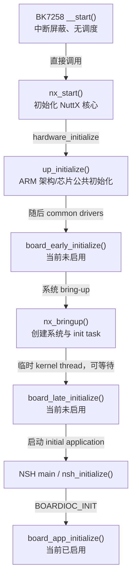

# 30｜四级初始化：reset、early、late 与 app

本篇回答板级移植中最常见的问题：**一段初始化代码究竟应该放在哪里？** 放得太早，内存、调度器和驱动服务还不能使用；放得太晚，系统 tick、串口或其他基础设施可能已经按错误状态启动。

> **来源记录**
>
> - 教学主题：BK7258 从 `__start()` 到 `board_app_initialize()` 的初始化层级与能力边界
> - `$WORKSPACE/nuttx` commit：`e02f581e235fc7b527d57ff62b668ce625d139ab`
> - `$WORKSPACE/apps` commit：`e81a73794786189f15e6c9fe9931ffddd561fd73`
> - `$CONTEST` source commit：`c588afbd8e0f1d30723f5076e585673a6ace8a4e`
> - 有效配置来源：当前 `$WORKSPACE/nuttx/.config`
> - 当前配置：`CONFIG_BOARD_EARLY_INITIALIZE` 未启用，`CONFIG_BOARD_LATE_INITIALIZE` 未启用，`CONFIG_NSH_ARCHINIT=y`
> - 最后核对日期：2026-07-24
> - 未覆盖：BootROM/Tier-1 bootloader 内部实现、其他 CPU 的启动、当前实施 worktree 的未提交变化

## 1. 当前 BK7258 实际走哪条路

```text
硬件从向量表进入 __start()
  → 设置 VTOR/FPU
  → 复制 .data、清零 .bss
  → early serial
  → 必要时切换 320 MHz
  → nx_start()
      → up_initialize()
      → drivers_initialize()
      → [board_early_initialize 未启用]
      → nx_bringup()
          → [board_late_initialize 未启用]
          → 启动 NSH application
              → nsh_initialize()
                  → boardctl(BOARDIOC_INIT, 0)
                      → board_app_initialize()
```

因此当前 BK7258 并不是“四个 hook 都实现了”，而是只使用其中适合当前设计的阶段。

## 2. M-002 初始化阶段图



`EARLY` 和 `LATE` 节点是 NuttX 支持但当前配置裁掉的路径。图中保留它们，是为了比较能力边界，不表示当前固件包含对应函数。

### 文本替代

| 阶段 | 直接调用位置 | 执行上下文 | 当前 BK7258 |
|---|---|---|---|
| `__start()` | 向量表 reset slot | 调度器前、基础 OS 服务前 | 已实现并执行 |
| `up_initialize()` | `nx_start()` 的 hardware initialization | 基础 OS/驱动服务已建立，仍在启动路径 | ARM common 实现会执行 |
| `board_early_initialize()` | `up_initialize()`、`drivers_initialize()` 之后 | startup initialization thread，不能等待事件 | 配置关闭、无实现 |
| `board_late_initialize()` | initial application 启动前 | 临时 kernel thread，可等待并使用 I2C/SPI | 配置关闭、无实现 |
| `board_app_initialize()` | NSH `boardctl(BOARDIOC_INIT)` | NSH application task | 已实现并执行 |

## 3. 阶段零：`__start()`

BK7258 reset entry：

`$BOARD/chip/cp/bk7258_start.c:88`

硬件从向量表获得：

- slot 0：初始 MSP；
- slot 1：reset handler，即 `__start()`。

当前 `__start()` 的主要步骤：

```text
1. cpsid i：屏蔽中断
2. 设置 VTOR
3. 配置 FPU/FPCCR
4. 把 .data 从 Flash 复制到 RAM
5. 把 .bss 清零
6. 初始化 early serial
7. 必要时切换 320 MHz
8. 调用 nx_start()
```

### 这一层已经有什么

- CPU 正在执行 C 函数；
- 栈由向量表初始 MSP 提供；
- 可以直接读写寄存器；
- 完成 `.data`/`.bss` 后，普通 C 全局变量才处于预期初始状态；
- early serial 可提供轮询式启动输出。

### 这一层还没有什么

- NuttX scheduler 尚未开始；
- 不能假设 heap/malloc 可用；
- 不能等待 semaphore、消息队列或 work queue；
- 不能依赖普通 device driver、VFS、文件系统；
- 中断在本实现入口处被屏蔽。

### 适合放什么

- 必须在 `nx_start()` 前完成的寄存器配置；
- vector table、栈、RAM section、FPU 安全配置；
- 极早期时钟和 console；
- 会影响后续 timer/SysTick 初始化的核心时钟设置。

BK7258 的 320 MHz 初始化放在这里，是因为 `up_timer_initialize()` 必须看到最终 CPU 时钟后才能计算正确 tick reload。

### 不适合放什么

- 文件系统挂载；
- 需要睡眠或超时等待的设备初始化；
- `/dev`、`/proc` 注册；
- 依赖 worker thread 的逻辑；
- 复杂、可能长时间失败重试的业务初始化。

## 4. 阶段一：`up_initialize()`

NuttX 进入：

`$WORKSPACE/nuttx/sched/init/nx_start.c:714`

ARM common 实现：

`$WORKSPACE/nuttx/arch/arm/src/common/arm_initialize.c:61`

当前主要处理：

```text
arm_addregion()
可选 power management
可选 DMA
arm_serialinit()
arm_netinitialize()
可选 USB
可选 coredump region
L2 cache / debug monitor / auto LED
```

NuttX 注释明确说明，此时：

- 基础 OS 已初始化；
- OS services 和 driver services 可用；
- user initialization 尚未启动。

### early serial 与正式 serial 的区别

BK7258 `__start()` 中调用：

```c
arm_earlyserialinit();
```

它用于尽早获得轮询 console。

`up_initialize()` 中调用：

```c
arm_serialinit();
```

它用于注册正式 serial driver，使系统后续可以通过标准 NuttX 设备接口使用串口。

可以记成：

```text
early serial：先让我能打印启动过程
formal serial：把串口正式接入驱动/VFS 世界
```

### `up_initialize()` 属于谁

这是 architecture port 的标准入口，不是每块板都自己实现一份。BK7258 当前复用了 ARM common `up_initialize()`，再通过 `arm_serialinit()`、`up_irqinitialize()` 等 architecture/chip hook 接到 BK7258 实现。

## 5. 阶段二：`board_early_initialize()`

启用条件：

```text
CONFIG_BOARD_EARLY_INITIALIZE=y
```

调用位置：

`$WORKSPACE/nuttx/sched/init/nx_start.c:720-729`

当前实际顺序是：

```text
up_initialize()
  ↓
drivers_initialize()
  ↓
board_early_initialize()   # 如果配置启用
```

### 执行上下文

NuttX 合同指出：

- 它运行在 startup initialization thread；
- 适合初始化简单 board-specific drivers；
- 不能等待事件；
- 不能执行可能阻塞的 mount、SD card 等操作。

这里“不能等待”是核心限制。即使某些 OS 服务已经存在，也不等于可以随意 `sleep()`、等待 semaphore 或进行不可控的总线事务。

### 适合放什么

- 简单、同步、不会阻塞的 board 资源注册；
- 必须早于 initial application 的简单设备；
- 对 `up_initialize()` 的 board-specific 扩展；
- 不依赖复杂文件系统或异步 worker 的初始化。

### 当前 BK7258 状态

当前 `.config`：

```text
# CONFIG_BOARD_EARLY_INITIALIZE is not set
```

队伍 overlay 中也没有 `board_early_initialize()` 实现。因此该调用和函数都不在当前构建路径中。

如果只添加函数、却不启用 Kconfig，它不会被调用；如果只启用 Kconfig、却不提供函数，则会产生构建/链接问题。

## 6. 阶段三：`board_late_initialize()`

启用条件：

```text
CONFIG_BOARD_LATE_INITIALIZE=y
```

调用位置：

`$WORKSPACE/nuttx/sched/init/nx_bringup.c:326-334`

NuttX 在启用该选项时创建临时 kernel thread：

```c
nxthread_create("AppBringUp", ...,
                nx_start_task, ...);
```

临时线程再调用：

```text
nx_start_task()
  → nx_start_application()
      → board_late_initialize()
      → 启动 initial application
```

### 相比 early 多了什么能力

NuttX 合同明确允许：

- 等待事件；
- I2C；
- SPI；
- 更复杂的设备初始化；
- 挂载 initial application 所依赖的文件系统。

### 适合放什么

- 需要总线事务和设备响应等待的传感器；
- SD/MMC 等可能等待介质的设备；
- initial application 启动前必须完成的文件系统；
- 需要普通 kernel thread context 的复杂 board driver。

### 当前 BK7258 状态

当前 `.config`：

```text
# CONFIG_BOARD_LATE_INITIALIZE is not set
```

也没有对应函数实现。因此 current firmware 不经过这一层。

## 7. 阶段四：`board_app_initialize()`

这不是 `nx_start()` 直接调用的 hook。当前路径是：

```text
initial application = NSH
  → main()
  → nsh_initialize()
  → boardctl(BOARDIOC_INIT, 0)
  → board_app_initialize(0)
```

启用条件包括：

```text
CONFIG_SYSTEM_NSH=y
CONFIG_NSH_ARCHINIT=y
CONFIG_BOARDCTL=y
```

当前 BK7258 在这里完成：

- WDT 初始化；
- DVFS procfs entry 注册；
- procfs mount；
- Flash MTD 创建；
- LittleFS/FTL/probe（按配置裁剪）。

### 这一层的特点

- 已在普通 application task context；
- 可以使用 VFS、`mount()`、`open()`、`read()`、`write()`；
- 函数返回 `int`，接口合同允许返回负 errno；
- 是否调用与 initial application 有关；当前是 NSH 发起调用；
- 太慢或永久阻塞会延迟 NSH console 出现。

### app init 与 late init 是否二选一

不是。

如果两个配置都启用，顺序是：

```text
board_late_initialize()
  ↓
启动 NSH application
  ↓
board_app_initialize()
```

前者属于 kernel bring-up，后者属于 application-level board command。

## 8. 四层能力对照表

| 能力 | `__start()` | `board_early` | `board_late` | `board_app` |
|---|---:|---:|---:|---:|
| 直接寄存器访问 | 是 | 是 | 是 | 是，但通常应通过驱动 |
| `.data/.bss` 已就绪 | 完成过程中 | 是 | 是 | 是 |
| heap/malloc 可依赖 | 否 | 通常可，但不应做复杂阻塞流程 | 是 | 是 |
| scheduler/task context | 否 | startup init context | 临时 kernel thread | application task |
| 可以等待事件 | 否 | 否 | 是 | 是 |
| 可以使用 I2C/SPI 高层接口 | 否/不应依赖 | 不适合阻塞事务 | 是 | 是 |
| 可以挂载文件系统 | 否 | 否 | 是 | 是 |
| 适合影响 SysTick 的时钟切换 | 是，且应在 timer init 前 | 通常太晚 | 太晚 | 太晚 |
| 是否由当前 BK7258 使用 | 是 | 否 | 否 | 是 |

“可以”不等于“最佳位置”。还要看依赖、启动顺序、失败策略和功能是否属于 kernel 还是 application。

## 9. 放置代码的决策树

```text
这项设置必须在 nx_start()/timer/IRQ 初始化前完成吗？
  ├─ 是 → __start() / architecture reset path
  └─ 否
      ↓
它属于 architecture/chip 通用基础设施吗？
  ├─ 是 → up_initialize() 对应的 arch/chip hook
  └─ 否
      ↓
它保证不等待、不阻塞，而且必须早于 application 吗？
  ├─ 是 → board_early_initialize()
  └─ 否
      ↓
它必须在 initial application 启动前完成吗？
  ├─ 是 → board_late_initialize()
  └─ 否
      ↓
它是 application/NSH 需要的 board service 吗？
  ├─ 是 → board_app_initialize()
  └─ 否 → 独立 service/task、按需初始化或其他 subsystem 入口
```

## 10. 典型功能应该放哪里

| 功能 | 首选阶段 | 原因 |
|---|---|---|
| VTOR、初始 FPU、`.data/.bss` | `__start()` | C/异常基础环境必须先成立 |
| 影响 SysTick 的核心时钟 | `__start()` | timer 初始化前必须稳定 |
| early polled UART | `__start()` | 用于观察后续启动 |
| 正式 UART driver 注册 | `up_initialize()`/arch hook | driver service 已可用 |
| NVIC 基础初始化 | `up_initialize()`/arch hook | architecture interrupt 基础设施 |
| 简单无阻塞 board LED/设备 | `board_early` | board-specific 且可立即完成 |
| 需等待响应的 I2C/SPI 设备 | `board_late` | 需要可阻塞 kernel thread context |
| initial app 所需 SD/文件系统 | `board_late` | 必须先挂载再启动 app |
| NSH `/proc` 扩展、诊断设备 | `board_app` | 与 application/NSH 服务直接相关 |
| 按用户命令才需要的设备 | 按需初始化 | 避免无条件增加启动时延和故障面 |

这些是默认建议，不是不可修改的法规。真正决定位置的是依赖图和上下文能力。

## 11. 为什么不能全部塞进 `board_app_initialize()`

这样做表面最简单，但可能产生：

- 时钟切换太晚，SysTick 已按旧频率配置；
- IRQ controller 尚未正确初始化就开始依赖中断；
- NSH 启动被慢设备拖延；
- 不使用 NSH 的 initial application 无法获得设备；
- kernel 基础设施与 application policy 混在一起；
- 一个可选文件系统失败影响所有不相关设备。

反过来，也不能全部塞进 `__start()`：那里缺少 OS 服务，任何复杂错误处理都很困难。

## 12. 返回值和失败策略

| 入口 | 返回类型 | 常见失败处理 |
|---|---|---|
| `__start()` | `void`，不应返回 | early log、停机、复位或受控降级 |
| `up_initialize()` | `void` | architecture-specific log/assert/降级 |
| `board_early_initialize()` | `void` | 记录错误并继续，或自行进入安全状态 |
| `board_late_initialize()` | `void` | 记录失败；若 app 强依赖，需要设计独立门禁 |
| `board_app_initialize()` | `int` | 可返回负 errno，经 `boardctl()` 转成 `ERROR + errno` |

即使接口是 `void`，仍然要设计失败策略，不能因为“没有返回值”就忽略失败。

## 13. 当前 BK7258 为什么这样分层

当前可见设计是：

- 对 tick、异常和 C runtime 有硬依赖的工作留在 `__start()`；
- ARM common `up_initialize()` 注册 architecture driver；
- 暂不额外引入 early/late board hooks；
- procfs、storage probe 等与 NSH 使用体验相关的逻辑放在 `board_app_initialize()`。

这不表示未来永远不需要 `board_late_initialize()`。如果加入必须在 NSH 前完成、又需要等待 I2C/SPI/介质响应的设备，late hook 会比继续扩大 app init 更合适。

## 14. 自测题

1. 为什么影响 SysTick 的时钟切换不能放在 `board_app_initialize()`？
2. `board_early_initialize()` 已经有 OS 服务，为什么仍然不能等待 semaphore？
3. 哪个阶段明确运行在临时 kernel thread？
4. 当前 BK7258 是否实现了 `board_late_initialize()`？
5. 如果某个传感器只有 NSH 命令首次使用时才需要，是否一定要在启动时初始化？
6. `board_app_initialize()` 与 `board_late_initialize()` 能否同时存在？谁先执行？

答案：

1. 因为 timer/SysTick 已在更早的 `up_initialize()` 路径配置。
2. 因为它仍运行在受限 startup initialization context，NuttX 合同禁止等待事件。
3. `board_late_initialize()`。
4. 否；当前配置也未启用。
5. 不一定，可考虑按需初始化。
6. 可以；late init 先于 initial application，app init 在 NSH 内随后执行。
