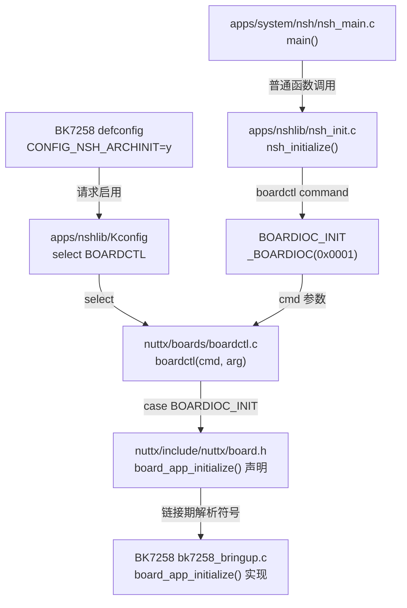

# 34｜NSH 怎样调用 `board_app_initialize()`

本篇沿一条跨仓调用链，解释 `CONFIG_NSH_ARCHINIT` 如何让 NSH 通过 `boardctl(BOARDIOC_INIT)` 找到 BK7258 的板级初始化函数。重点不是背函数名，而是理解“配置选择、公共接口、命令分发、链接绑定和板级实现”五层怎样接起来。

> **来源记录**
>
> - 教学主题：NSH application initialization 到 BK7258 board bring-up 的完整静态链
> - `$WORKSPACE/apps` commit：`e81a73794786189f15e6c9fe9931ffddd561fd73`
> - `$WORKSPACE/nuttx` commit：`e02f581e235fc7b527d57ff62b668ce625d139ab`
> - `$CONTEST` source commit：`c588afbd8e0f1d30723f5076e585673a6ace8a4e`
> - 源码状态：以上三个仓库的相关 tracked source 在核对时无本地修改；学习文档本身是未提交新增内容
> - 有效配置来源：当前 `$WORKSPACE/nuttx/.config`，属于一次本地构建配置，不是 Git source ref
> - 最后核对日期：2026-07-24
> - 未覆盖：`nx_start()` 如何创建 NSH application、ELF 链接细节、当前实施 worktree 的未提交变化

## 1. 本课结论先行

静态主链是：

```text
CONFIG_NSH_ARCHINIT=y
  → Kconfig 自动 select CONFIG_BOARDCTL
  → NSH main 调用 nsh_initialize()
  → nsh_initialize() 调用 boardctl(BOARDIOC_INIT, 0)
  → boardctl() 按 cmd 分发
  → case BOARDIOC_INIT 调用 board_app_initialize(arg)
  → 链接器把该符号绑定到 BK7258 board overlay 的实现
```

它不是函数指针注册表，也不是按字符串查找函数名；核心连接是一个由配置保留、由链接器解析的普通 C 外部符号。

## 2. M-001 调用链图



图只表示配置和静态源码关系，不证明某份镜像已经链接或板端已经执行。

### 文本替代

| 顺序 | Source | 关系 | Target | 直接证据 |
|---|---|---|---|---|
| 1 | BK7258 `defconfig` | 设置 | `CONFIG_NSH_ARCHINIT=y` | `$BOARD/configs/t5ai_core_cp_base/defconfig` |
| 2 | `NSH_ARCHINIT` Kconfig | `select` | `BOARDCTL` | `$WORKSPACE/apps/nshlib/Kconfig:1133-1141` |
| 3 | NSH application `main()` | 调用 | `nsh_initialize()` | `$WORKSPACE/apps/system/nsh/nsh_main.c:51-69` |
| 4 | `nsh_initialize()` | 调用 | `boardctl(BOARDIOC_INIT, 0)` | `$WORKSPACE/apps/nshlib/nsh_init.c:144-148` |
| 5 | `BOARDIOC_INIT` | 编码为 | `_BOARDIOC(0x0001)` | `$WORKSPACE/nuttx/include/sys/boardctl.h:178` |
| 6 | `boardctl()` | 分发 | `board_app_initialize(arg)` | `$WORKSPACE/nuttx/boards/boardctl.c:346-373` |
| 7 | NuttX board contract | 声明 | `int board_app_initialize(uintptr_t)` | `$WORKSPACE/nuttx/include/nuttx/board.h:173-197` |
| 8 | BK7258 board overlay | 定义 | `board_app_initialize()` | `$BOARD/src/bk7258_bringup.c:148-186` |

## 3. 第一层：defconfig 请求 NSH 架构初始化

BK7258 board config 中有：

```text
CONFIG_NSH_ARCHINIT=y
CONFIG_SYSTEM_NSH=y
```

分别表示：

- `CONFIG_SYSTEM_NSH=y`：把 NSH application 作为系统应用加入配置；
- `CONFIG_NSH_ARCHINIT=y`：让 `nsh_initialize()` 在早期调用 board initialization command。

这里使用“请求”一词，因为 defconfig 不是最终结果。最终仍要核对生成的 `.config`。

本次有效 `.config` 确认：

```text
CONFIG_BOARDCTL=y
CONFIG_FS_PROCFS=y
CONFIG_NSH_PROC_MOUNTPOINT="/proc"
CONFIG_NSH_ARCHINIT=y
CONFIG_SYSTEM_NSH=y
# CONFIG_BOARDCTL_FINALINIT is not set
```

因此当前配置下，普通 `BOARDIOC_INIT` 路径存在，`BOARDIOC_FINALINIT` 路径不存在。

## 4. 第二层：Kconfig 的 `select BOARDCTL`

`$WORKSPACE/apps/nshlib/Kconfig` 定义：

```kconfig
config NSH_ARCHINIT
  bool "Have architecture-specific initialization"
  default n
  select BOARDCTL
```

含义是：

```text
用户启用 NSH_ARCHINIT
  → Kconfig 同时选择 BOARDCTL
```

因为 NSH 自己不能直接调用任意 board 函数；它需要 NuttX 提供统一的 `boardctl()` 接口。

`apps/nshlib/nsh.h` 还有一层防御：

```c
#if defined(CONFIG_NSH_ARCHINIT) && !defined(CONFIG_BOARDCTL)
#  warning CONFIG_NSH_ARCHINIT is set, but CONFIG_BOARDCTL is not
#  undef CONFIG_NSH_ARCHINIT
#endif
```

也就是说，如果配置最终出现不一致，NSH 会警告并取消这条调用路径，避免编译出一个没有 `boardctl()` 支撑的 arch-init 调用。

## 5. 第三层：NSH application 入口

`$WORKSPACE/apps/system/nsh/nsh_main.c` 中：

```c
int main(int argc, FAR char *argv[])
{
  ...
  nsh_initialize();
  ...
  ret = nsh_consolemain(argc, argv);
}
```

顺序很重要：

```text
先做一次 nsh_initialize()
  ↓
再进入通常长期运行的 nsh_consolemain()
```

因此 board application initialization 发生在交互式 NSH console 开始之前。

`nsh_initialize()` 的合同也明确要求它在 application start-up 时调用一次。

## 6. 第四层：`nsh_initialize()` 发出命令

关键代码：

```c
#ifdef CONFIG_NSH_ARCHINIT
  boardctl(BOARDIOC_INIT, 0);
#endif
```

这里有三个信息。

### 6.1 它受编译配置控制

如果 `CONFIG_NSH_ARCHINIT` 未启用，这两行不会进入编译结果。

### 6.2 NSH 不直接调用 BK7258 函数

它没有写：

```c
bk7258_xxx_initialize();
```

否则通用 NSH 就会依赖某一颗芯片。它只发出通用 board command：

```c
boardctl(BOARDIOC_INIT, 0);
```

### 6.3 参数 `0` 是默认配置

`boardctl` 合同要求每个 board implementation 都应接受 `zero/NULL` 作为默认配置。

在 BK7258 实现中，`arg` 当前没有实际用途。

## 7. 第五层：`BOARDIOC_INIT` 是什么

`$WORKSPACE/nuttx/include/sys/boardctl.h` 定义：

```c
#define BOARDIOC_INIT _BOARDIOC(0x0001)
```

不要简单理解成：

```c
#define BOARDIOC_INIT 1
```

`_BOARDIOC()` 会把序号编码进 board ioctl command namespace，使不同类别的控制命令不容易发生编号冲突。

对本课来说，只需记住：

```text
BOARDIOC_INIT 是命令编号
不是函数
不是回调指针
也不是设备文件 ioctl
```

它作为 `cmd` 参数传给 `boardctl()`。

## 8. 第六层：`boardctl()` 是命令分发器

公共接口：

```c
int boardctl(unsigned int cmd, uintptr_t arg)
```

核心结构与普通菜单分发类似：

```c
switch (cmd)
  {
    case BOARDIOC_INIT:
      ret = board_app_initialize(arg);
      break;

    case BOARDIOC_RESET:
      ...
      break;

    default:
      ...
      break;
  }
```

所以：

- `cmd` 决定执行哪一种 board operation；
- `arg` 原样传给具体 board function；
- `BOARDIOC_INIT` 分支直接调用 `board_app_initialize(arg)`。

## 9. 第七层：头文件只声明合同

`$WORKSPACE/nuttx/include/nuttx/board.h` 中：

```c
int board_app_initialize(uintptr_t arg);
```

这只是声明，告诉编译器：

- 函数名是什么；
- 参数是什么类型；
- 返回值是什么类型。

头文件本身没有函数体，也不会完成初始化。

合同规定：

```text
成功：返回 OK/0
失败：返回负 errno
```

## 10. 第八层：链接器找到 BK7258 实现

BK7258 overlay 提供真正函数体：

```c
int board_app_initialize(uintptr_t arg)
{
  ...
  return 0;
}
```

编译阶段：

```text
boardctl.c 只知道声明
bk7258_bringup.c 提供定义
```

链接阶段：

```text
boardctl.o 中未解析的 board_app_initialize
  + bk7258_bringup.o 中的全局定义
  → 绑定成同一个最终符号
```

这就是 NuttX “找到”BK7258 函数的关键。不是运行时搜索源码路径，而是构建系统把正确 board object 加入链接，链接器按全局符号名完成绑定。

如果 board object 没有进入链接，或者没有提供符合签名的定义，通常会在链接阶段出现 undefined reference，而不是等到板上才发现。

## 11. 返回值经过了什么转换

`boardctl()` 先接收 board function 的返回值：

```c
ret = board_app_initialize(arg);
```

随后：

```c
if (ret < 0)
  {
    set_errno(-ret);
    return ERROR;
  }

return ret;
```

因此存在两种接口风格：

```text
board_app_initialize(): 失败返回 -errno
boardctl():              对外返回 ERROR，并设置 errno
```

例如 board function 返回：

```text
-ENODEV
```

`boardctl()` 会：

```text
errno = ENODEV
return ERROR   // 通常是 -1
```

但是当前 `nsh_initialize()` 没有检查 `boardctl(BOARDIOC_INIT, 0)` 的返回值；而当前 BK7258 实现也固定返回 0。因此现在整体策略偏向“初始化尽力进行，不因单个 bring-up 子步骤阻止 NSH console 出现”。

这是一项设计选择，不是所有 board 都必须采用的策略。

## 12. 它在 NSH 初始化中的时间位置

`nsh_initialize()` 的相关顺序是：

```text
更新 prompt
  ↓
可选：配置 symbol table
  ↓
BOARDIOC_INIT                 ← BK7258 board_app_initialize 在这里
  ↓
可选：执行 system init script
  ↓
可选：network bring-up
  ↓
可选：BOARDIOC_FINALINIT
  ↓
可选：执行普通 startup script
```

所以普通 `BOARDIOC_INIT` 比 NSH system/startup script 更早。

当前 `.config` 没有启用 `CONFIG_BOARDCTL_FINALINIT`，因此第二次 final-initialization 调用不会编入当前配置。

## 13. `BOARDIOC_INIT` 与 `BOARDIOC_FINALINIT` 的区别

| 命令 | 典型时机 | 当前配置 |
|---|---|---|
| `BOARDIOC_INIT` | NSH 初始化早期、脚本之前 | 已启用 |
| `BOARDIOC_FINALINIT` | system init script 和 network bring-up 之后 | 未启用 |

需要依赖启动脚本结果的初始化，理论上可放 final-init；基础设备注册和 `/proc` 等通常放普通 init。但最终位置仍需根据依赖关系和失败策略设计，不能只凭名称决定。

## 14. 添加新初始化时应该检查什么

假设要在 `board_app_initialize()` 中增加 `my_driver_initialize()`，至少检查：

1. **配置：**哪个 Kconfig 控制它？生成 `.config` 是否真正启用？
2. **构建：**实现文件是否由当前 Make/CMake 后端加入？
3. **接口：**函数声明和定义签名是否一致？
4. **顺序：**它依赖 procfs、filesystem、IRQ、scheduler 还是其他设备？
5. **失败策略：**失败时记录日志继续，还是返回负 errno？
6. **幂等性：**函数是否可能被调用第二次？重复调用会怎样？
7. **上下文：**这里已经是 application initialization，不是复位后的最早阶段。
8. **验证：**分别证明配置、对象、ELF 和板端行为，不能只看编译通过。

## 15. 三个容易混淆的概念

### `nsh_initialize()` 不是 NuttX 内核初始化

它是 NSH library 的一次性初始化函数，发生在 NSH application 内。

### `boardctl()` 不是 Linux `/dev/...` ioctl

它是 NuttX 提供的非标准 board operation 分发接口，不需要先打开设备文件。

### `board_app_initialize()` 不是最早期 board init

它是 application-level hook。更早的硬件初始化可能位于 reset/startup、architecture initialization、`board_early_initialize()` 或 `board_late_initialize()` 等其他路径。

## 16. 自测题

1. 如果只设置 `CONFIG_SYSTEM_NSH=y`，是否必然调用 `board_app_initialize()`？
2. `BOARDIOC_INIT` 是函数还是命令编号？
3. 谁真正调用 `board_app_initialize()`：NSH 还是 `boardctl()`？
4. 头文件中的声明为什么不能代替 board 实现？
5. 如果 `board_app_initialize()` 返回 `-EIO`，`boardctl()` 对外返回什么？
6. 为什么 `nsh_initialize()` 能保持芯片无关？

答案：

1. 不必然；还需要 `CONFIG_NSH_ARCHINIT` 等条件。
2. 命令编号。
3. 直接调用者是 `boardctl()`；NSH 是命令发起者。
4. 声明没有函数体，链接仍需要一个全局定义。
5. 设置 `errno=EIO`，返回 `ERROR`。
6. 因为它只使用通用 `boardctl(BOARDIOC_INIT)` 合同，不引用 BK7258 专有函数名。
