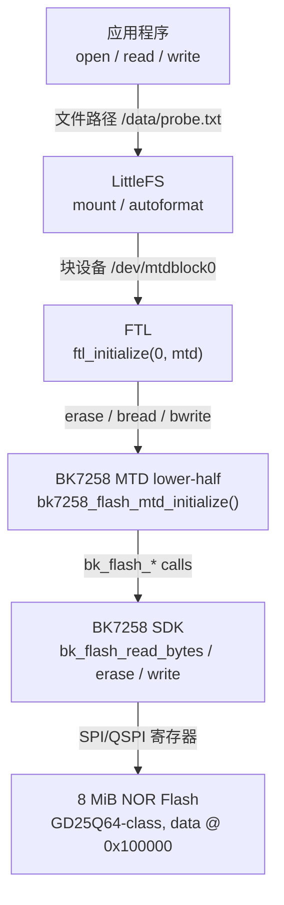

# Flash 存储栈：从硬件到文件

本篇解释 BK7258 如何从硬件 flash 一路到达 `/data/probe.txt`。这个链路涉及五层，每层只关心自己下面一层的接口，不直接访问最底层硬件。

> **来源记录**
>
> - 教学主题：BK7258 Flash → MTD → FTL → LittleFS 完整存储栈
> - `$CONTEST` source commit：`c588afbd8e0f1d30723f5076e585673a6ace8a4e`
> - `$WORKSPACE/nuttx` commit：`e02f581e235fc7b527d57ff62b668ce625d139ab`
> - 有效配置来源：当前 `$WORKSPACE/nuttx/.config`
> - 最后核对日期：2026-07-24
> - 未覆盖：SmartFS、NXFFS、分区表工具、外部 SPI flash

## 1. 五层总览

```text
应用程序
  open("/data/probe.txt", ...)
      │
      ▼
LittleFS                 文件系统层
  ↓ 通过 /dev/mtdblock0
FTL                      块设备层
  ↓ 通过 struct mtd_dev_s
MTD lower-half           抽象设备层
  ↓ 通过 bk_flash_* SDK
BK7258 Flash 硬件        物理层
```

每一层的职责：

| 层 | 回答什么问题 | 典型接口 |
|---|---|---|
| 硬件 | 怎样读/写/擦除物理地址 | `bk_flash_read_bytes()` / `bk_flash_erase_sector()` / `bk_flash_write_bytes()` |
| MTD | 这块 flash 的几何参数和基本操作是什么 | `struct mtd_dev_s` 的 `erase` / `bread` / `bwrite` / `ioctl` |
| FTL | 怎样把擦除块设备变成可随机读写的块设备 | `ftl_initialize()` → `/dev/mtdblock0` |
| LittleFS | 怎样在块设备上管理文件和目录 | `mount("littlefs", ...)` |
| 应用 | 文件叫什么、内容是什么 | `open()` / `read()` / `write()` / `close()` |

## 2. M-004：存储栈分层图



### 文本替代

| 层 | 上层接口 | 下层接口 | 关键函数 |
|---|---|---|---|
| 应用 | 文件路径 | VFS | `open()` / `read()` / `write()` |
| LittleFS | 块设备路径 | `bread` / `bwrite` / `erase` / `ioctl` | `mount()` / `autoformat` |
| FTL | `struct mtd_dev_s` | `struct mtd_dev_s` | `ftl_initialize()` |
| MTD | SDK 函数 | flash 控制器 | `bk7258_flash_mtd_initialize()` |
| SDK | 硬件寄存器 | — | `bk_flash_driver_init()` |

## 3. 最底层：BK7258 Flash 硬件

当前板使用 8 MiB NOR flash，JEDEC ID 包括：

```text
GD25Q64   0x00c86517
GD25Q64B  0x00c84017
W25Q64    0x000b4017
TH25Q64   0x00cd6017
```

flash 被逻辑分为若干区域，当前 MTD driver 只暴露 **1 MiB data 分区**：

```text
物理地址 0x00100000 .. 0x001FFFFF（1 MiB）
逻辑上是 8 MiB flash 的第 2 个 MiB
```

几何参数：

```text
blocksize    = 4096 字节（4 KiB）
erasesize    = 4096 字节（与 blocksize 相同）
neraseblocks = 256（1 MiB / 4 KiB）
erase state  = 0xff（擦除后每个字节为 0xFF）
```

NOR flash 的物理特性：

- 读取：可以直接按地址读，没有"读-擦除"周期；
- 写入：只能把 1 变成 0，不能把 0 变成 1；
- 擦除：必须以 4 KiB 扇区为单位，擦除后恢复为 0xFF；
- 因此"修改一个字节"实际上需要：读出整个扇区 → 擦除 → 修改 → 写回。

## 4. MTD 层：`struct mtd_dev_s`

MTD 是 NuttX 的 Memory Technology Device 抽象。定义位于：

`nuttx/include/nuttx/mtd/mtd.h:182`

```c
struct mtd_dev_s
{
  int (*erase)(FAR struct mtd_dev_s *dev, off_t startblock, size_t nblocks);
  ssize_t (*bread)(FAR struct mtd_dev_s *dev, off_t startblock,
                   size_t nblocks, FAR uint8_t *buffer);
  ssize_t (*bwrite)(FAR struct mtd_dev_s *dev, off_t startblock,
                    size_t nblocks, FAR const uint8_t *buffer);
  ssize_t (*read)(FAR struct mtd_dev_s *dev, off_t offset,
                  size_t nbytes, FAR uint8_t *buffer);
  int (*ioctl)(FAR struct mtd_dev_s *dev, int cmd, unsigned long arg);
  int (*isbad)(FAR struct mtd_dev_s *dev, off_t block);
  int (*markbad)(FAR struct mtd_dev_s *dev, off_t block);
  FAR const char *name;
};
```

这是一个**函数指针表**，类似 UART 的 `uart_ops_s`。每种 flash 芯片提供自己的实现，上层通过统一接口调用。

当前 BK7258 的实现：

| 方法 | 实现 | 说明 |
|---|---|---|
| `erase` | `bk7258_flash_erase()` | 逐扇区擦除 |
| `bread` | `bk7258_flash_bread()` | 按 4 KiB 块读取 |
| `bwrite` | `bk7258_flash_bwrite()` | 按 4 KiB 块写入 |
| `read` | `NULL` | 不支持字节级读取 |
| `write` | `NULL` | 不支持字节级写入 |
| `ioctl` | `bk7258_flash_ioctl()` | 几何参数和擦除状态查询 |
| `isbad` | `NULL` | NOR flash 通常没有坏块 |
| `markbad` | `NULL` | 同上 |

### 初始化过程

`$BOARD/src/bk7258_flash_mtd.c`

```c
FAR struct mtd_dev_s *bk7258_flash_mtd_initialize(void)
{
  // 1. 初始化 SDK flash driver
  bk_flash_driver_init();

  // 2. 填充函数指针表
  g_bk7258_flash_mtd.mtd.erase  = bk7258_flash_erase;
  g_bk7258_flash_mtd.mtd.bread  = bk7258_flash_bread;
  g_bk7258_flash_mtd.mtd.bwrite = bk7258_flash_bwrite;
  g_bk7258_flash_mtd.mtd.ioctl  = bk7258_flash_ioctl;
  ...

  // 3. 验证 JEDEC ID
  id = bk_flash_get_id() & 0x00ffffffu;
  if (id != ...) return NULL;

  // 4. 返回单例
  return &g_bk7258_flash_mtd.mtd;
}
```

这是一个**单例**：全局只有一个 `g_bk7258_flash_mtd` 实例，所有调用者共享同一个 MTD 设备。

### `MTDIOC_GEOMETRY` 查询

上层需要知道"这个 flash 有多大、每块多少字节"时，调用：

```c
MTD_IOCTL(dev, MTDIOC_GEOMETRY, (unsigned long)&geo);
```

BK7258 返回：

```c
geo->blocksize    = 4096;
geo->erasesize    = 4096;
geo->neraseblocks = 256;
geo->model        = "bk7258-data";
```

### 写入保护

BK7258 flash 有硬件写保护（SR0 block protect）。每次写入/擦除前，driver 临时解除保护，操作完成后恢复：

```c
bk_flash_set_protect_type(FLASH_PROTECT_NONE);   // 解除
... 操作 ...
bk_flash_set_protect_type(FLASH_UNPROTECT_LAST_BLOCK); // 恢复
```

这样 boot/app 区域在非操作窗口内保持硬件保护。

## 5. FTL 层：把 MTD 变成块设备

MTD 的最小操作单位是"擦除块"（4 KiB），且必须先擦除再写入。但文件系统通常期望一个可随机读写的块设备。

FTL（Flash Translation Layer）做这个转换：

`nuttx/drivers/mtd/ftl.c:1188`

```c
int ftl_initialize(int minor, FAR struct mtd_dev_s *mtd)
{
  snprintf(path, DEV_NAME_MAX, "/dev/mtdblock%d", minor);
  return ftl_initialize_by_path(path, mtd, O_RDWR);
}
```

调用：

```c
ftl_initialize(0, mtd);
```

结果：

```text
创建 /dev/mtdblock0
```

此后上层可以按 512 字节或 4096 字节块随机读写，FTL 在内部处理"写入前需要擦除"的细节。

## 6. LittleFS 层：在块设备上管理文件

`mount()` 调用：

```c
mount("/dev/mtdblock0", "/data", "littlefs", 0, "autoformat");
```

参数含义：

| 参数 | 值 | 含义 |
|---|---|---|
| source | `/dev/mtdblock0` | 块设备路径 |
| target | `/data` | 挂载点 |
| filesystemtype | `"littlefs"` | 文件系统类型 |
| mountflags | `0` | 无额外标志 |
| data | `"autoformat"` | 首次启动时自动格式化 |

`autoformat` 的含义：如果 LittleFS 在块设备上没有找到有效的文件系统元数据，就自动格式化一次；此后每次启动都直接挂载已有文件系统。

### `mount()` 的内部路径

`nuttx/fs/mount/fs_mount.c:604`

```c
int mount(FAR const char *source, FAR const char *target,
          FAR const char *filesystemtype, unsigned long mountflags,
          FAR const void *data)
{
  int ret;
  ret = nx_mount(source, target, filesystemtype, mountflags, data);
  ...
}
```

`nx_mount()` 根据 `filesystemtype` 字符串找到对应的文件系统实现（LittleFS、procfs、tmpfs 等），然后调用该文件系统的 mount 方法。

## 7. 完整调用链

从 `board_app_initialize()` 到文件系统可用：

```text
board_app_initialize()
  │
  ├─ bk7258_flash_mtd_initialize()
  │    ├─ bk_flash_driver_init()
  │    ├─ 填充 mtd_dev_s 函数指针
  │    ├─ 验证 JEDEC ID
  │    └─ return &g_bk7258_flash_mtd.mtd
  │
  ├─ ftl_initialize(0, mtd)
  │    └─ 创建 /dev/mtdblock0
  │
  ├─ mkdir("/data", 0777)
  │
  ├─ mount("/dev/mtdblock0", "/data", "littlefs", 0, "autoformat")
  │    └─ LittleFS 挂载到 /data
  │
  └─ bk7258_fs_probe(mtd)
       ├─ open("/data/probe.txt", O_RDONLY)
       ├─ [首次] write("BK7258LFS-OK") + sync()
       └─ [后续] read() + memcmp() 验证持久性
```

## 8. 持久性探针的意义

`bk7258_fs_probe()` 不只是一个测试工具；它回答了一个关键问题：

> 设备复位后，写入的数据是否仍然存在？

```text
首次启动：
  创建 /data/probe.txt，写入 "BK7258LFS-OK"
  sync()
  复位

后续启动：
  读取 /data/probe.txt
  比较内容
  如果一致 → 写入持久性已证实
  如果不一致 → 存储栈有问题
```

这是"board-verified"证据阶梯的典型应用：

```text
源码存在 ≠ 配置启用 ≠ 构建成功 ≠ 板上执行 ≠ 复位后数据仍在
```

## 9. 当前实现的已知边界

- 只暴露 1 MiB data 分区，不是整个 8 MiB flash；
- 只支持 NOR flash 的 4 KiB 扇区擦除，没有坏块管理；
- FTL 没有掉电安全的写入日志（LittleFS 自身有）；
- `read` 和 `write` 字节级方法为 NULL，只有块级 `bread`/`bwrite`；
- JEDEC ID 检查只覆盖四种已知 8 MiB 型号。

## 10. 自测题

1. `struct mtd_dev_s` 的作用类似什么？
2. `ftl_initialize(0, mtd)` 创建了什么设备节点？
3. `autoformat` 参数在什么时候触发格式化？
4. 为什么写入前需要 `bk_flash_set_protect_type(FLASH_PROTECT_NONE)`？
5. `bk7258_fs_probe()` 的持久性验证为什么需要复位？
6. MTD 的 `bread` 与 `read` 有什么区别？

答案：

1. 类似 UART 的 `uart_ops_s`：函数指针表，让不同硬件共享同一上层接口。
2. `/dev/mtdblock0`。
3. 当块设备上没有有效的 LittleFS 元数据时（通常是首次使用或格式化后）。
4. 因为 flash 有硬件写保护（SR0 block protect），必须临时解除才能写入/擦除。
5. 因为 `sync()` 只保证数据提交到 flash 控制器，复位后仍能读回才证明持久性。
6. `bread` 按块操作（当前 4 KiB），`read` 按字节操作（当前未实现）。
