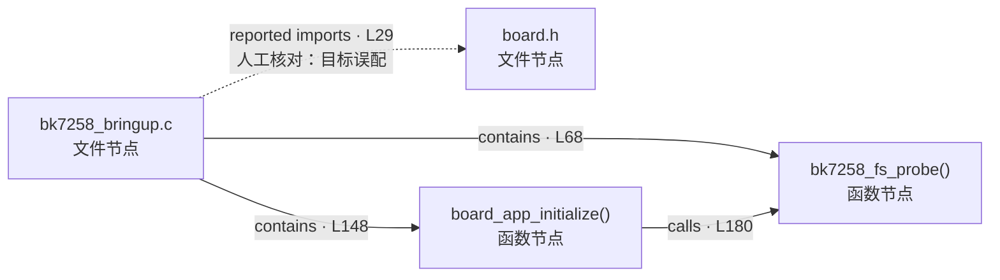

# G-001｜Board bring-up 最小 AST 拓扑

这张图用于演示怎样阅读 Graphify 的静态 AST 节点和关系。它只覆盖两个文件，不是完整 BK7258 bring-up 架构图。

> **来源记录**
>
> - source repository：BK7258 contest implementation worktree
> - source branch：`bk7258-n6-sdk-irq-bridge-clean`
> - source commit：`07c6bbc7e2722f78b5abc5cec9a66d3f091b501b`
> - snapshot：committed Git objects；未提交工作树内容未进入输入
> - 输入文件：`board/bk7258/include/board.h`、`board/bk7258/src/bk7258_bringup.c`
> - Graphify：`0.9.25`，AST-only，`python -m graphify extract .`
> - 原始结果：4 nodes、4 edges、2 communities
> - 最后核对日期：2026-07-24
> - 证据等级：`curated-static`；不代表构建、运行或板测事实

## 1. 拓扑图



图刻意不使用颜色表达关系，所有边都直接写出关系类型和来源行，避免依赖颜色辨识。实线是人工核对后接受的静态关系；虚线是 Graphify 原始报告中保留用于教学的误配边，不能当作真实 include 关系。

## 2. 文本关系表

| Source | Relation | Target | Graphify 来源位置 | 人工复核结论 |
|---|---|---|---|---|
| `bk7258_bringup.c` | `imports` | 本地 `board.h` | `bk7258_bringup.c:L29` | **驳回目标匹配。**该行实际是 `<nuttx/board.h>`；Graphify 因输入中存在同名本地头文件而误连 |
| `bk7258_bringup.c` | `contains` | `bk7258_fs_probe()` | `bk7258_bringup.c:L68` | 接受：函数定义位于该源文件内 |
| `bk7258_bringup.c` | `contains` | `board_app_initialize()` | `bk7258_bringup.c:L148` | 接受：函数定义位于该源文件内 |
| `board_app_initialize()` | `calls` | `bk7258_fs_probe()` | `bk7258_bringup.c:L180` | 接受：AST 中存在该静态调用表达式 |

文本表与图表达同一组关系，可在 Mermaid 不可渲染、屏幕阅读器或纯终端环境中使用。

## 3. 初学者应该怎样读

先区分两类节点：

- **文件节点**回答“定义放在哪里、包含了哪个头文件”；
- **函数节点**回答“文件里声明/定义了哪些函数、静态语法上谁调用谁”。

然后区分三类边：

- `imports`：候选文件级依赖，必须核对 include 的完整路径；本图的这一条正是被驳回的同名文件误配；
- `contains`：归属关系，不是一次运行时调用；
- `calls`：AST 中出现了调用表达式，但仍需结合条件编译、配置和运行证据判断它是否进入并执行于某份固件。

最小静态主链可以写成：

```text
bk7258_bringup.c
  ├─ contains board_app_initialize()
  └─ contains bk7258_fs_probe()

board_app_initialize()
  └─ calls bk7258_fs_probe()

Graphify reported: imports local board.h
Manual review: rejected; L29 actually includes <nuttx/board.h>
```

## 4. 这张图没有证明什么

它没有证明：

- `board_app_initialize()` 由谁调用；输入中没有包含上游 NuttX 调用者；
- 相关 Kconfig 与最终 `.config` 是否启用；
- `bk7258_bringup.c` 是否编入某份 ELF 或最终镜像；
- `board_app_initialize()` 的分支是否一定执行到 `bk7258_fs_probe()`；
- 文件中其他外部调用的完整目标；
- 宏、函数指针、注册表、链接脚本和动态派发关系；
- 板端是否执行、执行结果是否成功或可重复。

Graphify 的 JSON 顶层将图标为 `directed: false`，但每条关系仍记录 `source` 和 `target`。本教学图用箭头表达关系记录中的 source/target，不把箭头解释为完整运行时控制流。

## 5. 扩图规则

不要直接扫描整个工作区。要回答“谁调用 `board_app_initialize()`”，下一张图应只增加：

1. 固定 commit 的 NuttX board initialization 入口；
2. 控制该入口的必要配置；
3. board build metadata；
4. 人工核对的动态注册或弱符号边。

形成新 checkpoint 后，将新图作为独立版本登记到[教学图索引](../../../90-reference/95-graph-index.md)，不要静默覆盖本图的来源基线。
