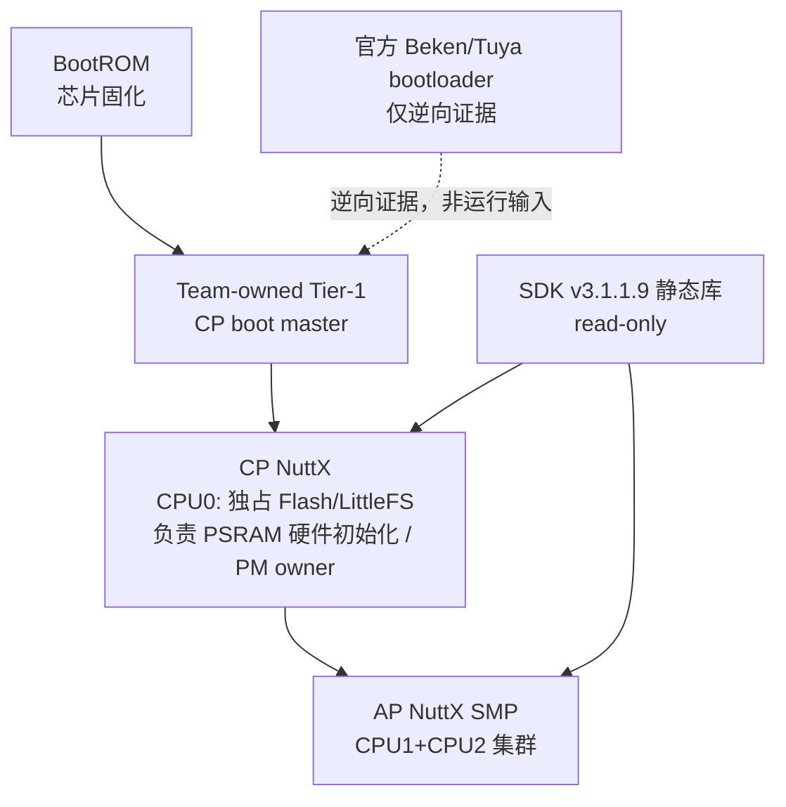

> **事实截止日期**：2026-08-04
> **权威来源**：a. 实际 team-owned 代码、构建产物与原始板测证据；b. memory ADR/规则、progress verification/milestone、阶段 worklog；c. 官方 Beken v3.1.1.9 源码/头文件/静态库与二进制逆向证据（只读）；d. 本指南仅为教学索引，冲突时回到上述来源。
> **证据边界**：本文件只定义概念、标签与阅读路径；不复制任何当前阶段结论，不发明命令/日志/函数。动态状态以 [当前状态与下一步](11-current-status-and-next-steps.md) 为准。

# 00 阅读地图与术语表

## 1. 先建立一张脑内地图

在读任何技术细节前，先在脑子里放三样东西：

1. **一块搭载 BK7258 的 T5-AI 模组/开发板**：BK7258 SoC 内部有 CPU0、CPU1、CPU2 三个物理核。
2. **一条真实启动链**：`BootROM → team-owned Tier-1 bootloader → CP NuttX → CP 释放 AP NuttX SMP`。官方 Beken/Tuya bootloader 二进制仅是逆向证据，**不在**这条正常运行链里。
3. **一种分工**：CPU0 是 CP（启动主控，独占 Flash/LittleFS，负责 PSRAM 硬件初始化并是 PM owner）；CPU1+CPU2 是一个 AP NuttX SMP 集群（注意：CPU2 不是第二个 RPMsg peer）。CP/AP 各消费互不重叠的 role-local heap。

把这张地图钉牢，后面每章都是往上面贴标签。

## 2. 术语表

| 术语 | 含义（本项目约定） |
|------|--------------------|
| SoC | System-on-Chip；此处指 Beken BK7258。Tuya T5-AI 是采用这颗 SoC 的模组/开发板，不是 SoC 的另一个名字。 |
| BootROM | 芯片出厂固化 ROM 中的第一段代码，上电自跑，不可由本项目改。 |
| bootloader | 加载后续固件并跳转的引导程序；本项目运行链用的是 team-owned Tier-1，不是官方二进制。 |
| Tier-1 | 团队自有的第一级引导（team-owned），位于 BootROM 之后、CP 之前，属正式可改代码。 |
| firmware/image | 烧录到器件的固件/镜像泛称。本项目的两个主 OS 镜像是 CP NuttX 与 AP NuttX，此外还有 team-owned Tier-1 boot 镜像。 |
| CP/AP | CP=物理 CPU0，启动主控，独占 Flash/LittleFS，负责 PSRAM 硬件初始化并是 PM owner；AP=物理 CPU1+CPU2 组成的 NuttX SMP 集群。CP/AP 各消费互不重叠的 role-local heap。 |
| physical/logical CPU | 物理 CPU 是芯片真实核编号（0/1/2）；逻辑 CPU 是某 NuttX 实例内部编号，二者映射非简单一一对应。 |
| SMP | 对称多处理：多物理核跑同一 OS 实例、共享地址空间；本项目 CPU1+CPU2 构成一个 AP SMP 集群。 |
| NuttX/openvela | NuttX 是 RTOS 内核；openvela 是其上发行/框架层；本项目在 BK7258 上运行二者。 |
| NSH | NuttX Shell，命令行交互界面，用于调试与执行命令。 |
| BSP | Board Support Package，板级支持包，封装硬件初始化与驱动适配。 |
| wrapper/overlay | team-owned 的封装/覆盖层，是正式代码唯一允许修改的范围。 |
| SDK/static library | Beken 提供的开发包；静态库（.a）以二进制链接，源码与库均只读。唯一 active SDK = Beken v3.1.1.9；Tuya/Beken bootloader 二进制仅作逆向证据参考，不暗示 Tuya SDK 为 active。 |
| ABI | Application Binary Interface，二进制层调用与数据布局约定，保证与静态库正确链接。 |
| IRQ/ISR | IRQ 是可屏蔽硬件中断请求；ISR 是响应它的中断服务程序。 |
| vector/VTOR/MSP/PSP | vector=异常/中断向量；VTOR=向量表偏移寄存器；MSP=主栈指针（内核/异常用）；PSP=进程栈指针（任务用）。 |
| SysTick | 系统节拍定时器，OS 用以产生周期 tick 驱动调度。 |
| Flash/MTD/LittleFS | Flash=非易失存储；MTD=内存技术设备抽象；LittleFS=跑在 Flash 上的文件系统，由 CP 独占。 |
| raw/XIP | raw=无文件系统包装的原始区；XIP=就地执行，代码直接在 Flash 取指，不先搬 RAM。 |
| 32+2 CRC | 一种以“32+2”为标记的校验约定（具体字节布局以官方契约文档为准），用于数据/镜像完整性检查；本项目不重新定义。 |
| mailbox/IPI | mailbox=核间消息寄存器机制；IPI=核间中断，用于一核唤醒/通知另一核。 |
| OpenAMP/RPTUN/RPMsg/endpoint/Name Service/RPMsgFS | OpenAMP=异构多核框架；RPTUN=远端处理器隧道；RPMsg=基于 virtio 的核间消息总线；endpoint=RPMsg 通道端点；Name Service=端点名字发现；RPMsgFS=通过 RPMsg 把一侧文件系统操作转发给另一侧的 client/server 机制。注意：CPU2 不是第二 RPMsg peer。 |
| Controller/Host/HCI/GAP/GATT | 蓝牙栈角色；Controller=底层射频控制；Host=协议上层；HCI=二者命令/事件接口；GAP=连接与广播；GATT=服务与数据。 |
| PSRAM/heap/PM | PSRAM=伪静态外部 RAM；heap=运行时动态内存堆；PM=电源管理。CP 负责 PSRAM 硬件初始化并是 PM owner；CP/AP 各消费互不重叠的 role-local heap。 |
| OTA/A-B/slot/metadata/generation/trial/confirm/rollback | OTA=空中升级；A-B=双 slot 冗余；slot=镜像分区槽；metadata=版本状态记录；generation=代次；trial=试跑；confirm=确认生效；rollback=回滚。 |
| ELF/map/hash | ELF=可执行可链接格式；map=链接映射（符号地址）；hash=完整性摘要。 |
| cold reset/power cut | cold reset=复位（状态保持依芯片而定）；power cut=完全断电再上电，状态彻底丢失；二者不等价。 |
| fail-closed | 故障封闭：启动/升级失败应落到安全可恢复状态，而非未知状态。 |

## 3. 状态不是“七选一”：两轴模型

不要把状态当成“planned/implemented/… 选一个”就完事。本项目用**两轴**描述：

**第一轴——实现/决策状态**（取值来自第 11 章的权威结论，本文件不判断）：
`planned` · `implemented` · `blocked` · `deferred` · `superseded`

**第二轴——证据等级**（可组合，可叠加多条）：
`source-verified` · `host-verified` · `ELF-verified` · `dry-run-verified` · `board-observed` · `board-verified`

三条关键区分：
- **implemented ≠ 验证**：代码落了地，不代表行为已被验证正确。
- **board-observed ≠ board-verified**：板子上有现象，不等于全流程通过验证。
- **reset ≠ 完整断电**：cold reset 不等同 power cut，凡涉及状态保持的断言都要分清。

## 4. 角色速查表

| 角色 | 归属 | 是否可改 | 说明 |
|------|------|----------|------|
| BootROM | 芯片出厂 | 否 | 上电第一段，固化 |
| 官方 Beken/Tuya bootloader | 厂商 | 否（仅逆向证据） | 逆向证据参考，不在运行链，不暗示 Tuya SDK 为 active |
| Tier-1 bootloader | team-owned | 是 | 运行链正式引导 |
| CP NuttX | team-owned wrapper + 官方树 | wrapper 可改 | CPU0，主控；独占 Flash/LittleFS；负责 PSRAM 硬件初始化并是 PM owner；与 AP 各消费互不重叠的 role-local heap |
| AP NuttX SMP | team-owned wrapper + 官方树 | wrapper 可改 | CPU1+CPU2 集群，非第二 RPMsg peer |
| SDK v3.1.1.9 静态库 | 厂商 | 否 | 唯一 active，只读 |
| legacy SDK | 厂商 | 否 | 冻结，不混用 |

## 5. 两条阅读路径

**顺序路径（推荐新手）**：00 → 01 → 02 → 03 → 04 → 05 → 06 → 07 → 08 → 09 → 10 → 11 → appendix-key-files.md。

**主题路径（按需跳读，引用冻结章号）**：
- 想搞清“哪些能改、怎么改、怎么构建”：02 + 10 + 本指南第 6 节（README）。
- 想搞清“板子怎么跑起来”：01 + 03 + 04 + 05。
- 想搞清“核间怎么协作、内存怎么分”：06 + 08。
- 想搞清“蓝牙怎么接”：07。
- 想搞清“升级与兜底”：09。
- 想看“现在到哪了”：11（且只信 11）。
- 查关键文件索引：appendix-key-files.md（附录）。

## 6. 权威来源优先级

1. 实际 team-owned 代码、构建产物与原始板测证据；
2. memory ADR/规则、progress verification/milestone、阶段 worklog；
3. 官方 Beken v3.1.1.9 源码/头文件/静态库与二进制逆向证据（只读）；
4. 本指南仅是教学索引，冲突时回到上述来源。

## 7. 新手每章自检四问

每读完一章，自问：
1. 这章讲的是“概念/约定”还是“已验证事实”？它落在状态两轴模型的哪一处？
2. 涉及的部分，属于 team-owned 可改范围，还是官方只读范围？
3. 我能否在不改官方树的前提下，用 wrapper/overlay 表达它？
4. 动态状态（做到哪了）我是否只去 11 查，而没有在别的章节当结论记？

## 8. 延伸阅读（真实相对链接）

- 上层总览：[BK7258 移植总览](../README.md)
- 技术总报告：[移植报告](../porting-report.md)
- 当前状态：[当前状态与下一步](11-current-status-and-next-steps.md)
- 记忆库：[PROJECT](../../../../memory/PROJECT.md) · [ARCHITECTURE](../../../../memory/ARCHITECTURE.md) · [RULES](../../../../memory/RULES.md) · [OPERATIONS](../../../../memory/OPERATIONS.md)
- 进度：[ROADMAP](../../../../progress/ROADMAP.md) · [CURRENT](../../../../progress/CURRENT.md)
