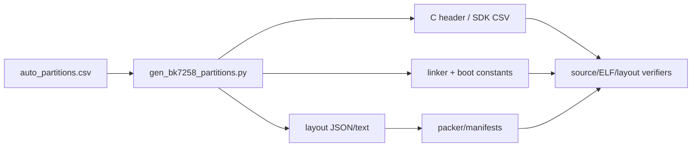
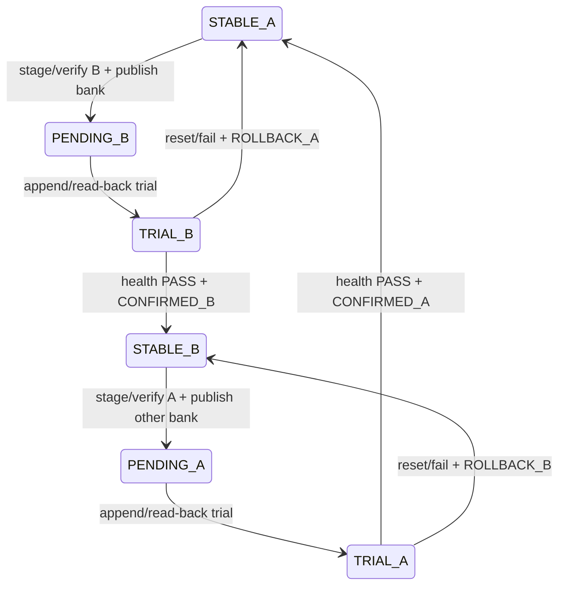
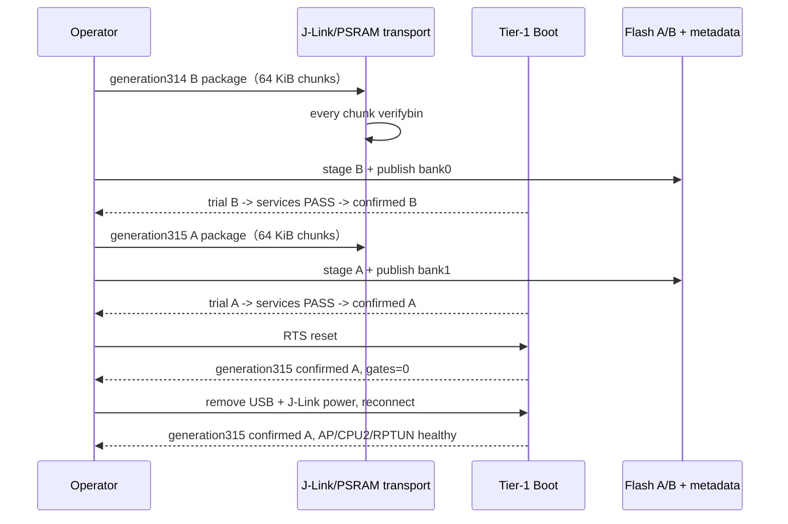

> **历史资料（已退役）**：本章记录 N15 自定义 OTA 的设计和实板证据。
> 对应 selector、journal、writer、命令和验证脚本已于 2026-08-10 从现役
> 源码删除；当前启动链以 BL1 + NuttX MCUboot BL2 为准。
> **事实截止日期**：2026-08-04
> **权威来源**：[N15 总计划/完成记录](../nuttx-port/prompts/15-n15-tier2-ota.md)、[ADR-004 连续A/B布局](../../../../memory/decisions/ADR-004-n15-official-contiguous-ab-layout.md)、[ADR-005 metadata v1](../../../../memory/decisions/ADR-005-n15-boot-selector-metadata-v1.md)、[ADR-006 对称双bank](../../../../memory/decisions/ADR-006-n15-symmetric-dual-bank-ota.md)、[N15 verification records](../../../../progress/verification/)
> **证据边界**：N15-M布局迁移与format-2最小physical A→B→A生命周期均已board-verified；确认后的RTS和完整移除USB/J-Link供电再上电，都恢复了同一generation 315 confirmed-A状态。analog mid-pulse brownout、physical rollback、签名和anti-rollback仍是未声称完成的独立边界。

# 09 成对 CP/AP OTA：N15

## 1. 为什么CP和AP必须一起升级

CP与AP之间共享：

- RPTUN resource/control ABI；
- mailbox command与generation；
- Bluetooth pointer IPC；
- AP boot address和shared SRAM布局；
- service endpoint与health contract。

如果只升级CP或只升级AP，两个镜像可能对同一结构有不同解释。N15因此把它们定义为一个 **pair generation**：选择A或B时，CP/AP必须同时切换，禁止混合generation。

## 2. 为什么先推翻旧Flash布局

official v3.1.1.9 A/B机制使用一个Flash-controller offset，把一段连续primary CP+AP窗口整体映射到等长`s_app`窗口。旧N14布局中LittleFS夹在可执行区域之间，无法一次remap整对镜像。

最初ADR-003研究了“不改布局、逐sector成对交换”：

- 能保留旧布局；
- 但要journal、scratch、复制和恢复状态机；
- 一个完整pair有约783 sectors，单scratch会成为erase热点；
- boot更慢、恢复逻辑更复杂。

ADR-003只完成read-only模型/可行性研究，从未被接受或写入板子。owner选择“一步到位”：允许一次有界全量迁移、LittleFS可清空，采用official-style连续A/B（ADR-004）。

## 3. 当前冻结的8 MiB raw physical布局

```text
0x000000 ┌────────────────────────────────┐
         │ Tier-1 boot              0x011000
0x011000 ├────────────────────────────────┤
         │ CP A                     0x154000
0x165000 ├────────────────────────────────┤
         │ AP A                     0x121000
0x286000 ├────────────────────────────────┤
         │ CP B                     0x154000
0x3da000 ├────────────────────────────────┤
         │ AP B                     0x121000
0x4fb000 ├────────────────────────────────┤
         │ metadata bank 0          0x001000
0x4fc000 ├────────────────────────────────┤
         │ vendor usr_config        0x00e000
0x50a000 ├────────────────────────────────┤
         │ metadata bank 1          0x001000
0x50b000 ├────────────────────────────────┤
         │ reserved
0x600000 ├────────────────────────────────┤
         │ CP LittleFS              0x100000
0x700000 ├────────────────────────────────┤
         │ reserved
0x7fa000 ├────────────────────────────────┤
         │ official calibration tail 0x6000
0x800000 └────────────────────────────────┘
```

| 区域 | raw physical range | 规则 |
|---|---|---|
| boot | `0x000000..0x011000` | team source |
| CP A | `0x011000..0x165000` | primary CP |
| AP A | `0x165000..0x286000` | primary AP |
| B pair | `0x286000..0x4fb000` | CP B + AP B，等长pair |
| bank0 | `0x4fb000..0x4fc000` | 8×512-byte records |
| `usr_config` | `0x4fc000..0x50a000` | vendor数据，保留 |
| bank1 | `0x50a000..0x50b000` | format-2第二bank |
| LittleFS | `0x600000..0x700000` | CP owner |
| calibration tail | `0x7fa000..0x800000` | 项目下载/OTA不可写 |

对应logical XIP：

- CP：`0x02010000..0x02150000`；
- AP：`0x02150000..0x02260000`。

raw地址给Flash API/loader，logical地址给CPU/linker。两个域不能混用。

## 4. CSV不是文档附件，而是布局源

team-owned [bk7258_ab_onchip_persistent.csv](../../../../boards/bk7258/common/partitions/bk7258/bk7258_ab_onchip_persistent.csv) 是当前示例的 canonical 输入。布局模块产出/交叉检查：

- SDK-compatible partition CSV；
- C header常量；
- linker/packer参数；
- human-readable text/JSON；
- factory与sparse manifest；
- verifier所用range/layout ID。



这样改一个分区时，不靠人工同时修改十几个magic number；任何消费者与CSV不一致都应在build阶段fail。

## 5. N15-M：一次性迁移做了什么

owner授权的不是chip erase，而是两段有界写：

1. project executable/layout范围 `0x000000..0x4fc000`；
2. 新LittleFS范围 `0x600000..0x700000`。

`usr_config`、reserved gap和`0x7fa000..0x800000` calibration tail都不在写入文件里。LittleFS被明确允许清空并autoformat。

迁移后重跑：

- NSH、LittleFS持久化；
- AP SMP；
- RPTUN/RPMsg/RPMsgFS；
- Bluetooth GAP/GATT；
- PSRAM与SDK timer；
- physical reset 3/3。

因此N15-M是board-verified。它只证明新布局和保留功能，不等于OTA生命周期完成。

## 6. 一个candidate package里有什么

N15-A把CP/AP做成确定性pair bundle。每个component有official-compatible RBL envelope，pair manifest记录：

- layout ID和目标slot；
- generation、version、base version、timestamp；
- CP/AP raw/physical长度；
- vector、magic、padding；
- CRC/SHA-256；
- complete pair digest；
- staging descriptor。

RBL的CRC32/FNV和pair SHA-256提供 **完整性**，不提供publisher身份认证，也不是anti-rollback。签名、key provisioning和安全版本策略属于未来独立阶段。

## 7. Staging必须“先写完验证，最后发布信任”

```mermaid
sequenceDiagram
    participant T as transport/validation loader
    participant C as CP OTA wrapper
    participant F as inactive Flash slot
    participant M as inactive metadata bank
    T->>C: descriptor + bounded candidate chunks
    C->>C: layout/generation/version/range preflight
    C->>F: erase/program exact inactive CP/AP ranges
    C->>F: read-back + CRC/RBL/vector/SHA/padding verify
    alt complete pair valid
        C->>M: erase inactive bank
        C->>M: append PENDING_* record
        C->>M: read-back/CRC verify
    else any failure
        C-->>T: fail; current slot/bank remains authoritative
    end
```

pending record永远最后写。candidate只写了一半、digest失败或metadata torn时，旧stable bank仍有效。

## 8. 为什么metadata要双bank

format-1只有bank0，能完成A→B，但`CONFIRMED_B`之后若擦掉唯一metadata sector去准备A，一旦断电就丢失“B已确认”这个唯一事实。

format-2增加bank1，并让状态slot-neutral：

```text
PENDING_B(1) -> TRIAL_B(2) -> CONFIRMED_B(3) | ROLLBACK_A(4)
PENDING_A(5) -> TRIAL_A(6) -> CONFIRMED_A(7) | ROLLBACK_B(8)
```

| 状态 | 本次boot/下次reset语义 |
|---|---|
| `PENDING_*` | candidate已验证，但还没有trial permission |
| `TRIAL_*` | 当前只允许一次candidate boot；若未confirm就reset，回base |
| `CONFIRMED_*` | candidate成为stable slot |
| `ROLLBACK_*` | 明确回base |

新generation只写不含当前durable lifecycle的bank。旧bank在新record完整read-back之前始终保留。两个bank同generation但identity冲突时fail-closed。

## 9. A/B remap为什么能保证成对切换

Slot A表示remap disabled；Slot B表示启用official-style单offset remap。窗口：

```text
begin  = 0x02010000
end    = 0x02260000
offset = 0x02250000
```

这个窗口正好覆盖CP A+AP A，并整体映射到B pair。Boot在remap前验证两边的CP/AP header、length、padding、vector、magic和whole-pair digest；不能只验证CP后就带着未知AP启动。

## 10. Trial、confirm、rollback



target health gate是5000 ms窗口、每250 ms polling，要求AP supervisor/RPTUN/保留服务达到健康条件。host model中的1000 ms只是加速fixture，不能写成target policy。

## 11. Normal profile与validation profile必须隔离

| Profile | 用途 | 写Flash/选择gate |
|---|---|---|
| `cp_nsh_psram + ap_smp_psram` | normal产品/回归 | Boot gates 0，CP runtime gate false，无`bkota` |
| `cp_nsh_ota + ap_smp_psram` | 明确授权的验证 | 编译期打开部分验证能力，仍需exact generation token |

validation loader默认dry-run；真实执行还需要target `prepare-transfer`、watchdog状态、`--execute`和新鲜board-write authority。生成host campaign不等于授权写板。

固定PSRAM transport窗口：

```text
0x60800000..0x60a76200
```

它只在N15 validation profile作volatile transfer，不是allocator、不是持久存储，也不改变N14 upper-half policy。

实板阶段发现单次大文件或同一J-Link Commander进程内连续装载并不可靠，因此正式transport改为固定64 KiB chunk；每个candidate chunk都用新的Commander进程执行`loadfile noreset`并立即`verifybin`，descriptor/record再用最后一个独立批次传入。这个改动只影响volatile PSRAM搬运，不扩大任何Flash写范围。

## 12. Host验证到底证明了什么

| 子阶段 | 已完成证据 | 未自动获得 |
|---|---|---|
| N15-A | pair bundle、golden vector、正/负例 | board write |
| N15-B | bounded inactive staging、Flash guard、ELF | physical slot行为 |
| N15-C | metadata parser、pair validation、remap adapter/gates | remap实板 |
| N15-D | one-trial、confirm/rollback、48 reset boundaries | actual reset campaign |
| N15-E | publish/reclaim、erase/program boundaries | analog mid-pulse brownout |
| N15-F | target health policy、validation profile、PSRAM transfer dry-run | transport可靠性 |
| N15-V/format-2 | fault hooks、双bankA→B→A、16 package campaign/independent verifier | physical A→B→A |

host fail-before callback证明软件操作边界；它不等价于在Flash erase/program电气脉冲中随机brownout。

随后完成的实板闭环补上了表格最后一列中的最小双向生命周期证据，详见[N15 physical symmetric lifecycle](../../../../progress/verification/2026-08-04-n15-physical-symmetric-lifecycle.md)。它仍不把analog mid-pulse brownout、publisher认证或anti-rollback算作已完成。

## 13. 2026-08-04 physical A→B→A实板闭环

最小双向生命周期已经完成：

1. 早期generation 314诊断暴露两个真实问题：Boot只喂APB_WDT，以及J-Link大块PSRAM传输不可靠；team-owned代码分别改为同时喂APB/AON WDT和64 KiB独立进程传输/逐块验证；
2. generation 314完整写入inactive B pair的629个sector，总计2576384 bytes；全量Flash read-back与candidate SHA-256一致；
3. 第一次publish采用旧10秒timeout，在pair rehash阶段返回`-ETIMEDOUT`且`mutation=0`，证明失败关闭；改为180秒后成功写入bank 0；
4. RTS后进入`TRIAL_B(2)`，AP SMP/CPU2、RPTUN、LittleFS/PSRAM、timer32、RPMsg、RPMsgFS和Bluetooth回归通过，随后进入`CONFIRMED_B(3)`；
5. generation 315从B对称写回inactive A，完整read-back/SHA通过，并把pending record发布到另一物理bank，即bank 1；
6. RTS后进入`TRIAL_A(6)`，同一套保留服务回归通过，随后进入`CONFIRMED_A(7)`；
7. 再次RTS后仍是generation 315、bank 1、confirmed A，active A、secondary mapping和两项runtime write gate均为0；
8. validation NSH profile同步把`CONFIG_NSH_MAXARGUMENTS`提高到10，消除长`bkota stage`命令曾出现的“too many arguments”噪声。



generation 315确认后，USB与J-Link供电被同时移除。重新连接后没有执行reset、J-Link Commander或Flash命令；COM11先到NSH，随后只读状态仍为bank 1、`CONFIRMED_A(7)`、active A、secondary/gates 0，AP/CPU2/RPTUN健康。因此最小掉电持久性门禁也已关闭。唯一动态快照见[第11章](11-current-status-and-next-steps.md)。

## 14. N15明确不包含

- network download protocol；
- bootloader self-update；
- publisher signature/key provisioning；
- hardware anti-rollback；
- 任意时刻的analog power-fail资格认证；
- calibration tail写入；
- 未授权chip erase/factory rewrite。

这让首版目标保持清楚：实板证明一对CP/AP能被安全stage、trial、confirm并在完整掉电后恢复，host模型覆盖rollback边界；传输产品化和安全能力继续作为后续独立阶段。
